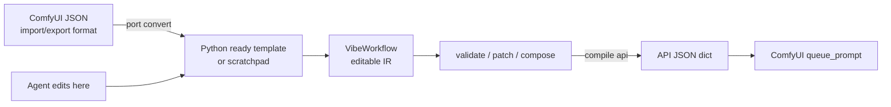

# VibeComfy: Making agents first-class citizens in the ComfyUI ecosystem


Its core job is translation: import a ComfyUI workflow, represent it as editable
Python, validate the result, and compile it back to the API JSON that ComfyUI queues.
JSON is the import/export format. Python is the authoring surface.
See [Why Python, Not JSON?](docs/comparisons/why_python_not_json.md).

The generated Python is intentionally ordinary code because Python is the
language even small local agents tend to understand best. A ready template is a
`build()` function that creates a `VibeWorkflow`, calls typed ComfyUI node
wrappers or generated subgraph functions, and finalizes the workflow contract.
The goal is not clever syntax; it is a surface that lightweight agents can read,
edit, validate, and translate back to ComfyUI without needing to reason directly
over graph JSON. This is abridged from `ready_templates/image/z_image.py`:

```python
# Abridged from ready_templates/image/z_image.py.
from vibecomfy.templates import ReadyMetadata, new_workflow
from vibecomfy.nodes.core import SaveImage

READY_METADATA = ReadyMetadata.build(capability="image")

def text_to_image_z_image_base(*, width, height, unet_name, clip_name, vae_name, prompt, steps, cfg):
    # Generated from a ComfyUI subgraph. Internally this calls CLIPLoader,
    # VAELoader, UNETLoader, EmptySD3LatentImage, CLIPTextEncode,
    # ModelSamplingAuraFlow, KSampler, and VAEDecode.
    ...

def build():
    wf = new_workflow(READY_METADATA, source_path=__file__)

    edited = text_to_image_z_image_base(
        width=1024,
        height=1024,
        unet_name="z_image_bf16.safetensors",
        clip_name="qwen_3_4b.safetensors",
        vae_name="ae.safetensors",
        prompt="a glass teapot on black basalt",
        steps=25,
        cfg=4,
    )

    save = SaveImage(_id="9", images=edited, filename_prefix="z-image")
    return wf.finalize(
        {},
        output_node=save,
        output_type="SaveImage",
        name="image",
        artifact_kind="image",
        mime_type="image/png",
        expected_cardinality="one",
        filename_prefix="z-image",
    )
```

Generated files in `ready_templates/` are annotated `# vibecomfy: generated`.
Treat them as read-only; copy one to a local `recipes/` workspace with
`copy-to-recipe` before editing. That workspace is gitignored.

Unlike ComfyScript-style exports that flatten a graph into Python calls,
VibeComfy preserves a workflow contract for agents. See
[VibeComfy And ComfyScript](docs/comparisons/comfyscript.md), and
[What Is a VibeWorkflow?](docs/comparisons/what_is_a_vibeworkflow.md) for the
object at the center of that contract.

Comfy MCP provides an agent access layer for operating ComfyUI. VibeComfy
focuses on the authoring layer: understanding workflows, finding proven
patterns, making complex edits, and preserving the result. See
[VibeComfy And Comfy MCP](docs/comparisons/comfy_mcp.md).

## Getting Started

Each path below is meant to be copied directly into an agent. The ComfyUI path
also includes a manual install block because it is a normal custom-node install.

### Use VibeComfy Inside ComfyUI

Use this when you want VibeComfy's ComfyUI extension nodes. The in-editor agent
panel also works from a normal install, but it needs the `agent` extra so the
Arnold runtime package is present in the same Python environment as ComfyUI.

```text
Install ComfyUI fresh (clone https://github.com/comfyanonymous/ComfyUI.git, create a venv, install torch and requirements.txt, start it once), then install VibeComfy into that ComfyUI checkout with the agent extra using the same Python that runs ComfyUI, symlink `vibecomfy/comfy_nodes` into `ComfyUI/custom_nodes/vibecomfy`, restart ComfyUI, and verify that the VibeComfy node categories are available.
```

Fresh ComfyUI install (skip this block if you already have a working ComfyUI
checkout):

```bash
git clone https://github.com/comfyanonymous/ComfyUI.git
cd ComfyUI
python3 -m venv venv
venv/bin/pip install torch torchvision torchaudio
venv/bin/pip install -r requirements.txt
venv/bin/python main.py  # start once to verify; Ctrl-C once it has loaded
```

Manual install of VibeComfy into that checkout:

```bash
cd /path/to/VibeComfy
COMFYUI=/path/to/ComfyUI
COMFY_PYTHON="$COMFYUI/venv/bin/python"  # replace with the Python that runs ComfyUI
"$COMFY_PYTHON" -m pip install -e ".[agent]"
ln -sfn "$PWD/vibecomfy/comfy_nodes" "$COMFYUI/custom_nodes/vibecomfy"
```

The default install is `".[agent]"`: it installs the VibeComfy Python package,
the extension-only dependencies, and the Arnold runtime that powers the
in-editor agent panel into ComfyUI's interpreter.

The symlink is what makes ComfyUI load `vibecomfy/comfy_nodes/__init__.py`,
which registers the node classes and serves the bundled `web/` extension assets.

After restart, look for nodes under `vibecomfy/exec`, `vibecomfy/intent`, and
`conditioning/vibecomfy`. Install success means the VibeComfy nodes appear in
node search and `/vibecomfy/agent/status` returns `ready: true`. Red "missing
model" errors on the default workflow (e.g. `qwen_3_4b.safetensors`,
`z_image_turbo_bf16.safetensors`) mean the models are not downloaded yet, not
an install failure.

The agent panel lets an agent edit a workflow from inside ComfyUI.

Its guarded JSON routes default to trusted loopback access. Remote/LAN/RunPod
access requires an explicit instance bearer capability; session ids are not
credentials. See [HTTP authorization boundary](docs/agent-edit/http-authorization.md)
before exposing ComfyUI beyond loopback.

#### Practically this is how this looks

The default workflow a fresh install loads is the z-image text-to-image graph.
Suppose you want the agent to change the save prefix. On the ComfyUI canvas
that node is a box, but as text — what the agent actually reads — it is this:

```json
{
  "id": 9,
  "type": "SaveImage",
  "inputs": [{"name": "images", "type": "IMAGE", "link": 86}],
  "widgets_values": ["z-image"],
  "properties": {
    "cnr_id": "comfy-core",
    "ver": "0.3.64",
    "Node name for S&R": "SaveImage"
  }
}
```

Accurate, but the agent's job is reconstruction: `link 86` lives elsewhere,
`widgets_values[0]` is a positional array with no name, and "SaveImage" tells
it nothing about where this sits in the graph. The VibeComfy layer says the
same thing in ordinary code:

```python
save = SaveImage(_id="9", images=edited, filename_prefix="z-image")
```

Change the prefix by editing one named argument, validate with
`vibecomfy validate`, and the compiler emits the API JSON ComfyUI queues. Both
representations describe the same node; the Python one gives the agent names,
call sites, and intent in one view — which is why the panel can act on
"rename the SaveImage node" without first decoding a graph. For the full
walkthrough — two connected nodes, subgraphs, and how this compares with
ComfyScript-style exports — see
[What Is a VibeWorkflow?](docs/comparisons/what_is_a_vibeworkflow.md).

#### Advanced: nodes-only install (no agent panel)

Skip the Arnold runtime if you only want the extension nodes:

```bash
"$COMFY_PYTHON" -m pip install -e .
```

The extension nodes and the panel's web assets work without the `agent` extra,
but the in-editor agent panel has no runtime until it is installed.

#### macOS: expected console noise

On first load you may see 404s for `/api/userdata/*`, `user.css`,
`comfy.templates.json`, and `/vibecomfy/demo/scenarios` (by design unless
`VIBECOMFY_DEMO_PICKER=1`), plus objc duplicate-class warnings (cv2 vs av) and
a comfy-kitchen CUDA backend "missing" message (expected on Mac; MPS is used).
These are not install failures.

#### `vibecomfy[comfy]` venv conflict

Installing the `vibecomfy[comfy]` extra (`comfyui==0.26.0`) into a checkout
venv, or reusing a venv that already has pip-installed comfyui, can produce a
pip resolver conflict: `comfyui 0.26.0` wants `comfyui-frontend-package<1.46`
while a fresh checkout pins 1.48.x. The checkout's own `comfy/` package wins
when running `main.py`, so it is benign — but keep those venvs separate.

### Use VibeComfy Directly

Use this when you want an agent to install VibeComfy, discover templates, copy
one into a recipe, import unfamiliar ComfyUI workflows when needed, validate the
result, and show the runtime JSON that ComfyUI will receive.

The supported template-corpus install is a VibeComfy checkout installed
editable (`pip install -e .`); `ready_templates/` and `template_index.json` are
checkout data. A built wheel is the Python library and ComfyUI plugin, including
its plugin assets, but does not include that corpus. The in-editor agent panel
is optional and requires `pip install -e ".[agent]"` (or the equivalent extra
on a wheel install).

```text
Clone https://github.com/peteromallet/VibeComfy and install it with `python -m pip install -e .`.
The canonical agent skill lives in `docs/agent-skill/SKILL.md`; there are no root
agent bootstrap copies. Run `python scripts/sync_agent_skill.py --apply` to check
it, or `python scripts/sync_agent_skill.py --install-user` to install it globally.
That installer uses SkillSinker: it symlinks the VibeComfy skill into detected Claude, Codex, and Hermes skill directories without overwriting existing entries, and it updates Codex's `AGENTS.md` with an idempotent fenced VibeComfy block.
If I already have ComfyUI workflows or custom nodes, index them with `python -m vibecomfy.cli sources sync --official <official_workflow_dir> --external <my_workflow_dir> --custom-nodes <ComfyUI/custom_nodes> --json`, then use `workflows list`, `search`, `nodes list`, and `nodes spec` against that local context.
List ready templates with `python -m vibecomfy.cli workflows list --ready`.
Inspect `image/z_image` with `python -m vibecomfy.cli inspect image/z_image`.
Copy it to `recipes/my_z_image.py` with `python -m vibecomfy.cli copy-to-recipe image/z_image --out recipes/my_z_image.py`.
If I give you an unfamiliar ComfyUI JSON workflow instead of a ready template, first run `python -m vibecomfy.cli port check <workflow.json> --json` and `python -m vibecomfy.cli nodes install-plan <workflow.json>`, then convert it with `python -m vibecomfy.cli port convert <workflow.json> --out out/scratchpads/<name>.py --json`.
Edit the copied or converted Python itself: change prompts, seeds, steps, model choices, wiring, and output prefixes in the generated/template call sites, not by editing compiled API JSON.
Validate the recipe with `python -m vibecomfy.cli validate recipes/my_z_image.py`.
For converted scratchpads, validate `out/scratchpads/<name>.py` instead.
Export the runtime API JSON with `python -m vibecomfy.cli port export recipes/my_z_image.py --to json --json`.
If node packs are missing, use `python -m vibecomfy.cli nodes ensure <workflow>`. If model assets are missing, prefer normal `run` because it reconciles declared assets before queueing; use `fetch` only when explicitly staging authored model assets.
Summarize what changed and show me the exact API JSON fields ComfyUI will receive before any GPU run.
```

## Architecture In One Pass

Everything flows through `VibeWorkflow`.



`compile("api")` returns the dict that ComfyUI's `queue_prompt` accepts. It is
useful for inspection and runtime, but it is not the format VibeComfy asks
agents to edit.

The main artifact types are:

| Term | Meaning |
|---|---|
| Workflow | Any graph, whether it came from ComfyUI JSON, a ready template, or a scratchpad. |
| Ready template | A curated Python starting point in `ready_templates/`, addressed by ids like `image/z_image`. |
| Recipe | Local user code in gitignored `recipes/` that loads templates, applies patches, adds blocks, and runs or exports the result. |
| API JSON | The runtime dict produced by `wf.compile("api")`; ComfyUI queues this, but agents should not hand-edit it. |

Agents should edit the Python workflow surface. Use patches when a change
decorates an existing graph, such as resolution, save prefix, model policy, or
low-VRAM behavior. Use blocks when a change adds graph structure and creates new
handles to wire.

## Templates And Porting

Ready templates live in [ready_templates/](ready_templates/). Give this to an
agent when you want it to choose a starting point:

```text
If I have an existing ComfyUI checkout or workflow folder, first run `python -m vibecomfy.cli sources sync --external <workflow_dir> --custom-nodes <ComfyUI/custom_nodes> --json` so discovery and node specs reflect my local workflows and installed custom nodes.
List ready templates with `python -m vibecomfy.cli workflows list --ready`.
Search for a relevant workflow with `python -m vibecomfy.cli search <query> --task <task>`.
Inspect likely candidates with `python -m vibecomfy.cli inspect <template_id>` and `python -m vibecomfy.cli analyze info <template_id>`.
Pick the smallest ready template that already has the needed media type, model family, and output contract.
```

Porting converts a raw ComfyUI JSON workflow into a Python scratchpad or ready
template. Give this to an agent when starting from raw JSON:

```text
Run `python -m vibecomfy.cli port check <workflow.json> --json` before editing or GPU time.
Run `python -m vibecomfy.cli nodes install-plan <workflow.json>` against the same custom-node context, then use `nodes ensure`, `nodes lock`, or `nodes restore` when the workflow needs packs that are missing or unpinned.
Convert to a scratchpad with `python -m vibecomfy.cli port convert <workflow.json> --out out/scratchpads/<name>.py --json`.
Validate the emitted Python with `python -m vibecomfy.cli validate out/scratchpads/<name>.py`.
If the workflow should become reusable, promote it to a ready template with `port convert --ready-id <kind>/<name> --out ready_templates/<kind>/<name>.py`.
```

Promote durable workflows to Python ready templates. Keep raw JSON as source
evidence; do not make compiled API JSON the reusable source of truth.

## Deeper Docs

- [Authoring](docs/authoring.md)
- [Porting workbench](docs/templates/porting_workbench.md)
- [Adding templates and models](docs/templates/adding_templates_models.md)
- [Testing user code](docs/testing/user_code.md)
- [What Is a VibeWorkflow?](docs/comparisons/what_is_a_vibeworkflow.md)
- [Why Python, not JSON?](docs/comparisons/why_python_not_json.md)
- [ComfyScript comparison](docs/comparisons/comfyscript.md)
- [Comfy MCP comparison](docs/comparisons/comfy_mcp.md)

## Repository Layout

| Path | Purpose |
|---|---|
| `vibecomfy/` | Package, CLI, workflow IR, porting code, runtime helpers, and ComfyUI nodes. |
| `ready_templates/` | Curated Python templates intended as starting points. |
| `ready_templates/sources/` | Source ComfyUI workflows used for indexing, conversion, and coverage. |
| `tests/structural_harness/` | Deterministic structural contract harness: adapter, runner, builders, scenarios, and briefs. |
| `tests/live_agentic_harness/` | True live-agentic harness placeholder; no fake builders or scripted scenarios. |
| `docs/` | Authoring, porting, runtime, testing, architecture, and migration docs. |
| `docs/agent-skill/` | The single authored VibeComfy agent skill source. |
| `scripts/` | Direct-run operational scripts, RunPod harnesses, sync helpers, and maintenance commands. |
| `tools/` | Importable developer tools intended to run with `python -m tools.<name>`. |
| `tests/` | Unit, integration, browser, parity, structural harness, and live agentic harness tests. |
| `.github/` | GitHub Actions workflows. |
| `pyproject.toml`, `uv.lock` | Python package metadata and locked dependencies. |
| `custom_nodes.lock` | Custom-node pack inventory: the enforced pin is each pack's git URL + commit; `pip_packages` is an unversioned hint for local catalog install/doctor/template metadata. RunPod continues with the cloned pack's `requirements.txt` plus compatibility dependencies; this is separate from `uv.lock`. |
| `template_index.json` | Tracked ready-template index consumed by fast discovery and strict-ready validation. |
| `out/`, `input/`, `output/`, `temp/` | Generated local runtime data; gitignored. |

## Thanks

VibeComfy is a relatively thin Python authoring layer for agents. The real work belongs to:

- **[`pip-and-uv-installable-ComfyUI`](https://github.com/hiddenswitch/pip-and-uv-installable-ComfyUI)** by [Dr. Pangloss / hiddenswitch](https://github.com/hiddenswitch) - the fork that makes ComfyUI installable as a normal Python package, which is what lets VibeComfy embed Comfy at all.
- **[ComfyUI](https://github.com/comfyanonymous/ComfyUI)** by **Comfy Anonymous** and the Comfy team / community, plus the custom-node pack authors VibeComfy indexes (KJNodes, VideoHelperSuite, WanVideoWrapper, LTXVideo, rgthree, was-node-suite, and many more).
- **The workflow builders** whose graphs the ready templates are based on - [Kijai](https://github.com/kijai), the [Comfy team's official examples](https://github.com/comfyanonymous/ComfyUI_examples), and many others across the community whose published workflows we adapted into the `ready_templates/` set.
- **The open-source model authors** whose weights every workflow actually runs - Black Forest Labs (Flux), Tencent (Hunyuan), Alibaba (Wan, Qwen), Lightricks (LTX-Video), Stability AI (SD/SDXL), and the long tail of fine-tuners and LoRA authors releasing openly on Hugging Face and Civitai.

## License

MIT - see [LICENSE](LICENSE).
