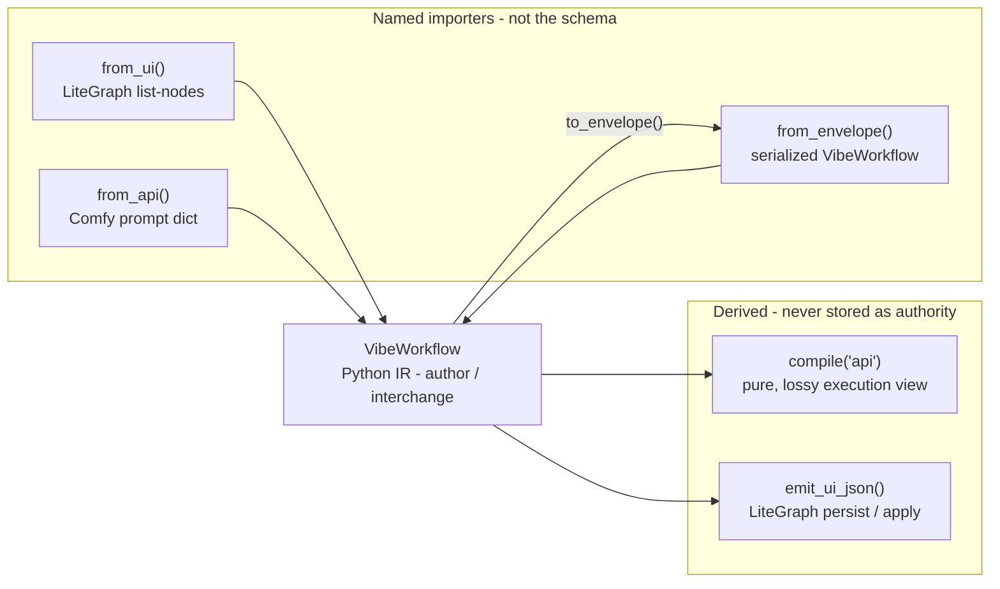
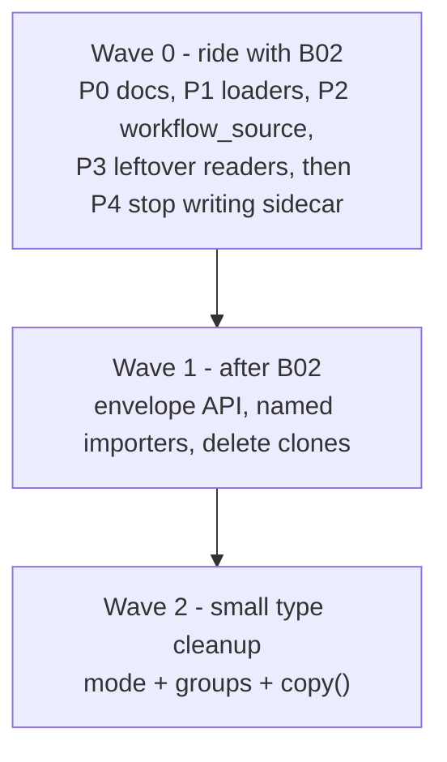
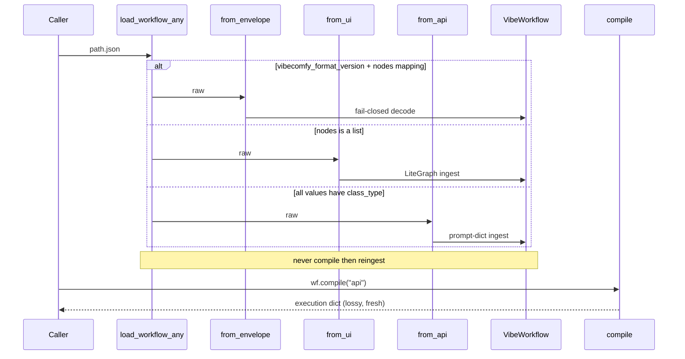

# Canonical Graph Expression: Elegance Plan

| Field | Value |
|---|---|
| **Author** | architecture assessment |
| **Date** | 2026-08-12 |
| **Status** | Draft |
| **Audience** | engineers landing B02 and the next cleanup PRs |
| **Constraint** | this document does not change code; it decides what *not* to change |

---

## Overview

B02 is landing "one lossless canonical graph representation." The remaining question is not whether a canonical form exists — it does, in the tree, today — but whether that form is *expressed* so a senior engineer can hold it in their head.

The short answer: **the center of gravity is right, the envelope is still ugly.** `VibeWorkflow` (`vibecomfy/workflow.py`) is the in-memory IR. `_decode_serialized_vibe` already treats the rich `nodes` mapping as the only structural authority. `compile("api")` is already a pure function of the IR. What is not elegant is everything around that: a persisted `compiled_api` twin, an 18-line shape detector that still treats vibe as a peer of UI/API, public loaders that compile-then-reingest (undoing the lossless decode), a half-extracted `vibecomfy/ir/` clone that has already drifted, and a family of dual-defined contracts that are not one problem.

The target is small: **the envelope *is* the serialized IR. `compile()` is a function, not a stored twin. UI and API stay named importers. The three views stay three views.**

This is not a rewrite. Collapsing author / edit / execute into one stored format is a landmine, not elegance.

---

## 1. Assessment

Honest inventory of what the expression costs today. Each smell is marked **legacy debt** (stop paying) or **still earning its keep** (leave it).

B02's own scout text is already stale. Item 3 of `docs/failure-analysis/agentic-pipeline-improvement-2026-08.md` still claims "NO lossless rich→canonical path exists today" and "nothing consumes [rich nodes] for structure." That was true when the scout ran. It is not true now. `_decode_serialized_vibe` (`vibecomfy/ingest/normalize.py:382-395`) is in the tree, `convert_to_vibe_format` dispatches to it (`:699-704`), `normalize_to_api` recompiles from the IR (`:82-91`), `executor_durable.py:77-80` now normalizes through `normalize_agent_edit_graph`, and `tests/test_b02_rich_preservation.py` plus `scripts/check_b02_rich_preservation.py` are a corpus-wide proof harness. Assessment below is of the *current* tree, not the scout.

### 1.1 Dual envelope — rich `nodes` + persisted `compiled_api`

**What exists.** There is no JSON Schema for the serialized vibe envelope. Writers dump a dataclass walk plus extras:

- `scripts/ingest_external_workflows.py:82-103` walks `dataclasses.fields`, then stamps `vibecomfy_format_version = "1.0"` and `compiled_api = workflow.compile("api")`.
- `vibecomfy/demo_factory/fixer.py:68-81` hand-builds the same envelope, including `compiled_api`.
- `VibeWorkflow` itself (`vibecomfy/workflow.py:148-158`) does **not** carry `compiled_api`. There is no `to_envelope()` / `from_envelope()`.

The decoder already got this right. `_decode_serialized_vibe` (`normalize.py:382-389`) treats rich `nodes` + `edges` as the only structural authority. `compile()` (`workflow.py:738-762`) is a pure function of the IR: it never reads an envelope field named `compiled_api`. `normalize_to_api` on a vibe envelope decodes then recompiles (`normalize.py:82-91`).

**The 90a1d5 smoking gun, verified 2026-08-12.** `external_workflows/corpus/90a1d5ff9044902e.json` stores 2 `compiled_api` nodes (`17`, `3`) and 15 rich nodes (9 `mode=4` bypassed, 4 `MarkdownNote` helpers, 2 executable). Tests at `tests/test_porting_normalize_ingest.py:642-704` lock the decoder to the 15-node IR even when `compiled_api` is missing or malformed.

One nuance the brief overstated: for *this* file, `compiled_api` is not drifted relative to `compile()`. Recompiling the 15-node IR today still yields exactly `{'3', '17'}`. The stored twin is a correct *lossy* snapshot, not a stale one. That does not make it an authority. It makes it a cache of a function. The optional-evidence test (`:692-704`) is the real invariant: delete or corrupt `compiled_api` and the graph is unchanged.

**What it costs.**

| Cost | Where it lands |
|---|---|
| Drift *risk* (even when this file happens to match) | Any future compile-behavior change, or any writer that stamps `compiled_api` from a different IR than it writes under `nodes`, silently forks the envelope. |
| Cognitive load | Every new reader has to ask "which one is real?" The module docstring of `graph_normalization.py:1-7` still says the executable graph "lives under `compiled_api`." `_merge_vibe_node_widget_evidence` (`normalize.py:223-229`) still says the same. Both comments are now wrong. |
| Leftover readers still treat the twin as data | `edit_batch_memory.py:664-666` (and the live twin `_frag_batch_memory.py:677-679`) fall back to `graph.get("compiled_api")` when `nodes` is neither a mapping nor a list. `executor/research.py:5056-5079` descends into `compiled_api` last. Hivemind ranks `has_compiled_api` +30 (`research.py:787-789`). `intent_judge.py:85-88` builds schema context *only* from `compiled_api` — if the sidecar is absent, the judge gets no schema context. |
| Writers still emit the twin | Ingest (`ingest_external_workflows.py:102`), fixer (`fixer.py:71`), hivemind upload (`upload_external_workflows_to_hivemind.py:481-489, 724, 736`) all persist or re-ship `compiled_api`. B02 did not stop them. |

**Verdict: mostly legacy debt as a second authority.** Keep `compile()` as a function. Stop persisting its output next to the IR. Recompute at the hivemind / judge / queue boundary. The sidecar is not earning its keep as stored data; it is earning a little as a *compat signal* for the detector (see 1.2) and as a hivemind rank feature. Both of those can be replaced by "envelope has rich `nodes` + version" and "envelope compiles."

### 1.2 Three input shapes + heuristic detector

**What exists.** `detect_workflow_shape` (`normalize.py:41-58`) is 18 lines:

1. Unwrap `prompt` recursively.
2. `nodes` is a dict **and** (`vibecomfy_format_version` present **or** `compiled_api` is a dict) → `"vibe"`.
3. `nodes` is a list → `"ui"`.
4. `{}` → `"api"`.
5. Every value is a dict with `class_type` → `"api"`.
6. Else `"unknown"`.

That function is the public ingest API (`vibecomfy/ingest/__init__.py:14`). `normalize_to_api` and `convert_to_vibe_format` both start by sniffing.

**Public loaders undo B02.** Verified:

```
convert_to_vibe_format(raw 90a1d5)  → 15 nodes, 10 edges
load_workflow_any(90a1d5)           →  2 nodes  (3, 17)
workflow_from_file(...)             →  same 2-node compile view
load_port_source(...)               →  same 2-node compile view
```

Three public loaders share the same compile-then-reingest:

- `cli_loader.py:37-39` (`load_workflow_any`)
- `registry/library.py:22-24` and `:48-50` (`workflow_from_file` / `workflow_from_id`)
- `porting/workbench.py:795-807` (`load_port_source` JSON) and the PNG path at `:771-782`

After B02, `normalize_to_api` on a vibe envelope correctly decodes 15 and compiles to 2. The second call then *re-ingests the compile product as an API dict*, so the lossless IR is thrown away. `load_port_source` is the porting entry: `inspect --field` (`commands/inspect.py:29`), `vibecomfy port`, `runtime/eval/plan.py:59`, and corpus tests (`test_porting_synthetic_fixtures.py`, `test_layout_store.py`). Fixing only `load_workflow_any` would leave `inspect --field` / `vibecomfy port` on the 2-node view. This is the single highest-leverage leftover in B02's own lane.

**Parallel sniffers that disagree.**

| Sniffer | Rule | Disagreement |
|---|---|---|
| `detect_workflow_shape` | vibe = nodes-dict + (version **or** compiled_api-dict); api = *all* values have `class_type` | Official |
| `graph_normalization.py:38` | `nodes` is a list → pass through as UI; else convert | No version check; any mapping goes through `convert_to_vibe_format` |
| `routes.py:207-214` | UI = `nodes` is a list; API = *any* value has `class_type` | `any` vs `all` is real. A *top-level* vibe envelope does **not** look like API: `source` / `nodes` / `compiled_api` / `requirements` are dicts without a `class_type` key, so `_is_comfy_api_graph(envelope)` is False. It only looks like API if a caller passes the inner `nodes` or `compiled_api` mapping as the graph. |
| `workflow_source.py:221-227` | maps `detect` `"ui"` → `"litegraph"`, `"api"` → `"api"`, **everything else → `"unknown"`** | A versioned rich envelope is **rejected as unsupported** (`:111-129`) before `normalize_to_api` ever runs |
| Hivemind upload (`upload_external_workflows_to_hivemind.py:343`) | truthy `vibecomfy_format_version` + nodes-dict | Does not require `compiled_api`; then uses a private constructor |
| Ingest classify (`ingest_external_workflows.py:170-193`) | list-nodes ≥ 2 → `comfy_ui`; numeric keys + `class_type`/`inputs` ≥ 2 → `comfy_api` | Thresholded; no vibe branch. Cloned in `pipeline_orchestrate.py:43-77` |

**Three constructors, not one.**

| Constructor | Strictness | Used by |
|---|---|---|
| `_decode_serialized_vibe` (`normalize.py:382`) | fail-closed, whole-graph, provenance forced to `untrusted_source` | `convert_to_vibe_format` vibe branch |
| `_convert_to_vibe_format_impl` (`:685`) | UI/API ingest, schema-aware widget split | public ingest |
| `_vibe_workflow_from_dict` (`upload_external_workflows_to_hivemind.py:358-455`) | lenient, skips validation, empty uid allowed | hivemind Python emission |

Plus a fourth *writer* that is not a constructor: `fixer.py:24-100` hand-builds the envelope dict field-by-field, and imports `vibecomfy.ir.types.WorkflowSource` (`fixer.py:51`) that it never uses.

**Verdict: UI vs API still earn their keep as ecosystem importers.** ComfyUI speaks both. We will always need `from_ui` and `from_api`. Stuffing vibe into the same 18-line sniffer is debt. Mapping vibe → `unknown` in `workflow_source` is a bug. The public loader compile-then-reingest is a B02 regression in B02's own API. Target: named importers; envelope parser first; retire `detect_workflow_shape` from the public ingest API.

### 1.3 Contract defined twice — a family, not one copy-paste

This is four different patterns. Treating them as one "generate everything from Python" problem would make the design worse.

**A. Closed-op hand mirrors — still earning their keep.**

`projection_registry_v1.py` / `.js`, `canonical_hash`, `layout_operation_v1`, `mutation_materialization_v1`. The browser **must** verify UTF-16 / SHA-256 locally. ComfyUI serves those files as ESM from `WEB_DIRECTORY` (`vibecomfy/comfy_nodes/__init__.py:43-84`) — either `./web` or an optional content-hashed `web_dist/<hash>/` copy, not a webpack of the IR. Production ESM imports are bare, e.g. `vibecomfy_roundtrip.js:131`. Golden JSON fixtures under `tests/fixtures/agent_edit/` are the digest SSOT. Dual validators for *authority* are intentional: the panel cannot phone Python to hash a candidate.

**B. Generated JS unused in production — legacy debt.**

`tools/generate_agent_contract_js.py` emits `agent_edit_response_contract_generated.js`. Production imports the handwritten `agent_edit_response_contract.js` (`vibecomfy_roundtrip.js:131`, `agent_edit_lifecycle.js:24`, `panel_composer.js:7`, …). Drift is real:

```7:13:vibecomfy/comfy_nodes/web/agent_edit_response_contract.js
const PUBLIC_OUTCOME_KINDS = Object.freeze([
  "candidate",
  "noop",
  "clarify",
  "requires_custom_nodes",
  "error",
]);
```

```25:32:vibecomfy/comfy_nodes/web/agent_edit_response_contract_generated.js
export const PUBLIC_OUTCOME_KINDS = Object.freeze([
  "candidate",
  "candidate_transaction",
  "noop",
  "clarify",
  "error",
  "requires_custom_nodes"
]);
```

Python `contracts.py:70-78` matches the *generated* file, including `candidate_transaction`. The handwritten production file drops it. The generated file is drift-guarded (`tests/test_agent_contract_codegen.py`) and listed in the ownership map as "do not hand-edit," but nothing in production imports it.

**C. Stale assembler snapshots — legacy debt.**

Fifteen `edit_*.py` files open with `# Generated from edit.py. Keep behavior changes in the installed source body.` and contain a `SOURCE = r'''...'''` blob. The live path is `_frag_*.py` imported by `edit.py:26-41`. Nothing production-imports the `edit_*` snapshots (`from vibecomfy.comfy_nodes.agent.edit_*` has no hits). A test still imports `edit_orchestration` / `edit_research` as modules and `inspect.getsource`s the snapshot (`tests/test_comfy_nodes_agent_edit.py:19610-19621`). That test is pinning a dead file.

**D. JSON Schema in `porting/edit/schemas/v2/` — documentation, not runtime SSOT.**

Nine schema files, a README listing the six V2 ops. Zero runtime `jsonschema` consumers (the only hit is a comment in `tests/test_agent_obligation_ledger.py:1009` that validation is *without* a JSON Schema validator). Fine as docs. Not a source of types.

**Frontend never consumes `compiled_api`.** Confirmed: zero hits under `vibecomfy/comfy_nodes/web/`. The panel consumes LiteGraph list-nodes via `vibecomfy_roundtrip.js`, projects via `projectGraphV1` (`projection_registry_v1.js:423`), applies deltas via `comfy_adapter.js`.

**Verdict: dual validators for authority still earn their keep.** Legacy debt is unused generated constants, third copies of op names, and the dead `edit_*.py` blobs. Strategy: extend the existing generator for **tables** (outcome kinds, field rules, op names); keep validator control-flow hand-mirrored; **do not** introduce a dataclass→JS pipeline for the IR. The browser never loads `VibeWorkflow`. Generating JS types from the Python IR would invent a fourth view.

### 1.4 `VibeWorkflow` IR

**Center of gravity is right.** The live IR is `vibecomfy/workflow.py` (1473 lines), not `vibecomfy/ir/`. Types:

```58:67:vibecomfy/workflow.py
class VibeNode:
    id: str
    class_type: str
    pack: str | None = None
    inputs: dict[str, Any] = field(default_factory=dict)
    widgets: dict[str, Any] = field(default_factory=dict)
    metadata: dict[str, Any] = field(default_factory=dict)
    uid: str = ""
    raw_widgets: RawWidgetPayload | None = None
```

```148:161:vibecomfy/workflow.py
class VibeWorkflow:
    id: str
    source: WorkflowSource
    nodes: dict[str, VibeNode]
    edges: list[VibeEdge]
    inputs: dict[str, VibeInput]
    outputs: list[VibeOutput]
    requirements: WorkflowRequirements
    metadata: dict[str, Any]
    strict_types: bool = False
    # plus private _id_map, _manual_input_names, _uid_counter
```

`widgets` and `raw_widgets` are already first-class. Mode, positions, colors, flags live in `metadata["_ui"]`. Mode is *also* stored at `metadata["mode"]` (90a1d5 node 10 has both). `compile()` reads only `_ui.mode` (`workflow.py:1152-1158`). Groups have no IR field at all: `graph_normalization.py:50-62` deep-copies `graph["groups"]` as a side channel into `emit_ui_json(..., groups=...)`. `workflow.py` has zero mentions of `groups`.

`copy()` (`workflow.py:214-280`) is a hand-maintained field list. Add a field to `VibeNode` or `VibeOutput`, forget `copy()`, silently drop it. `clone()` is an alias.

`compile()` is pure and lossy, on purpose (`:738-762`, `:1068-1177`): drops helpers (`MarkdownNote`), editor-only intent nodes, muted (`mode=2`), bypassed (`mode=4`, edges rewired). That lossiness is the *execution* view. It is not a bug. Making `compile()` include muted nodes would change hivemind identity (see landmines).

`VibeInput` has a `media` alias around `media_semantics` (`workflow.py:98-104`). `ir/types.py:76-87` does not.

**`vibecomfy/ir/` is a mid-extraction that already drifted.** Live consumers of `vibecomfy.ir` are `tests/test_diagnostics.py` (Diagnostic / DiagnosticLike only) and a dead import in `fixer.py:51`. The clone disagrees with live in at least:

| Axis | Live `workflow.py` | `ir/` |
|---|---|---|
| Intent-strip fallback | `{vibecomfy.code, vibecomfy.loop}` (`:1082`) | also `branch`, `workflowref` (`ir/compile.py:124-129`) |
| `VibeInput.media` alias | yes (`:98-104`) | no |
| `ValidationIssue` | standalone dataclass (`:119-123`) | subclasses `ir.diagnostic.Diagnostic` (`ir/types.py:101-116`) |
| Size | 1473-line module that is the product | 788 + 505 + 138, unused |

Live `is_intent_class_type` (`contracts/intent_nodes.py:243-306`) includes *all* of `ALL_INTENT_KINDS` (shipped `code`/`loop` + deferred `branch`/`workflowref`). The live fallback is the conservative one; `ir/`'s fallback is the optimistic one. They only diverge when the contracts import fails.

**`docs/vibeworkflow.md` is a 15-line v0 note** that still says `JSON/UI → API dict → VibeWorkflow`. That is the pre-B02 path. It is now wrong for vibe envelopes and, after the public-loader fix, will be wrong for the happy path too.

**Verdict: cleanup, not a greenfield redesign.** Finish or (prefer) delete `ir/` except `diagnostic.py`. Promote `mode` and `groups` into fields. One `to_envelope` / `from_envelope`. Derive `copy()` from the dataclass, stop hand-listing fields.

### 1.5 Additional smells verified

| Smell | Evidence | Debt or earning? |
|---|---|---|
| Two IRs | `workflow.py` live; `ir/` clone drifted; fixer imports the clone | Debt. Delete the clone. |
| Public loaders undo B02 | `cli_loader.py:37-39`, `library.py:22-24,48-50`, `workbench.py:795-807` (and PNG `:771-782`); 15→2 on 90a1d5 | Debt, behavior-affecting, B02's lane. |
| Leftover `compiled_api` readers | Live: `_frag_batch_memory.py:677-679`, `research.py:5056,787`, `intent_judge.py:85-88`, hivemind upload. Snapshot only: `edit_batch_memory.py:664-666` (P8 deletes it). | Debt. Recompute or read rich `nodes`. |
| Stale docs / comments | `docs/vibeworkflow.md`; scout §5 of the 2026-08 failure-analysis; `graph_normalization.py:1-7`; `normalize.py:223-229` | Debt. Ride with B02. |
| Groups not on IR | `graph_normalization.py:50-62` side channel; `workflow.py` silent | Debt, but small. Promote a `groups` list on `VibeWorkflow`, not on `VibeNode`. |
| `workflow_source` maps vibe → unknown | `workflow_source.py:221-227, 111-129` | Debt / bug. A versioned envelope is "unsupported." |
| `inspect` sniffs compile output | `commands/inspect.py:47-48` runs `detect_workflow_shape(workflow.compile("api"))` — always `"api"` | Harmless noise. |
| Format version lives in a script | `VIBECOMFY_FORMAT_VERSION = "1.0"` only at `ingest_external_workflows.py:39`; fixer hardcodes `"1.0"` | Debt. Belongs next to `to_envelope`. |
| Mode stored three times | `metadata["mode"]`, `metadata["_ui"]["mode"]`, soon `VibeNode.mode` | Debt. One field. |
| Hivemind private constructor | `_vibe_workflow_from_dict` bypasses the fail-closed decoder | Debt. Call `from_envelope`. |

### 1.6 B02 status (so this plan does not fight it)

Landed in the tree (C1/C3/C4 + durable-executor close):

- Rich-envelope decoder, vibe branch in `convert_to_vibe_format` and `normalize_to_api`.
- `normalize_agent_edit_graph` uses rich `nodes` as sole structural authority.
- `executor_durable.py` normalizes before allocate.
- Corpus-wide preservation proof + 90a1d5 unit tests.
- Pin-opaque UID emission is part of the C4 proof (`check_b02_rich_preservation.py:27-30`).

Not landed, and this plan does not ask B02 to land them:

- Stop *writing* `compiled_api`.
- Public loader decode-not-compile-then-reingest.
- Detector retirement.
- `ir/` deletion.
- First-class `mode` / `groups`.

**Can ride with B02:** stale docs/comments; leftover `compiled_api` *readers* (prefer rich / recompute); stop *requiring* `compiled_api` on newly written envelopes; public loader fix (behavior-affecting, but it is B02's authority lane leaking).

**Must wait:** changing LiteGraph as the persist/apply shape; changing `VibeNode` public API / ready-template Python; making `compile()` include muted nodes; overnight corpus rewrite; collapsing the three views; generating JS from the IR dataclasses.

**Compatibility landmines (do not step on):**

- Hivemind identity = `canonical_form(compile("api"))` hash (`ingest_external_workflows.py:71-73, 227`; corpus filenames are `hash[:16]`).
- `ready_templates/` are authored Python + `.layout.json`, not vibe envelopes — lower risk, but `load_workflow_any` is their public entry.
- Agent panel persist/apply is LiteGraph list-nodes + V2 deltas.
- ~2.8k corpus envelopes (`external_workflows/corpus/*.json`: 2799 files, 2797 carry both `compiled_api` and `vibecomfy_format_version`). Leave them. The ~8936 JSON files under `external_workflows/` include 6129 `.shadow` UI/API originals, which are not sidecar envelopes. The decoder already ignores the sidecar for structure.

---

## 2. The beautiful target

One picture. Three views. One stored schema.



### 2.1 What "one schema source" means — and what it does not

The schema source is the **`VibeWorkflow` dataclass family in `vibecomfy/workflow.py`**, plus a short `docs/vibeworkflow.md` that explains it. Adding a field means adding it to the dataclass. `to_envelope()` / `from_envelope()` / `copy()` are derived from that dataclass, not hand-listed.

It does **not** mean:

- A JSON Schema that generates Python *and* JS types for the graph. The browser never sees `VibeWorkflow`. Its graph is LiteGraph.
- Generating `projection_registry_v1.js` from the IR. That registry is a *different* contract (field categories, UTF-16 order, hashes) over LiteGraph, not over the IR.
- Collapsing UI / API / envelope into one stored JSON shape.

Single-source applies to **shared constants** (outcome kinds, field-rule tables, op names) and to the **IR envelope**. It does not apply to the whole graph model across languages.

### 2.2 The envelope *is* the serialized IR

```python
# Target shape — illustrative, not a patch.
FORMAT_VERSION = "1.0"

@dataclass
class VibeWorkflow:
    ...
    groups: list[dict[str, Any]] = field(default_factory=list)

    def to_envelope(self) -> dict[str, Any]:
        """Serialize this IR. No compiled_api. Transport stamps (workflow_id) are applied by callers after this, not here."""
        ...

    @classmethod
    def from_envelope(cls, raw: dict[str, Any]) -> VibeWorkflow:
        """Fail-closed decoder. Today's _decode_serialized_vibe."""
        ...

    def compile(self, backend: str = "api") -> dict[str, Any]:
        """Pure. Lossy. Never persisted next to the IR."""
        ...
```

Envelope keys = public dataclass fields + `vibecomfy_format_version`. That is the stored IR schema. `compiled_api` is absent on new writes. Old corpus files may still carry it; `from_envelope` ignores it.

`workflow_id` is **not** an IR field (`VibeWorkflow` has `id`). Agent-edit apply still requires a UUID `workflow_id` (`projection_registry_v1.workflow_identity_v1` at `projection_registry_v1.py:93-94, 955`). `demo_factory/fixer.py:70` stamps `"workflow_id": workflow.id` today, and `_ensure_workflow_uuid` (`fixer.py:137-148`) exists because apply rejects graphs whose `workflow_id` is not a stable Comfy UUID. **`to_envelope()` must not silently drop that stamp.** Fixer (and any apply-bound writer) calls `to_envelope()` then `_ensure_workflow_uuid`. `from_envelope` already ignores unknown top-level keys, so a `workflow_id` extra is harmless on read.

`VIBECOMFY_FORMAT_VERSION` moves out of `scripts/ingest_external_workflows.py:39` and lives next to the IR.

### 2.3 `compile()` stays a pure function

No change to semantics. Drop helpers, drop editor-only intent nodes, drop muted, rewire bypass, emit `{node_id: {class_type, inputs}}`. Callers that need the execution view call `compile()` at the boundary:

- queue / runtime (`runtime/eval/plan.py:62`)
- hivemind identity (`canonical_form(workflow.compile("api"))`)
- intent judge schema context (today `intent_judge.py:85-88` — recompute, don't read a sidecar)
- `export_to_json(format="api")` already is this (`workflow.py:764-767`)

### 2.4 Named importers, no detector on the happy path

```python
# Public ingest surface (target)
from_envelope(raw) -> VibeWorkflow   # versioned rich mapping
from_ui(raw)       -> VibeWorkflow   # LiteGraph list-nodes
from_api(raw)      -> VibeWorkflow   # Comfy prompt dict
from_prompt_wrap(raw) -> VibeWorkflow  # optional {prompt: ...} unwrap, then one of the above

# Deprecated
detect_workflow_shape(...)
convert_to_vibe_format(...)   # kept as a thin dispatcher during migration
normalize_to_api(...)         # kept: it is an execution-view adapter, not an IR constructor
```

Happy-path loaders (`load_workflow_any`, `workflow_from_file`, `load_port_source`) try `from_envelope` first (version + nodes-dict), then `from_ui`, then `from_api`. They never `compile()` as a step on the way to an IR. `normalize_to_api` remains for callers that *want* the execution dict (queue, identity hash, offline API).

`detect_workflow_shape` becomes a private helper or a deprecated export. It is not how a caller is supposed to think.

### 2.5 Cross-language strategy

```mermaid
flowchart TB
  subgraph generate [Generate - tables only]
    PYC["contracts.py PUBLIC_OUTCOME_KINDS\nFIELD_RULES / op names"]
    GEN["tools/generate_agent_contract_js.py"]
    JSC["*_generated.js constants"]
    PYC --> GEN --> JSC
  end

  subgraph hand [Hand-mirror - control flow]
    PYV["projection_registry_v1.py\nlayout_operation_v1.py\nmutation_materialization_v1.py"]
    JSV["projection_registry_v1.js\nlayout_operation_v1.js\ncanonical_hash.js"]
    GOLD["tests/fixtures/agent_edit/*.json\ndigest SSOT"]
    PYV --- GOLD --- JSV
  end

  subgraph never [Never generate]
    IR["VibeWorkflow dataclasses"]
    LG["LiteGraph persist / apply"]
    IR -.->|browser does not load this| LG
  end
```



- **Generate** frozen tables the handwritten JS already has to import. First consumer: `PUBLIC_OUTCOME_KINDS` (kills the `candidate_transaction` drift). Next, if a table is already a Python tuple/dict with a golden, emit it.
- **Hand-mirror** validator control flow. The browser's SHA-256 / UTF-16 path is a security and identity boundary; a generator of control flow would hide that.
- **Never** generate JS types from `VibeNode` / `VibeWorkflow`. That would be a fourth view, unused by the only JS consumer.

### 2.6 How the frontend consumes this

Unchanged.

1. Agent-edit persist/apply shape remains LiteGraph list-nodes (`graph_normalization.py:22-32`, `emit_ui_json`).
2. Panel reads list-nodes, projects with `projectGraphV1`, applies with `comfy_adapter.js`.
3. No `compiled_api` in the browser today; none tomorrow.
4. Python-side interchange (corpus, fixer, hivemind JSON) is the envelope. When the executor receives an envelope, `normalize_agent_edit_graph` still emits LiteGraph for the session.

The three views remain three views. Elegance is naming them, not merging them.

### 2.7 IR type cleanup (no greenfield)

- Delete `vibecomfy/ir/{types,compile,workflow}.py` and the unused `__init__` re-exports of those types. Keep `vibecomfy/ir/diagnostic.py` (it is the live `Diagnostic` / `DiagnosticLike` leaf; `ValidationIssue` in `workflow.py` does not even inherit it). Or move `diagnostic.py` under `vibecomfy/contracts/` in the same PR if that is cleaner — do not keep a package that claims to be "the IR."
- Promote `VibeNode.mode: int = 0`. `compile()` reads the field. Ingest copies `_ui.mode` / `metadata["mode"]` into it once. Stop storing mode in two metadata places.
- Promote `VibeWorkflow.groups: list[dict] = []`. Canvas-only, but it needs a home so `graph_normalization` stops being a courier.
- Leave positions / colors / flags in `metadata["_ui"]`. They are LiteGraph furniture. Promoting them is a rewrite of `emit_ui_json` for no IR consumer.
- `copy()` becomes dataclass-driven deep copy. No hand list.
- One constructor for envelopes: `VibeWorkflow.from_envelope`. Hivemind and fixer call it.

### 2.8 What this should feel like

See §4. The test is: a new engineer reads `docs/vibeworkflow.md` (one screen) and `workflow.py` (the types), and can predict every load/save/compile path without opening `detect_workflow_shape`.

---

## 3. Migration plan

Ordered, low-risk, cut to what pulls its weight. Each step: the change, files, what breaks, the gate, ride-with-B02 vs wait, cleanup vs behavior.

### Principle

Do not rewrite ~2.8k corpus envelopes. Do not change `compile()` semantics. Do not touch LiteGraph persist/apply. Prefer "stop writing / stop reading / name the door" over "invent a new format."



### Wave 0 — ride with B02

These are either comments, or they *are* B02's authority leaking out of the decoder.

#### Step 0.1 — Tell the truth in docs and comments

| | |
|---|---|
| **Change** | Rewrite `docs/vibeworkflow.md` as the one-page model (envelope = IR, compile is a function, UI/API are importers). Patch the stale scout §5 in `docs/failure-analysis/agentic-pipeline-improvement-2026-08.md` to say "landed; see this plan." Fix `graph_normalization.py:1-7` and `normalize.py:223-229` so they stop saying the executable graph lives under `compiled_api`. |
| **Files** | `docs/vibeworkflow.md`, `docs/failure-analysis/agentic-pipeline-improvement-2026-08.md`, `vibecomfy/comfy_nodes/agent/graph_normalization.py`, `vibecomfy/ingest/normalize.py` |
| **Breaks** | Nothing. |
| **Gate** | Grep for "executable graph lives under" / "JSON/UI workflow source -> normalized API" returns nothing live. |
| **Ride B02?** | Yes. |
| **Kind** | Pure cleanup. |

#### Step 0.2 — Public loaders decode envelopes; they do not compile-then-reingest

| | |
|---|---|
| **Change** | `load_workflow_any` / `workflow_from_file` / `workflow_from_id`: if the JSON is a vibe envelope (`nodes` dict + version, or existing `detect == "vibe"`), return `convert_to_vibe_format(raw)` (or `_decode_serialized_vibe`) directly. Do **not** pass through `normalize_to_api`. UI/API keep today's path. |
| **Files** | `vibecomfy/cli_loader.py`, `vibecomfy/registry/library.py`, tests around 90a1d5 |
| **Breaks** | Anyone who loaded a corpus JSON via CLI/`load_workflow_any` and assumed the 2-node compile view now gets the 15-node IR. `compile("api")` of that IR is unchanged (still 2 nodes), so queue/identity stay stable. Inspect node counts change. Ready templates are Python, not corpus JSON — unaffected. |
| **Gate** | `load_workflow_any("external_workflows/corpus/90a1d5ff9044902e.json").nodes` has 15 entries including `TripoRefineNode`; `wf.compile("api")` still has 2. New test next to `test_vibe_rich_ingest_preserves_90a1d5`. |
| **Ride B02?** | Yes — this *is* B02's public API. |
| **Kind** | Behavior-affecting (lossless; execution view identical). |

#### Step 0.3 — Stop writing `compiled_api` on new envelopes

| | |
|---|---|
| **Change** | `ingest_external_workflows._vibe_workflow_to_dict` and `fixer._ui_graph_to_ir_envelope` stop stamping `compiled_api`. Keep `vibecomfy_format_version`. Hivemind upload: if the sidecar is absent, do not list `"compiled_api"` as a representation; compute `compile("api")` at upload/rank time if identity or class-multiset needs it. Change the hivemind rank gate from `has_compiled_api` to `has_rich_nodes` (or "compiles") in the same PR so new uploads do not drop 30 points. |
| **Files** | `scripts/ingest_external_workflows.py`, `vibecomfy/demo_factory/fixer.py`, `scripts/upload_external_workflows_to_hivemind.py`, `scripts/hivemind_workflow_semantics.py`, `vibecomfy/executor/research.py:787`, tests that assert the sidecar is present |
| **Breaks** | Tests that require `payload["compiled_api"]` (`tests/test_upload_external_workflows_to_hivemind.py:74-104`). Intent judge, if pointed at a *new* envelope, currently gets no schema context (`intent_judge.py:85-88`) — fix in 0.4, same wave. Old corpus files still have the sidecar; do not rewrite them. |
| **Gate** | New ingest fixture has version + rich `nodes`, no `compiled_api`. `convert_to_vibe_format` still returns 15 nodes. Hivemind rank for a sidecar-less envelope is not 30 points worse than today's sidecar-full one. |
| **Ride B02?** | Yes. |
| **Kind** | Behavior-affecting at the hivemind/judge boundary; cleanup at the writer. |

#### Step 0.4 — Leftover readers: rich nodes first, recompute execution, sidecar last

| | |
|---|---|
| **Change** | `edit_batch_memory` / `_frag_batch_memory`: if `nodes` is a dict or list, use it (already does); delete the `compiled_api` fallback or keep it last behind a comment that it is corpus-compat only. `research.py:_graph_node_class_types` already prefers UI list then rich mapping then sidecar — leave the last branch for old files. `intent_judge._schema_context_from_payload`: if `compiled_api` missing, `convert_to_vibe_format(graph).compile("api")`. |
| **Files** | `vibecomfy/comfy_nodes/agent/edit_batch_memory.py`, `_frag_batch_memory.py`, `tests/live_agentic_harness/intent_judge.py`, its test `tests/test_live_agentic_intent_judge_schema_context.py` |
| **Breaks** | Judge test currently asserts `payload["schema_context"]["compiled_api"]` — keep the *key* as the execution view, change the *source*. |
| **Gate** | Existing judge test plus a sidecar-less envelope still produces schema context. |
| **Ride B02?** | Yes. |
| **Kind** | Behavior-affecting only for sidecar-less envelopes (which today yield empty context — this is a fix). |

#### Step 0.5 — `workflow_source` recognizes vibe

| | |
|---|---|
| **Change** | `_detect_source_shape`: `"vibe"` → a named `"vibe"` / `"serialized_vibe"` shape, not `"unknown"`. `normalize_workflow_source` then runs `normalize_to_api` (already lossless-then-compile) instead of rejecting. |
| **Files** | `vibecomfy/ingest/workflow_source.py` + its tests |
| **Breaks** | Callers that treated any non-ui/non-api as unsupported now accept corpus JSON. That is the point. |
| **Gate** | `normalize_workflow_source(90a1d5)` is `status="loaded"`, shape is not `"unknown"`. |
| **Ride B02?** | Yes. |
| **Kind** | Behavior-affecting (bugfix). |

**Wave 0 cut list:** do not touch `detect_workflow_shape` public export yet; do not promote `mode`; do not delete `ir/`; do not rewrite corpus.

### Wave 1 — after B02 is merged and Wave 0 is green

#### Step 1.1 — `to_envelope` / `from_envelope` are the only writer/reader

| | |
|---|---|
| **Change** | Add `VibeWorkflow.to_envelope` / `from_envelope` (move `_decode_serialized_vibe` onto the class, or thin-wrap it). Ingest script and fixer call them. Hivemind `_vibe_workflow_from_dict` deleted. Format version constant lives in `workflow.py`. |
| **Files** | `vibecomfy/workflow.py`, `vibecomfy/ingest/normalize.py`, `scripts/ingest_external_workflows.py`, `scripts/upload_external_workflows_to_hivemind.py`, `vibecomfy/demo_factory/fixer.py` |
| **Breaks** | Nothing if the envelope bytes for public fields stay the same (minus absent `compiled_api`, already done in 0.3). |
| **Gate** | 90a1d5 `from_envelope` == today's `convert_to_vibe_format`; `to_envelope` round-trip preserves uid / `_ui` / edges / inputs. Hivemind upload tests call `from_envelope`. |
| **Ride B02?** | Wait for Wave 0 writers to stop stamping the sidecar. |
| **Kind** | Pure cleanup if 0.3 landed; otherwise pair them. |

#### Step 1.2 — Named importers; deprecate the detector

| | |
|---|---|
| **Change** | Public functions `from_envelope`, `from_ui`, `from_api` (names bikesheddable; see Open Questions). `convert_to_vibe_format` becomes a deprecated dispatcher. `detect_workflow_shape` is no longer in `ingest.__all__`. Internal sniffing may remain inside the dispatcher for one release. |
| **Files** | `vibecomfy/ingest/normalize.py`, `vibecomfy/ingest/__init__.py`, `cli_loader.py`, `library.py`, tests that import `detect_workflow_shape` |
| **Breaks** | External callers of `detect_workflow_shape` (the agent skill / scripts). Grep first; wrap with a deprecation warning rather than a hard delete if anything outside tests uses it. |
| **Gate** | `ingest.__all__` has no `detect_workflow_shape`. Happy-path tests never call it. 90a1d5 / a UI fixture / an API fixture each go through the named door. |
| **Ride B02?** | Wait. |
| **Kind** | Cleanup of the public surface; dispatcher behavior unchanged if Wave 0.2 landed. |

#### Step 1.3 — Delete the `ir/` clone (keep diagnostic)

| | |
|---|---|
| **Change** | Remove `vibecomfy/ir/types.py`, `compile.py`, `workflow.py`. Stop re-exporting those types from `ir/__init__.py`. Keep `diagnostic.py`. Point `fixer.py:51` at `vibecomfy.workflow.WorkflowSource` or delete the unused import. Update `tests/test_ir_import_topology.py` so it no longer expects a second VibeWorkflow. |
| **Files** | `vibecomfy/ir/*`, `vibecomfy/demo_factory/fixer.py`, `tests/test_ir_import_topology.py`, `tests/test_diagnostics.py` (Diagnostic imports stay) |
| **Breaks** | Anyone who imported `vibecomfy.ir.workflow.VibeWorkflow` — grep says only `ir/` itself. |
| **Gate** | `from vibecomfy.ir import Diagnostic` still works. `import vibecomfy.ir.workflow` fails. Intent-strip fallback exists in exactly one place. |
| **Ride B02?** | Wait. Deleting a clone during B02 churn is how you get a third clone. |
| **Kind** | Pure cleanup. |

**Cut: do not "finish" the extraction.** Moving 1473 lines of live IR under `ir/` is a rename that fights every import in the repo for no user-visible gain. The package name already lied; deleting the lie is cheaper than making it true.

#### Step 1.4 — Delete dead `edit_*.py` SOURCE blobs

| | |
|---|---|
| **Change** | Delete the fifteen `edit_*.py` files that are only `SOURCE = r'''...'''` snapshots. Move the additive-bypass test (`test_comfy_nodes_agent_edit.py:19610`) onto `_frag_orchestration` / `_frag_research`. Leave `edit_batch_repl.py` (it is live). |
| **Files** | `vibecomfy/comfy_nodes/agent/edit_{research,batch_reports,response_contract,batch_memory,session_bundle,humanize,state,chat,revision_stages,ingest,transform_stages,narrator,entrypoint,orchestration,revision}.py`, the one test, compatibility-ledger paths that list them |
| **Breaks** | Ledger / ownership docs that list the snapshot paths. Update those lists. |
| **Gate** | `rg "Generated from edit.py" vibecomfy/` is empty. Additive-bypass test still fails if the flag comes back. |
| **Ride B02?** | Wait — unrelated to B02, but do not mix with graph work. Own PR. |
| **Kind** | Pure cleanup. |

#### Step 1.5 — Generated JS tables actually feed production

| | |
|---|---|
| **Change** | Handwritten `agent_edit_response_contract.js` imports `PUBLIC_OUTCOME_KINDS` (and `FAILURE_HINT_KEYS`, `INTERNAL_OUTCOME_KIND_MAP`) from `agent_edit_response_contract_generated.js`. Do not generate control flow. Do not generate IR types. |
| **Files** | `vibecomfy/comfy_nodes/web/agent_edit_response_contract.js`, the generated file, `tools/generate_agent_contract_js.py` if export shape needs a tweak, browser tests |
| **Breaks** | If the panel was implicitly relying on *not* recognizing `candidate_transaction` as a public kind, that now matches Python. That is the drift we want to close; check lifecycle tests. |
| **Gate** | Production file no longer declares its own `PUBLIC_OUTCOME_KINDS`. Browser contract tests green. Python and JS kinds are the same tuple. |
| **Ride B02?** | Wait. Unrelated. Own PR. |
| **Kind** | Behavior-affecting only if something depended on the missing kind. |

**Wave 1 cut list:** no JSON Schema generator, no LiteGraph change, no corpus rewrite, no `mode` field yet (Wave 2 — it changes the dataclass).

### Wave 2 — small type cleanup, after the envelope API exists

#### Step 2.1 — `VibeNode.mode` is a field

| | |
|---|---|
| **Change** | Add `mode: int = 0` to `VibeNode`. `from_envelope` / UI ingest populate it from `_ui.mode` (fallback `metadata["mode"]`). `compile()` / `_get_node_mode` read the field. `to_envelope` writes it. Stop writing a duplicate `metadata["mode"]` on new envelopes. Leave `_ui.mode` in place so `emit_ui_json` furniture stays intact. |
| **Files** | `vibecomfy/workflow.py`, `vibecomfy/ingest/normalize.py`, `copy()`, tests that do `node.metadata.get("mode")` (`test_porting_normalize_ingest.py:661`) |
| **Breaks** | Ready-template Python that constructs `VibeNode(...)` positionally after `raw_widgets` — `mode` must be keyword-only or inserted carefully (`slots=True` dataclass). Grep `VibeNode(` before landing. |
| **Gate** | 90a1d5: 9 nodes have `mode==4`, compile still emits 2. `copy()` preserves mode. No test reads `metadata["mode"]` as the authority. |
| **Ride B02?** | Wait. Public dataclass change. |
| **Kind** | Behavior-affecting for anything that constructed `VibeNode` with extra positional args (should be none). |

#### Step 2.2 — `VibeWorkflow.groups`

| | |
|---|---|
| **Change** | Add `groups: list[dict[str, Any]] = field(default_factory=list)`. `from_envelope` / `from_ui` fill it. `normalize_agent_edit_graph` reads `workflow.groups` instead of a side-channel argument. `emit_ui_json` can still take `groups=` as an override. |
| **Files** | `workflow.py`, `graph_normalization.py`, `porting/emit/ui.py` (only if the override needs a default of `wf.groups`), B02 preservation tests |
| **Breaks** | Nothing if default is `[]` and old envelopes without `groups` stay empty. |
| **Gate** | The synthetic groups case in `tests/test_b02_rich_preservation.py:10-12` still round-trips; the side-channel argument is optional. |
| **Ride B02?** | Wait. |
| **Kind** | Cleanup with a small public-field addition. |

#### Step 2.3 — `copy()` derived, not listed

| | |
|---|---|
| **Change** | Replace the hand-maintained `copy()` body with a dataclass deep-copy that also copies the three private fields (`_id_map`, `_manual_input_names`, `_uid_counter`). |
| **Files** | `vibecomfy/workflow.py:214-280` + copy tests |
| **Breaks** | Only if some field was *intentionally* shallow; today's code deep-copies everything public. |
| **Gate** | Existing copy/clone tests; a new field added in the same PR appears in the copy without a `copy()` edit. |
| **Ride B02?** | Wait — pair with 2.1 so `mode` is not another line in the hand list. |
| **Kind** | Pure cleanup. |

**Wave 2 cut list:** do not promote `pos` / `size` / `color`. Do not make `compile()` emit muted nodes. Do not generate JS from these new fields.

### Explicitly out of scope (cut, with reason)

| Temptation | Why it is not elegance |
|---|---|
| Overnight corpus rewrite dropping `compiled_api` | 9k files, no reader benefit (decoder already ignores it). Lazy-compat is cheaper. |
| `compile()` includes muted / bypassed | Changes hivemind identity hashes and queue payloads. The lossiness *is* the execution view. |
| Browser speaks `VibeWorkflow` | Panel is a ComfyUI frontend. LiteGraph is the native persist/apply shape. |
| Generate JS from the IR dataclasses | Invents a fourth view nobody loads. |
| Generate validator control-flow | Authority hashes must be auditable in the file the browser runs. |
| Finish moving live IR into `vibecomfy/ir/` | A 1473-line rename. Delete the clone instead. |
| One stored format for UI + API + IR | Collapses three legitimate views. Landmine. |
| JSON Schema as runtime SSOT for the graph | We already have dataclasses. The v2 op schemas can stay docs. |

---

## 4. The "beautiful" bar

The end state should *feel* like this. If a PR does not move a bullet, it is not this project.

- **One file explains the whole graph model.** `docs/vibeworkflow.md` is one screen: IR types, envelope = `to_envelope()`, `compile()` is derived, UI/API are importers. A new engineer does not need `detect_workflow_shape` to form a mental model.
- **No format detector on the happy path.** `load_workflow_any` / `from_envelope` / `from_ui` / `from_api`. Sniffing, if it exists, is a private implementation detail of a deprecated dispatcher.
- **Adding a field touches one place.** The dataclass. Envelope, copy, and decode follow. Not `copy()` + ingest script + fixer + hivemind constructor + `ir/types.py`.
- **The envelope is the serialized IR.** Opening a corpus JSON, you see `nodes` / `edges` / `inputs` / `outputs` / `source` / `requirements` / `metadata` / `groups`. You do not see a second graph called `compiled_api`.
- **`compile()` is a function, not a stored twin.** Grep for `["compiled_api"] = workflow.compile` is empty. Queue, hivemind identity, and the judge call `compile()` at the boundary.
- **UI and API are named importers, not peers of the canonical schema.** They are how ComfyUI enters the building. They are not the floor plan.
- **Two IRs do not exist.** `vibecomfy.ir.workflow` is gone. `vibecomfy.workflow.VibeWorkflow` is the IR.
- **Authority contracts stay dual where the browser must verify, single-sourced where they are tables.** `PUBLIC_OUTCOME_KINDS` is generated and imported. `projectGraphV1` is still hand-mirrored against goldens.

---

## Key Decisions

| Decision | Rationale |
|---|---|
| Keep three views | Author (IR), edit/persist (LiteGraph), execute (compile API) are different jobs. Merging them is how you get 90a1d5's 15-vs-2 confusion as a *product* rather than a smell. |
| Envelope = `asdict(IR)` + version, no sidecar | The decoder already believes this. The writers should. |
| `compile()` semantics frozen | Hivemind identity and the queue consume that exact lossy dict. Elegance is not changing the function; it is stopping storing its output. |
| Named importers, detector demoted | UI and API earn a door. Vibe is not a third *format*; it is our own serialization. |
| Delete `ir/` clone, do not finish the move | The extraction drifted in the fallback set and the `media` alias before it gained a single live caller. |
| Generate tables, hand-mirror validators, never generate the IR into JS | Browser graph ≠ Python IR. Authority hashes must run locally without a bundler. |
| No corpus rewrite | Decoder is already sidecar-tolerant. Paying to rewrite 9k files buys a grep that is slightly quieter. |
| Promote `mode` and `groups` only | Both have compile/round-trip consumers today. Positions do not. |
| Public loader fix is in B02's lane | A lossless decoder that the public API immediately compiles away is not a landed canonical form. |

---

## Goals & Non-Goals

**Goals**

- One obvious stored schema: the serialized `VibeWorkflow`.
- One obvious in-memory type: `vibecomfy.workflow.VibeWorkflow`.
- One obvious execution function: `compile("api")`.
- Public loaders preserve rich structure.
- Dead twins (`ir/` clone, `edit_*.py` SOURCE blobs, unused generated constants) gone.
- Docs match the tree.

**Non-goals**

- Changing what the agent panel persists or applies.
- Changing ready-template Python authoring.
- Changing compile lossiness.
- A cross-language IR.
- A graph JSON Schema runtime.
- A corpus migration.
- "Finishing" the `ir/` extraction.

---

## Proposed Design (mechanics)

Covered in §2. The only additional mechanic worth pinning is loader order, because that is the behavior-affecting seam.



Today the vibe branch of `load_workflow_any` is `normalize_to_api` (decode + compile) then `convert_to_vibe_format(api)` (API ingest). Tomorrow the vibe branch is `from_envelope` only.

---

## API / Interface Changes

| Surface | Today | Target |
|---|---|---|
| `vibecomfy.ingest.detect_workflow_shape` | public | deprecated, then dropped from `__all__` |
| `convert_to_vibe_format` | public dispatcher | deprecated dispatcher around named importers |
| `VibeWorkflow.to_envelope` / `from_envelope` | missing | public |
| `VibeWorkflow.compile` | public, pure | unchanged |
| `VibeNode.mode` | in metadata junk drawer | field, default 0 |
| `VibeWorkflow.groups` | missing | field, default `[]` |
| Envelope `compiled_api` | always written | not written; ignored on read |
| `vibecomfy.ir.workflow` | unused clone | deleted |
| Hivemind `_vibe_workflow_from_dict` | third constructor | deleted, call `from_envelope` |
| `has_compiled_api` rank gate | +30 | `has_rich_nodes` / compiles |

No change to: `emit_ui_json` persist shape, V2 delta ops, `projectGraphV1`, ready-template `build()` return type.

---

## Data Model Changes

**Envelope (new writes).**

```text
{
  "vibecomfy_format_version": "1.0",
  "id": "...",
  "source": {...},
  "nodes": { "<id>": {id, class_type, pack, inputs, widgets, metadata, uid, raw_widgets?, mode? } },
  "edges": [...],
  "inputs": {...},
  "outputs": [...],
  "requirements": {...},
  "metadata": {...},
  "groups": [...],          # once 2.2 lands
  "strict_types": false
}
```

No `compiled_api`. Old files may still have it; `from_envelope` never consults it for structure (already true of `_decode_serialized_vibe`).

**Migration strategy:** write-new / read-old. No batch rewrite. Corpus filenames stay `canonical_form(compile("api"))[:16]` — identity is the execution view, not the envelope bytes.

**In-memory:** `VibeNode.mode`, `VibeWorkflow.groups`. Keyword-only or defaulted so existing `VibeNode(...)` calls keep working.

---

## Alternatives Considered

### A. Collapse the three views into one stored LiteGraph document

Treat list-nodes UI JSON as *the* canonical file format. Python would ingest UI to work, compile to run.

- **For:** Matches the browser; one JSON a Comfy user already understands.
- **Against:** LiteGraph is a canvas format (integer ids, `widgets_values` vectors, `links` tuples). The IR's named widgets, typed edges, `VibeInput` surface, and scratchpad `build()` do not belong there. We would spend the next year re-deriving the IR from furniture. **Rejected.**

### B. Collapse the three views into one stored `compile("api")` dict

- **For:** Smallest JSON; what the queue wants.
- **Against:** This is the 90a1d5 bug as a product: 15 nodes become 2, bypassed TripoRefine disappears, MarkdownNotes vanish, UIDs die. B02 exists because we already tried this. **Rejected.**

### C. Generate JS types from the `VibeWorkflow` dataclasses

- **For:** "Schema defined once."
- **Against:** The browser never loads this IR. It would add a generated LiteGraph-incompatible type layer on top of the layer the panel actually uses. Dual-maintaining *that* plus `projection_registry_v1.js` is worse than today. **Rejected.**

### D. Finish moving the live IR into `vibecomfy/ir/`

- **For:** The README already claims that package is the home.
- **Against:** ~1500 lines and every import in the repo, to satisfy a package that currently has one live leaf (`diagnostic.py`) and a drifted clone. Deleting the clone makes the claim go away. **Rejected as a move; accepted as a delete.**

### E. Keep writing `compiled_api` as a cache, mark it `derived: true`

- **For:** Judge / hivemind keep a fast path; no recompute.
- **Against:** We already have a cache-invalidation bug in the *concept* — the field name does not say "derived," and leftover readers treat it as data. A `derived` bit is a third thing to teach. Recompute is cheap (90a1d5 compile is 15 nodes). **Rejected.** If a future profiler shows hivemind upload compile is hot, add an explicit `execution_cache` with a hash of the IR, not a peer named `compiled_api`.

### F. Overnight corpus rewrite

- **For:** Grep goes quiet.
- **Against:** 9k files, identity hashes unchanged, decoder already ignores the sidecar. Pure churn. **Rejected.**

---

## Security & Privacy Considerations

- **Ingest remains the trust boundary.** `from_envelope` keeps today's fail-closed decode and the unconditional `provenance = "untrusted_source"` stamp (`normalize.py:529-533`). Hivemind's lenient constructor is a hole: it accepts empty uids and skips the stamp. Deleting it (1.1) is a security cleanup, not just elegance.
- **`untrusted_scope()` around `convert_to_vibe_format`** (`normalize.py:676-677`) stays on every named importer.
- **Authority hashes stay in the browser.** Generating tables does not move SHA-256 / UTF-16 verification off-box. Do not "simplify" by hashing only in Python.
- **No new PII.** Envelopes already carry provenance URLs and originator emails in `source.provenance` (see 90a1d5). This plan does not add fields; it stops adding a derived graph.
- **Threat: a hostile envelope with a lying `compiled_api`.** Already mitigated for structure. After Wave 0, leftover readers stop preferring it. After Wave 0.3, new writers stop offering the lie.

---

## Observability

- **Log at importer boundaries**, one line: `ingest_shape=envelope|ui|api`, `node_count`, `compile_node_count`. That pair *is* the 15-vs-2 signal. Today we have no such log; 90a1d5 was found by a unit test.
- **Metric:** `vibecomfy.ingest.shape` counter (envelope / ui / api / unknown). Alert if `unknown` spikes — that is the detector coming back through the side door.
- **Metric:** `vibecomfy.compile.dropped_nodes` (muted + bypass + helper). Not an alert; a sanity check that compile is still lossy.
- **Hivemind:** replace `has_compiled_api` in promotion gates with `compile_ok` / `rich_node_count`. Keep the existing parseable-workflow +40 (`research.py:784-786`).
- **No new alerts** for missing `compiled_api`. Absence is the target.

---

## Rollout Plan

Feature flags are the wrong tool here. The risk is loader behavior and hivemind rank, not a user-facing toggle.

1. **Wave 0 behind tests, not flags.** Land 0.1 (docs) first if B02 wants a quiet PR. Land 0.2 (public loader) with the 90a1d5 loader test as the merge gate. Land 0.3+0.4 together so judge/hivemind do not see a sidecar-less envelope without a recompute path.
2. **Do not flip ingest writers (0.3) before leftover readers (0.4).** Order is 0.4 then 0.3, or one PR.
3. **Wave 1 after B02 is on `main` and Wave 0 is green for a few days.** Envelope API is a rename; detector deprecation needs a grep of the agent skill and scripts.
4. **Wave 2 last.** Dataclass field additions want the envelope API already in place.
5. **Rollback:** Wave 0.2 revert restores compile-then-reingest (lossy but familiar). Wave 0.3 revert starts writing the sidecar again; old corpus files never lost it. Nothing in this plan is a one-way corpus migration.

---

## Open Questions

Only decisions that actually need an owner. Not product hypotheticals.

1. **Importer names.** `from_envelope` / `from_ui` / `from_api` vs `vibe_workflow_from_{envelope,litegraph,prompt}`. The first is shorter; the second cannot be confused with `pathlib`. Pick one in the Wave 1 PR; do not alias both forever.
2. **Does `normalize_to_api` stay public?** It is a real operation (IR or UI → execution dict) and `commands/inspect.py`, runtime, and ingest identity all want it. Recommendation: yes, keep it, but document it as "execution view," not "the way to load a workflow." Confirm with whoever owns the agent skill (`docs/agent-skill`).
3. **Hivemind rank replacement.** `has_rich_nodes` (cheap, structural) vs `compile_ok` (proves the execution view exists). Recommendation: `has_rich_nodes` for the +30 slot, because that is what we are promoting (lossless interchange), and `compile_ok` as a separate gate if upload already compiles for identity.
4. **`Diagnostic` home.** Leave `vibecomfy/ir/diagnostic.py` as a one-module package, or move it under `vibecomfy/contracts/` when deleting the clone. Either is fine; do not invent `vibecomfy/diagnostics_base.py`.
5. **When, if ever, to strip `compiled_api` from corpus files.** Recommendation: never as a project. If a future ingest re-run rewrites a file for another reason, omit the sidecar then.

---

## References

- Live IR: [`vibecomfy/workflow.py`](../../vibecomfy/workflow.py) (`VibeWorkflow` `:148`, `copy()` `:214`, `compile()` `:738`, mode/bypass `:1148-1177`)
- Decoder / detector: [`vibecomfy/ingest/normalize.py`](../../vibecomfy/ingest/normalize.py) (`detect_workflow_shape` `:41`, `normalize_to_api` vibe branch `:82`, `_decode_serialized_vibe` `:382`, `convert_to_vibe_format` `:669`)
- Public loaders: [`vibecomfy/cli_loader.py`](../../vibecomfy/cli_loader.py) `:17-39`, [`vibecomfy/registry/library.py`](../../vibecomfy/registry/library.py) `:21-24`
- Agent-edit UI adapter: [`vibecomfy/comfy_nodes/agent/graph_normalization.py`](../../vibecomfy/comfy_nodes/agent/graph_normalization.py)
- UI emit (not a compile backend): [`vibecomfy/porting/emit/ui.py`](../../vibecomfy/porting/emit/ui.py) `:1-7, 1994`
- B02 proof: [`tests/test_porting_normalize_ingest.py`](../../tests/test_porting_normalize_ingest.py) `:642-704`, [`tests/test_b02_rich_preservation.py`](../../tests/test_b02_rich_preservation.py), [`scripts/check_b02_rich_preservation.py`](../../scripts/check_b02_rich_preservation.py)
- Smoking-gun envelope: [`external_workflows/corpus/90a1d5ff9044902e.json`](../../external_workflows/corpus/90a1d5ff9044902e.json)
- B02 parent (scout §5 stale): [`docs/failure-analysis/agentic-pipeline-improvement-2026-08.md`](../failure-analysis/agentic-pipeline-improvement-2026-08.md) item 3, §5
- Stale v0 note: [`docs/vibeworkflow.md`](../vibeworkflow.md)
- Drifted clone: [`vibecomfy/ir/`](../../vibecomfy/ir/)
- Writers of the sidecar: [`scripts/ingest_external_workflows.py`](../../scripts/ingest_external_workflows.py) `:82-103`, [`vibecomfy/demo_factory/fixer.py`](../../vibecomfy/demo_factory/fixer.py) `:24-81`
- Leftover readers: [`edit_batch_memory.py`](../../vibecomfy/comfy_nodes/agent/edit_batch_memory.py) `:664-666`, [`executor/research.py`](../../vibecomfy/executor/research.py) `:787, 5045-5080`, [`intent_judge.py`](../../tests/live_agentic_harness/intent_judge.py) `:85-88`
- Outcome-kind drift: [`agent_edit_response_contract.js`](../../vibecomfy/comfy_nodes/web/agent_edit_response_contract.js) `:7-13` vs [`_generated.js`](../../vibecomfy/comfy_nodes/web/agent_edit_response_contract_generated.js) `:25-32` vs [`contracts.py`](../../vibecomfy/comfy_nodes/agent/contracts.py) `:70-78`
- Frontend ownership: [`vibecomfy/comfy_nodes/web/frontend_ownership_map.md`](../../vibecomfy/comfy_nodes/web/frontend_ownership_map.md)
- Prior contract-ownership recommendation (tables vs control flow): [`docs/megaplan_chains/technical_debt_cleanup/area-digest.md`](../megaplan_chains/technical_debt_cleanup/area-digest.md) item 8

---

## PR Plan

Concrete, ordered, small. Dependencies are hard: do not land a later PR first.

| # | Title | Files / components | Depends on | Description |
|---|---|---|---|---|
| P0 | `docs: tell the truth about the canonical graph` | `docs/vibeworkflow.md`, scout §5 of `docs/failure-analysis/agentic-pipeline-improvement-2026-08.md`, docstrings in `graph_normalization.py` + `normalize.py` | B02 decoder in tree (already) | Pure cleanup. Rewrite the one-pager. Mark scout text landed. Stop saying the executable graph lives under `compiled_api`. |
| P1 | `fix: public loaders preserve rich vibe envelopes` | `cli_loader.py`, `registry/library.py`, `tests/test_porting_normalize_ingest.py` (new 90a1d5 loader assertion) | P0 optional | Behavior-affecting. `load_workflow_any` / `workflow_from_file` decode envelopes; they do not compile-then-reingest. Gate: 15-node IR, 2-node `compile()`. **B02 lane.** |
| P2 | `fix: workflow_source accepts serialized vibe` | `ingest/workflow_source.py` + tests | P1 nice-to-have | Bugfix. Stop mapping vibe → `unknown`. |
| P3 | `fix: leftover compiled_api readers recompute` | `_frag_batch_memory.py` (live), `edit_batch_memory.py` if it still ships, `intent_judge.py`, judge test | — | Sidecar-less envelopes still get schema context and tweak targets. Do this **before** P4. |
| P4 | `fix: stop writing compiled_api on new envelopes` | `scripts/ingest_external_workflows.py`, `demo_factory/fixer.py`, hivemind upload + semantics, `executor/research.py` rank gate, upload tests | P3 | New writes omit the sidecar. Hivemind rank uses rich nodes / compile-ok, not `has_compiled_api`. No corpus rewrite. |
| P5 | `refactor: VibeWorkflow.to_envelope / from_envelope` | `workflow.py`, `ingest/normalize.py`, ingest script, fixer, hivemind upload (delete `_vibe_workflow_from_dict`) | P4 | One writer, one fail-closed reader. Format version lives on the IR. |
| P6 | `refactor: named graph importers; deprecate detect_workflow_shape` | `ingest/normalize.py`, `ingest/__init__.py`, loaders, tests | P1, P5 | Public `from_envelope` / `from_ui` / `from_api`. Detector leaves `__all__`. |
| P7 | `chore: delete drifted vibecomfy.ir clone` | `vibecomfy/ir/{types,compile,workflow}.py`, `__init__.py` re-exports, `fixer.py` unused import, `tests/test_ir_import_topology.py` | P5 | Keep `diagnostic.py`. One IR. |
| P8 | `chore: delete dead edit_*.py SOURCE snapshots` | fifteen `edit_*.py` blobs, `test_comfy_nodes_agent_edit.py:19610`, compatibility ledger paths | — (independent of P1–P7) | Live path is `_frag_*`. Move the additive-bypass pin onto the fragments. |
| P9 | `fix: handwritten JS imports generated outcome kinds` | `agent_edit_response_contract.js`, generated file, browser tests | — (independent) | Close `candidate_transaction` drift. Tables only; no IR codegen. |
| P10 | `refactor: VibeNode.mode + VibeWorkflow.groups + derived copy()` | `workflow.py`, ingest, `graph_normalization.py`, copy/90a1d5/B02 tests | P5, P6 | First-class mode and groups. `copy()` stops being a field list. Keyword-safe dataclass change. |

P0–P4 can overlap B02. P5–P10 wait until B02's decoder/loader story is the one on `main`. P8 and P9 are independent cleanups and must not be stuffed into a graph PR.
