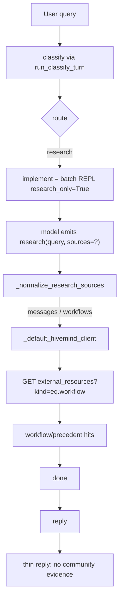
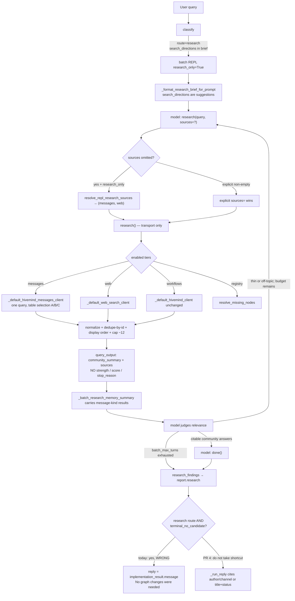

# Agent-Judgment Iteration for Informational Research (supersedes deterministic inner loop)

| Field | Value |
|---|---|
| **Author** | VibeComfy executor / research |
| **Date** | 2026-08-13 |
| **Status** | Draft |
| **Repo** | VibeComfy |
| **Parent** | [`docs/plans/informational-research-path.md`](informational-research-path.md) (messages client, tier gating, hoist) |
| **Supersedes** | Iteration / inner-loop / latch / expansion / `evidence_strength` / early-stop sections of [`docs/plans/discord-message-search-default.md`](discord-message-search-default.md); parent Goal 3, §3, Key Decisions 5 and 8, PR 5, and the inner-loop mermaid/observability. Parent Goal 2 / Decision 4 (inherit-on-omit) were already superseded by the child omit-default. |
| **Scope** | How the informational research path iterates: agent judgment only. Inherited client / omit-default / memory / hoist restated so this document is implementable alone. |
| **Related live probes** | MiniMax H3 community sentiment; LTX 2.5 praises/complaints (2026-08-12) |

This is a **constraint revision**, not a greenfield design. The messages client, tier gating, research-route omit-default, memory carry, hoist, and followup-as-prompt-text contracts are already agreed and are not reopened. What is overturned is every code-level decision about *what to search* and *when to stop*.

---

## Overview

Informational questions already classify to `route=research`, enter the batch REPL with `research_only=True`, and already let the model emit `research(...)` statements. They still return knowledge-free replies because (1) the `"messages"` tier is a no-op alias of the workflow Hivemind client, (2) omitted `sources=` defaults to `("workflows",)` at [`vibecomfy/porting/edit/_resolve.py:786`](../../vibecomfy/porting/edit/_resolve.py), (3) message-kind results do not persist in [`_batch_research_memory_summary`](../../vibecomfy/comfy_nodes/agent/_frag_batch_memory.py), and (4) even after findings are hoisted onto `report.research`, every successful research-route implement is `terminal_no_candidate` and **skips `_run_reply`**, so the user-facing reply stays the narrator’s “No graph changes were needed.” line. `_should_prefetch_research` is False for this route; that is not the reply hole.

The parent and child plans already specify the wiring fix (real messages client, `sources=` gating, research-route omit → `("messages", "web")`, memory persist, hoist). The child then added a **deterministic inner loop** inside `research()`: term expansion, IDF scoring, `evidence_strength` thresholds, early-stop, a session found-latch, tried-ok/tried-error sets, a 2-call network cap, and a research-only `max_batches = min(..., 4)` stop.

That inner loop is rejected.

> **User ruling (2026-08-12, DIRECT, FINAL):**
> "We should not have any deterministic loops or actions inside this whole flow, it should be based on agent judgment."

The flow is: the **model** chooses the query, judges whether the returned evidence is relevant, and decides — by its own judgment — whether to search again with different terms or call `done()`. Code transports, normalizes, dedupes-by-id for display, and bounds presentation. Code does **not** expand terms, score relevance, latch "found", or stop searching. The only bound is the existing REPL turn budget (`batch_max_turns`, default 50).

---

## Background & Motivation

Verified against live source on 2026-08-13. Parent and child have the full root-cause writeup; this section only restates what is still true and what the 2026-08-12 ruling changes.

### What is already true in code



- Classify already emits `route=research`, `intent=research`, `implement=false`, `source_preferences=["messages","web"]`, and `search_directions` for MiniMax/LTX-style questions. `ClassifyDecision.__post_init__` ([`contracts.py:486-518`](../../vibecomfy/executor/contracts.py)) canonicalizes booleans to `(research=True, implement=False)`.
- `_ROUTE_BEHAVIORS["research"]` ([`core.py:354-361`](../../vibecomfy/executor/core.py)) still sets `needs_implement=True`. The research route's "implement" phase *is* the agentic REPL, not a graph edit.
- `_should_prefetch_research` is **False** for `route=research` ([`core.py:504-524`](../../vibecomfy/executor/core.py); locked by `TestShouldPrefetchResearch.test_should_prefetch_research_false_for_research_route` at [`tests/test_executor_flows.py:4741`](../../tests/test_executor_flows.py)).
- `research()` has **no** `sources=` parameter ([`research.py:6212-6224`](../../vibecomfy/executor/research.py)). The omit site is `requested_source_tuple = requested_sources or ("workflows",)` ([`_resolve.py:786`](../../vibecomfy/porting/edit/_resolve.py)). `"messages"` is aliased to the workflow client ([`_resolve.py:804`](../../vibecomfy/porting/edit/_resolve.py)).
- `_batch_research_memory_summary` ([`_frag_batch_memory.py:185-243`](../../vibecomfy/comfy_nodes/agent/_frag_batch_memory.py)) only persists workflow markers (`"Concrete workflow pattern found"`, `"github_workflow_json"`, `"source_workflow_path"`, `"No node signature found"`, `"Registry check"`).
- `done()` refusal is already skipped on research-only ([`edit_batch_repl.py:2321`](../../vibecomfy/comfy_nodes/agent/edit_batch_repl.py) `and not research_only_route`). `batch_max_turns` defaults to 50 ([`_frag_state.py:222`](../../vibecomfy/comfy_nodes/agent/_frag_state.py)). `max_batches = max(1, int(state.batch_max_turns or 1))` at [`edit_batch_repl.py:1397`](../../vibecomfy/comfy_nodes/agent/edit_batch_repl.py) — there is **no** research-only 4-turn cap in live code.
- The Banodoco corpus already has the answers (live HTTP 2026-08-12, same publishable key [`research.py:72-73`](../../vibecomfy/executor/research.py)): `unified_feed` "ltx 2.5" and "minimax h3" hit `live_updates` / `ltx_chatter` / `minimax_h3_chatter`. The knowledge path is a wiring bug, not a corpus gap.

### Root cause the parent/child hoist missed — `_run_reply` never runs

Verified 2026-08-13. After `_run_implement` succeeds ([`core.py:2263-2270`](../../vibecomfy/executor/core.py)), `run_executor` does **not** always fall through to `_run_reply` ([`core.py:2386-2396`](../../vibecomfy/executor/core.py)):

```2310:2337:vibecomfy/executor/core.py
        if (
            route_behavior.can_produce_candidate
            and implementation_result.graph is not None
        ):
            ...
        elif _implementation_result_is_terminal_no_candidate(implementation_result):
            report = _build_report(...)
            reply_text = implementation_result.message
            ...
            return _finish(ExecutorResult.success(
                report=report,
                graph=None,
                reply=reply_text,
            ))
```

`_implementation_result_is_terminal_no_candidate` ([`core.py:2470-2474`](../../vibecomfy/executor/core.py)) delegates to `_implementation_response_is_terminal_no_candidate` ([`core.py:1595-1623`](../../vibecomfy/executor/core.py)), which returns True when `no_candidate_reason == "route_not_applyable"` and `graph_unchanged is not False`. Live `_build_batch_repl_response` **always** sets both for research ([`_frag_response_contract.py:1110-1112`](../../vibecomfy/comfy_nodes/agent/_frag_response_contract.py)):

```python
if canonical_route == "research":
    response["graph_unchanged"] = True
    response["no_candidate_reason"] = "route_not_applyable"
```

`_route_blocks_apply("research")` is True ([`_frag_research.py:402-409`](../../vibecomfy/comfy_nodes/agent/_frag_research.py)). `_ROUTE_BEHAVIORS["research"].can_produce_candidate` is False ([`core.py:354-361`](../../vibecomfy/executor/core.py)). The durable outcome is `noop`; `implementation_result.message` is the narrator/fallback from `_narrate_final_message` ([`_frag_narrator.py:351`](../../vibecomfy/comfy_nodes/agent/_frag_narrator.py)), which is fed `change.graph_unchanged` and has **no** `research_findings` / `community_summary` fields — typically “No graph changes were needed.”

Hoisting onto `report.research` without changing this early-return populates the report while the **user reply stays the knowledge-free narrator line**. PR 4 must both hoist *and* take the research route through `_run_reply`. Do not treat `implementation_result.message` as the research answer.

### What the child added that this document deletes

The child ([`discord-message-search-default.md`](discord-message-search-default.md) §2, Key Decisions 5–8, PR 4) specified:

| Deleted mechanism | Why it is gone |
|---|---|
| `vibecomfy/executor/research_iteration.py` | Existed only for expansion / scoring / latch |
| `expand_research_queries` / `QueryVariant` | Code choosing what to search |
| `evidence_strength` / `score_message_source` / IDF as a found-predicate | Code judging relevance |
| `EvidenceCard.strength` / `top_score` / `stop_reason` | Code telling the model it is done |
| Early-stop inside `research()` | Code deciding when to stop a search |
| Session found-latch (`community_latch`, `tried_ok_queries`, `tried_error_queries`, `research_network_calls`, `latched_message_sources`) | Code deciding the next call is forbidden |
| `_MAX_RESEARCH_NETWORK_CALLS = 2`, `_run_messages_iteration`, `_research_result_from_latch`, `_update_session_latch_from_result`, `_union_message_sources` merge ranking | Inner loop + outer cap |
| `research(..., tried_queries=, prior_sources=, evidence_latch=, search_directions=)` | Iteration kwargs |
| `VIBECOMFY_MESSAGES_MAX_VARIANTS`, `VIBECOMFY_MESSAGES_WALLCLOCK_S` | Search/stop knobs |
| Research-only `max_batches = min(..., 4)` | A new deterministic stop. Live default is 50. Do not add this cap. |
| `tests/test_research_iteration.py` | That module is gone |

What remains of "iteration" is the **existing** batch REPL: the model emits another `research(...)` or `done()`. Memory + followup prompt text are how the model sees prior evidence and is *nudged* (not forced) to search again or stop.

---

## Goals & Non-Goals

### Goals

1. State and enforce the no-deterministic-loop constraint: the agent searches, judges, and iterates by judgment; code only transports and displays evidence.
2. Restate the already-agreed messages client, tier gating, research-route omit-default, memory carry, hoist, and prompt-text followup so this document is implementable without reopening those decisions.
3. Specify the agent-judgment contract in implementable detail: what `research()` returns, what the model sees, what memory persists, exact followup text, budget-exhaustion behavior, and how `search_directions` stay prompt-visible without being executed.
4. Fold remaining work into a PR plan that **drops** the inner-loop/latch PR. Live MiniMax/LTX re-probe remains the acceptance gate after hoist **and** the `_run_reply` early-return fix.
5. Keep tests honest: no assertions on scoring / expansion / latch / early-stop.

### Non-goals

- Reopening the messages client playbook, omit-default, hoist insertion, or web backoff.
- Prefetching research for `route=research`.
- Auto-injecting a synthetic `research()` statement.
- Inherit-on-omit of classify `source_preferences`.
- Changing classify route vocabulary or research-route `needs_implement=True`.
- Replacing the workflow Hivemind client or searching `unified_feed` for workflows.
- FTS, unfiltered `limit=1000`, reaction ranking, distillation write-back, new product UI, graph edits on informational answers.
- Growing [`research.py`](../../vibecomfy/executor/research.py) (already 6558 lines) by an iteration module. There is no iteration module.

---

## Key Decisions

1. **No deterministic loop or action decides what to search or when to stop.** Per the 2026-08-12 ruling (quoted in Overview). The agent issues `research(...)`, reads the returned sources, and either searches again or calls `done()`. Determinism is allowed only in transport plumbing: HTTP clients, table selection (distillations-first then `kind=eq.message`, channel-scoped `message_feed` fallback via `_raw_message_hits_are_thin` — that is table selection for **one** query, not iteration), formulating `Q` for that one string (distinctive-token join + individual-token Step D — **not** extracting multiple variants), normalization, dedupe-by-id at the display/collection layer, a simple display order (approved distillations first, then recency), and a result cap (~12 sources in `query_output`). Not allowed: term expansion, IDF-as-found-predicate, `evidence_strength` thresholds, early-stop, found-latch, tried-ok/tried-error sets, variant caps, wall-clock stop, network-call caps, or a research-only `max_batches=4`.

2. **The only bound is the existing REPL turn budget.** `max_batches = max(1, int(state.batch_max_turns or 1))` ([`edit_batch_repl.py:1397`](../../vibecomfy/comfy_nodes/agent/edit_batch_repl.py)). `batch_max_turns` defaults to 50 ([`_frag_state.py:222`](../../vibecomfy/comfy_nodes/agent/_frag_state.py)) and is already overridable via implement payload `max_batches` ([`_frag_entrypoint.py:249-250`](../../vibecomfy/comfy_nodes/agent/_frag_entrypoint.py)). There is no `research()`-call cap, no variant cap, no timeout-derived stop, no latch. If the agent burns the budget, hoist whatever was collected and reply honestly. **Do not add** the child's `if research_only_route: max_batches = min(max_batches, 4)`.

3. **Two Hivemind clients, one transport** (parent Decision 1, inherited). Workflow search stays on `external_resources?kind=eq.workflow`. Messages search is `_default_hivemind_messages_client` on `unified_feed` + `message_feed`. `HivemindClient = Callable[[str, float], dict[str, Any]]` ([`research.py:138`](../../vibecomfy/executor/research.py)) is not widened.

4. **Research-route omit default, not inherit-on-omit** (child Decision 1, inherited). On a `research_only` REPL session, omitted `sources=` (including `[]`) resolve to `("messages", "web")` via `resolve_repl_research_sources()`. Explicit non-empty `sources=` wins with no union. Adapt/revise omit stays `("workflows",)`. Public `research(query)` with `sources=None` stays legacy (messages off). Classify `source_preferences` stay prompt-visible and are not a hidden control path.

5. **`research()` honors the `sources=` tuple it is passed.** It does not read classify prefs, `research_only`, or `search_directions`. When `sources` is a tuple, only listed tiers run. When `sources is None` (legacy public API), messages stay off.

6. **Evidence carries across REPL turns so the agent can judge.** Fix `_batch_research_memory_summary` to persist message-kind `query_output` / `research_query` / `community_summary`. This is prompt memory, not a latch.

7. **Followup guidance is static prompt text, not a strength-gated branch.** When messages are in play (`"messages" in source_set and "workflows" not in source_set and "registry" not in source_set`), emit **only** the messages followup. Do **not** gate the wording on `evidence_strength`. Explicit `sources=["web"]` still gets External workflow check. Do **not** use `source_set <= {"messages", "web"}` (that swallows `sources=["web"]`).

8. **`search_directions` stay in the research brief.** `_format_research_brief_for_prompt` ([`_frag_state.py:479-505`](../../vibecomfy/comfy_nodes/agent/_frag_state.py)) already JSON-dumps them on turn 0. Memory echoes them as optional candidate terms on later turns. Code does **not** execute them. `research()` does **not** grow a `search_directions=` kwarg.

9. **Hoist findings after `_run_implement` and fall through to `_run_reply`.** Additive `ResearchResult.community_summary` (field + `research()` writer land in PR 3; hoist only reads). No `evidence_card` with `strength` / `top_score` / `stop_reason`. Display packet is `community_summary` + normalized `sources`. Do **not** take the `terminal_no_candidate` shortcut when `_canonical_route_for_plan(plan) == "research"` — that shortcut assigns `reply = implementation_result.message` and never calls `_run_reply`. Live MiniMax/LTX re-probe is the gate on the hoist + reply-path PR.

10. **Extract `hivemind_clients.py` + `research_sources.py` only.** Do not create `research_iteration.py`. Edit live `_frag_*` modules, not generated `edit_*.py` SOURCE wrappers. Additive contracts only. `VIBECOMFY_MESSAGES_RESEARCH=0` may stay as a transport kill switch for the messages *client*; it is not a search/stop decision.

---

## Proposed Design

### Target control flow

No inner-loop box. The only loop is the existing batch REPL.



### Module layout

[`research.py`](../../vibecomfy/executor/research.py) is 6558 lines. Do **not** grow it by an iteration module.

| File | Responsibility |
|---|---|
| `vibecomfy/executor/hivemind_clients.py` | **New** (parent). Shared PostgREST GET, workflow client move/re-export, messages client, channel map, `_raw_message_hits_are_thin`, normalize-only runner, **approved-then-recency display order (no IDF / no `score <= 0` drop)**, `format_community_summary`, `_query_tokens` / stopword frozensets (re-exported from `research.py`). |
| `vibecomfy/executor/research_sources.py` | **New** (child, omit-default only). `canonicalize_research_sources`, `resolve_repl_research_sources`. No HTTP. No `core` import. |
| `vibecomfy/executor/research.py` | Façade: additive `sources=`, `hivemind_messages_client=`. Four tier booleans. Sets `ResearchResult.community_summary` when the messages tier ran (PR 3). Re-export workflow client. **No** inner loop. **No** `search_directions=` / `tried_queries=` / `prior_sources=` / `evidence_latch=`. |
| `vibecomfy/executor/research_iteration.py` | **Do not create.** |
| `vibecomfy/porting/edit/_resolve.py` | Omit-site calls `resolve_repl_research_sources`. Split clients. Messages followup (static text). `_format_research_query_output` prints `community_summary` + author/channel (up to 12 when message/distillation sources are present). |
| `vibecomfy/comfy_nodes/agent/edit_batch_repl.py` | Stash `session.research_only`, `session.executor_research_brief`. Owns `_fold_research_statement` and `_dedupe_sources_by_id`; fold live `StatementResult.detail` after each resolve. **No** `max_batches=4`. **No** latch attributes. |
| `vibecomfy/comfy_nodes/agent/_frag_batch_memory.py` | Persist any `research_query` and message-kind markers. Echo brief `search_directions` as optional candidate terms. |
| `vibecomfy/comfy_nodes/agent/_frag_state.py` | Additive `collected_research_sources`, `collected_research_summary`, `collected_community_summary`. `executor_research_brief` already exists at line 207. **No** `collected_evidence_card`. |
| `vibecomfy/comfy_nodes/agent/_frag_response_contract.py` | Stamp `research_findings` before `build_legacy_agent_edit_v1` (~1160). Re-synthesize `community_summary` from the union if the folded paragraph is empty. |
| `vibecomfy/comfy_nodes/agent/_frag_entrypoint.py` | Already assigns `state.executor_research_brief` (237–238). Do not change generated wrappers. |
| `vibecomfy/comfy_nodes/agent/provider.py` | Research-only prompt: omit 4-turn apply-edit cap and construction surface; document omit default; instruct search-again-vs-done as judgment. |
| `vibecomfy/executor/core.py` | Hoist after `_run_implement`. **Skip the `terminal_no_candidate` early-return when route is `research`** so `_run_reply` runs. `_run_reply` prefers `community_summary`. Update distilled/faster canned `avoid`. |
| `vibecomfy/executor/contracts.py` | Additive `community_summary: str = ""` on `ResearchResult` (**lands in PR 3**, not PR 4). **No** `evidence_card`. |
| `vibecomfy/executor/prompts.py` | Reply citation split + route-gate “explain why nothing changed”. |

Generated `edit_*.py` SOURCE wrappers are **not live**. Behavior changes go in `_frag_*` and `edit_batch_repl.py`.

Keep `_default_hivemind_client` importable from `research.py` so existing patches (`vibecomfy.executor.core._default_hivemind_client`, `vibecomfy.executor.research._default_hivemind_client`) keep working.

---

### 1. Genuine messages research tier (inherited — parent §1, with one ranking delta)

Restated so this document is implementable alone. Client playbook, tables, channel map, normalize-only runner, and `HivemindClient` shape are inherited — **do not reopen**. Display ranking is **not** inherited as written in parent §1.

**Explicit delta vs parent §1 ranking (PR 1 implementers: follow this document, not `_rank_message_rows`):**

| Parent §1 (superseded for ranking) | This document |
|---|---|
| `_rank_message_rows` with IDF / phrase-in-title bonuses | **Do not implement** |
| **Skip rows with `score <= 0`** | **Do not drop rows on a score bar** — that is a deterministic filter on what the agent may judge |
| Workflow bonuses explicitly excluded (keep that) | Still exclude workflow bonuses |
| Display: approved → pending → daily_summaries → topic → other | Display: approved distillations → pending distillations → recency. Topic/daily_summaries is a **tie-break inside the same status bucket only** |

A PR 1 test must assert a low-IDF on-topic row (e.g. a `ltx_chatter` message whose title does not contain every query token) is still returned. Do not ship parent `_rank_message_rows`.

#### Shared transport

Generalize `_hivemind_get` (today bound to `_DEFAULT_HIVEMIND_URL = …/external_resources` at [`research.py:72`](../../vibecomfy/executor/research.py) / [`research.py:532`](../../vibecomfy/executor/research.py)):

```python
_HIVEMIND_REST_ROOT = "https://ujlwuvkrxlvoswwkerdf.supabase.co/rest/v1"
_DEFAULT_HIVEMIND_KEY = "sb_publishable_O38oPBafrBoFrpi_rlWJvA_UJrulFsx"  # research.py:73

def _hivemind_get_table(
    table: str,
    params: Mapping[str, str],
    *,
    timeout: float,
) -> Any:
    """GET {REST_ROOT}/{table}?{urlencode(params)} with the publishable anon key.

    ``table`` is one of: external_resources, unified_feed, message_feed.
    Raises HivemindError on HTTP / timeout / invalid JSON. Never logs the key.
    """
```

`_default_hivemind_client` keeps calling `_hivemind_get_table("external_resources", …)` with `kind=eq.workflow`. Existing `TestDefaultHivemindClient` assertions stay green.

#### Channel map

Port the hivemind skill map, plus live `minimax_h3_chatter`. The skill omits `live_updates`; this design adds it (live probes' LTX hits live there).

```python
_DAILY_SUMMARIES = ("daily_summaries",)

_CHANNEL_GROUPS: dict[str, tuple[str, ...]] = {
    "ltx": ("ltx_chatter", "ltx_resources", "ltx_gens", "ltx_training", "live_updates", "resources"),
    "wan": ("wan_chatter", "wan_comfyui", "wan_gens", "wan_resources", "live_updates", "resources"),
    "comfy": ("comfyui", "wan_comfyui", "ltx_chatter", "live_updates", "resources"),
    "minimax": ("minimax_h3_chatter", "ltx_chatter", "live_updates", "chatter", "art_sharing"),
    "training": ("training_control_loras", "ltx_training", "wan_training", "comfyui"),
    "general": ("chatter", "live_updates", "nsfw", "introductions", "art_sharing"),
}

_FAMILY_TO_GROUP = (
    (("ltx", "ltxv", "lightricks", "ltx 2.5", "ltx2.5"), "ltx"),
    (("wan", "wanvideo", "vace", "scail", "infinitetalk", "lightx2v"), "wan"),
    (("minimax", "minimax h3", "h3"), "minimax"),
    (("comfy", "comfyui", "kijai"), "comfy"),
)

def _channel_scope_for_query(query: str) -> tuple[str, ...]:
    """daily_summaries first, then matching topic groups, then general fallback.

    Never returns empty: at minimum (daily_summaries, chatter).
    Cap at 10 channel names so PostgREST ``in.()`` stays cheap.
    """
```

`_FAMILY_TO_GROUP` / `_channel_scope_for_query` are **table-selection** helpers for a single query string. They are not a term-expansion loop.

#### Messages client signature

Keep `HivemindClient = Callable[[str, float], dict[str, Any]]`. Do **not** widen with `channels=` / `limit=` — existing fakes are `(query, timeout)`.

```python
def _default_hivemind_messages_client(query: str, timeout: float) -> dict[str, Any]:
    """Search Banodoco community knowledge.

    Channel scope is computed inside via ``_channel_scope_for_query(query)``
    (includes ``live_updates`` for LTX / general / minimax groups). Returns
    ``{"results": [unified-shaped dicts...], "warnings": [...]}``.
    Each result keeps raw unified_feed / message_feed columns plus
    ``_hivemind_table`` and ``_match_query`` for audit.
    """
```

#### Messages runner is normalize-only

Do **not** reuse `_run_hivemind_research` ([`research.py:1072-1114`](../../vibecomfy/executor/research.py)). It scans `url`/`body`/`content` and calls `_hivemind_workflow_url_candidates` + `_fetch_external_workflow_json_source`. `_ALLOWED_DIRECT_WORKFLOW_JSON_HOSTS` ([`research.py:125-129`](../../vibecomfy/executor/research.py)) includes `cdn.discordapp.com` / `media.discordapp.net`. Message rows with Discord attachment URLs would be treated as workflow JSON.

```python
def _run_hivemind_messages_research(
    query: str,
    *,
    client: HivemindClient,
    timeout: float,
) -> tuple[dict[str, Any], ...]:
    """Call ``client(query, timeout)`` and normalize only.

    No ``_hivemind_workflow_url_candidates``. No
    ``_fetch_external_workflow_json_source``. Channel scope lives inside
    the default client, not on this runner. One call, one query string.
    """
    response = client(query, timeout)
    items = response.get("results", response.get("sources", []))
    if not isinstance(items, list):
        return ()
    return tuple(
        _normalize_hivemind_message_source(item)
        for item in items
        if isinstance(item, dict)
    )
```

#### Phrase helper (single-token must work) — how `Q` is built

`_hivemind_phrase_ilike_query` ([`research.py:701-715`](../../vibecomfy/executor/research.py)) returns `None` unless there are **≥2** non-stopword tokens. Reusing it would drop `ltx` / `minimax`. Do **not** reuse it on `unified_feed`. Do **not** call `_hivemind_search_terms` (that helper emits **3-grams first**, e.g. `"do people think"` — [`research.py:606-644`](../../vibecomfy/executor/research.py)).

`Q` is transport for **one** model query string, not a search loop. Specify it exactly:

```python
def _distinctive_tokens(query: str) -> list[str]:
    """Tokens remaining after ``_SEARCH_STOPWORDS | _HIVEMIND_FALLBACK_STOPWORDS``.

    Uses the existing frozensets only (research.py:145-174 and :180+).
    Does **not** add question-word stopwords (people/think/about/new/do).
    Does **not** extract a family+version span (that would reintroduce
    expand_research_queries). Keep version-like tokens (contain a digit).
    Preserve original order. Cap at 8 tokens.
    """


def _hivemind_single_or_phrase_ilike(query: str) -> str | None:
    """Build ``or=(title.ilike.*Q*,body.ilike.*Q*)`` for this one query.

    ``Q`` is the distinctive tokens joined with a single space (one token
    if only one remains). Returns None only when no distinctive token remains.
    Never falls through to unscoped token-OR on unified_feed.
    Never emits a second variant. Never calls ``_hivemind_search_terms``.
    """
```

Worked example — the model wrote `research("What do people think about the new MiniMax H3 model?")`:

- `_SEARCH_STOPWORDS` drops `what` / `the`.
- `_HIVEMIND_FALLBACK_STOPWORDS` drops `model`.
- Remaining distinctive tokens, original order: `do people think about new MiniMax H3`.
- Steps A/B `Q` = that joined phrase. It will **not** `ilike`-match a title such as “MiniMax H3 is amazing”. That is expected. Recall for this NL string is Step D (individual-token OR on channel-scoped `message_feed`), not a second expanded query.

If the model writes `research("MiniMax H3")` or `research("LTX 2.5")`, `Q` is that short phrase and A/B can hit directly. Prompt + followup tell the agent to prefer model name + version.

#### Query sequence (per `research()` call — one query string)

Always scoped `ilike`. Never FTS. Never unfiltered `limit=1000`. This is **one** search the model asked for, not an expansion over variants.

**Step A — distillations first**

```text
GET /unified_feed?select=*
  &kind=eq.distillation
  &or=(title.ilike.*PHRASE_OR_TOKEN*,body.ilike.*PHRASE_OR_TOKEN*)
  &limit=20
```

**Step B — unified_feed messages only** (same phrase/token)

```text
GET /unified_feed?select=*
  &kind=eq.message
  &or=(title.ilike.*PHRASE_OR_TOKEN*,body.ilike.*PHRASE_OR_TOKEN*)
  &order=created_at.desc
  &limit=20
```

`kind=eq.message` is intentional. Articles / transcripts / workflow resources in the unified view are v1 non-goals.

**Step C — `message_feed`, channel-scoped** (if A+B are thin or timed out)

Thin is a **client-local** predicate on raw PostgREST rows. It decides whether to open a second table for **this** query. It is not a found-predicate for the REPL and must **not** call `evidence_strength` (that helper does not exist).

```python
def _raw_message_hits_are_thin(rows: list[Mapping[str, Any]], query: str) -> bool:
    """True when A+B are not yet enough to skip message_feed.

    Operates on raw PostgREST dicts (``kind``, ``title``, ``body``/``content``,
    ``metadata.status``). Never reads ``source``.

    Not thin (skip Step C) when either:
      - any row has ``kind == "distillation"`` and
        ``(metadata or {}).get("status") == "approved"`` and a distinctive
        token appears in title/body, or
      - >= 3 rows with ``kind in {"message", "distillation"}`` whose
        title/body/content contain a distinctive token.
    Otherwise thin (run Step C). Empty rows are thin. Timeout is always thin.
    """
```

```text
GET /message_feed?select=message_id,content,author_name,channel_name,channel_id,created_at
  &channel_name=in.(daily_summaries,ltx_chatter,live_updates,...)
  &content=ilike.*PHRASE_OR_TOKEN*
  &order=created_at.desc
  &limit=30
```

On HTTP 500 / statement timeout (`SQLSTATE 57014`):

1. Retry with only `daily_summaries`.
2. Retry with the single densest topic group (still including `live_updates` for LTX).
3. Optionally add `created_at=gte.<90d>`.
4. Convert remaining failure to `HivemindError` → warning.

**Step D — individual-token OR fill** only on `message_feed` with channel scope, never as the first `unified_feed` query. Tokens are `_distinctive_tokens(query)` (the same list used to build `Q`), each becoming `content.ilike.*TOKEN*`, OR’d together, still channel-scoped, `limit=30`.

```text
GET /message_feed?select=message_id,content,author_name,channel_name,channel_id,created_at
  &channel_name=in.(daily_summaries,ltx_chatter,live_updates,...)
  &or=(content.ilike.*do*,content.ilike.*people*,...,content.ilike.*MiniMax*,content.ilike.*H3*)
  &order=created_at.desc
  &limit=30
```

This is table-selection / query formulation for **one** model string, not iteration. Do **not** walk those tokens as separate `research()` calls. Do **not** emit 3-grams. Do **not** use `_hivemind_search_terms()[0]`. Run Step D when A+B+C are thin or timed out (same thin predicate as Step C). A raw MiniMax/LTX question must be able to match live titles via this token-OR, not via `expand_research_queries`.

#### Dedupe, display order, normalize

Snowflake ids are `str(...)`. Discord `message_id` is a bigint; JSON numbers lose precision above 2^53.

```python
def _hivemind_item_id(row: Mapping[str, Any]) -> str:
    raw = row.get("item_id", row.get("message_id", row.get("id")))
    return "" if raw is None else str(raw)

def _message_dedupe_key(row: Mapping[str, Any]) -> str:
    kind = str(row.get("kind") or "")
    item_id = _hivemind_item_id(row)
    if kind and item_id:
        return f"{kind}:{item_id}"
    return str(row.get("url") or f"{row.get('author')}:{row.get('body', '')[:80]}")
```

Display order (not a found-predicate; **delta vs parent §1** — do **not** implement `_rank_message_rows`; do **not** drop rows on an IDF score bar or `score <= 0`):

1. Approved distillations.
2. Pending distillations.
3. Recency (`created_at` descending).

A daily_summaries / topic-channel preference may be used as a **tie-break inside the same status bucket**. Do not use IDF scoring to decide "found" or to skip the agent's next `research()`. A low-IDF on-topic row must still appear.

Cap presented sources at 12. That is a display bound, not a stop-searching decision. The same 12-cap applies to `query_output`, `detail["research_result_sources"]`, and hoisted findings (see §4).

```python
def _normalize_hivemind_message_source(item: dict[str, Any]) -> dict[str, Any]:
    kind = item.get("kind") or "message"
    if kind != "distillation" and item.get("_hivemind_table") == "message_feed":
        kind = "message"
    title = _first_text(item, "title", "class_type")
    body = _first_text(item, "body", "content", "description", "text")
    if not title and body:
        title = _excerpt(body, limit=80)
    channel = (
        item.get("context")
        or item.get("channel_name")
        or item.get("channel")
        or ""
    )
    metadata = item.get("metadata") if isinstance(item.get("metadata"), dict) else {}
    source_kind = (
        "hivemind_distillation" if kind == "distillation" else "hivemind_message"
    )
    return {
        "class_type": title,
        "title": title,
        "score": item.get("score", 0),  # unused as a found-predicate
        "reasons": _coerce_tasks(item.get("reasons", [])),
        "source": source_kind,
        "kind": kind,
        "pack": channel or "banodoco-discord",
        "description": _excerpt(body),
        "tasks": [],
        "path": None,
        "hivemind_id": _hivemind_item_id(item),
        "url": _first_text(item, "url", "source_url", "permalink"),
        "author": _first_text(item, "author", "author_name"),
        "channel": channel if kind != "distillation" else "",
        "created_at": item.get("created_at"),
        "distillation_status": metadata.get("status"),
        "confidence": metadata.get("confidence"),
        "node_types": None,
        "workflow_schema": None,
    }
```

Stamp via existing `_stamp_source_evidence_meta`. Extend `_source_tier_for_source` ([`research.py:2343`](../../vibecomfy/executor/research.py)) and `_TIER_TTL_MAP` ([`research.py:103-113`](../../vibecomfy/executor/research.py)):

```python
"hivemind_message": _DEFAULT_HIVEMIND_TTL,       # 7d
"hivemind_distillation": _DEFAULT_HIVEMIND_TTL,
```

`_build_summary` ([`research.py:396-445`](../../vibecomfy/executor/research.py)) currently prefers workflow path/url language and appends `WORKFLOW_RESEARCH_GUIDANCE`. When any source has `source in {hivemind_message, hivemind_distillation}`, emit:

```text
Found N community result(s): <top titles>. Channels: ltx_chatter, daily_summaries.
```

Do not append `WORKFLOW_RESEARCH_GUIDANCE` for a messages-only result set.

#### Injectability

```python
def research(
    query: str,
    *,
    # existing kwargs unchanged...
    hivemind_client: HivemindClient | None | object = _USE_DEFAULT,
    hivemind_messages_client: HivemindClient | None | object = _USE_DEFAULT,
    sources: tuple[str, ...] | None = None,
) -> ResearchResult:
```

Default `hivemind_messages_client` → `_default_hivemind_messages_client`. `None` skips the messages tier. Existing callers that pass only `hivemind_client=` keep today's workflow behavior.

`VIBECOMFY_MESSAGES_RESEARCH=0` forces the messages client to `None` and adds a warning `"messages tier disabled"`. Transport on/off, not a search/stop decision. Do **not** add `VIBECOMFY_MESSAGES_MAX_VARIANTS` or `VIBECOMFY_MESSAGES_WALLCLOCK_S`.

---

### 2. Executor-level tier gating (inherited — parent §2, child's four-boolean split)

```python
source_set = set(sources) if sources is not None else None
run_workflows = source_set is None or "workflows" in source_set
run_messages = source_set is not None and "messages" in source_set
run_web = source_set is None or "web" in source_set
run_registry = source_set is None or "registry" in source_set

messages_enabled = (
    run_messages
    and os.environ.get("VIBECOMFY_MESSAGES_RESEARCH", "1") != "0"
)
```

| Condition | Workflow Hivemind | Messages client | Web | Registry | `local_limit` |
|---|---|---|---|---|---|
| `sources is None` (legacy) | default | **skip** | default | default | as passed |
| `sources=("messages",)` | skip | default | **skip** | **skip** | 0 |
| `sources=("messages","web")` | skip | default | default | **skip** | 0 |
| `sources=("web",)` | skip | skip | default | skip | 0 |
| `sources=("workflows",)` | default | skip | skip | skip | as passed |
| `sources=("messages",)` and `VIBECOMFY_MESSAGES_RESEARCH=0` | skip | **skip** + warning | skip | skip | 0 |

When a default injectable would run but the tier is off, assign `None`. Public `research(..., sources=("messages",))` must not hit DDG/Brave or `resolve_missing_nodes`. Today's `research("Hotshot XL")` must not grow a Discord search.

Adapt prefetch (`_run_research`) still passes only `hivemind_client=_default_hivemind_client`. Out of scope.

`_normalize_research_sources` ([`_resolve.py:448-481`](../../vibecomfy/porting/edit/_resolve.py)) diagnostic contract is unchanged: invalid explicit sources still return `unsupported_research_source`. Tests in `tests/test_porting_edit_resolve.py` lock that.

---

### 3. Research-route omit default (inherited — child §1)

New module `vibecomfy/executor/research_sources.py`. **Do not import `core`.**

```python
from __future__ import annotations

from collections.abc import Mapping
from typing import Any

# Keep in lockstep with _RESEARCH_SOURCE_ALIASES in
# vibecomfy/porting/edit/_resolve.py:425-445.
_ALLOWED_RESEARCH_TIERS = frozenset({"workflows", "registry", "messages", "web"})

_RESEARCH_SOURCE_ALIASES: dict[str, str] = {
    "local": "workflows",
    "workflow": "workflows",
    "workflows": "workflows",
    "template": "workflows",
    "templates": "workflows",
    "registry": "registry",
    "comfy-registry": "registry",
    "comfy_registry": "registry",
    "manager": "registry",
    "comfyui-manager": "registry",
    "custom_nodes": "registry",
    "custom-nodes": "registry",
    "hivemind": "messages",
    "message": "messages",
    "messages": "messages",
    "discord": "messages",
    "web": "web",
    "github": "web",
    "internet": "web",
}

_RESEARCH_ROUTE_DEFAULT_SOURCES: tuple[str, ...] = ("messages", "web")
_EDIT_ROUTE_DEFAULT_SOURCES: tuple[str, ...] = ("workflows",)


def canonicalize_research_sources(
    value: Any,
    *,
    default: tuple[str, ...] = _EDIT_ROUTE_DEFAULT_SOURCES,
) -> tuple[str, ...]:
    """Normalize aliases; drop unknown; preserve order.

    Empty / None → ``default``. Never returns a CompactDiagnostic.
    ``_normalize_research_sources`` in _resolve.py keeps the diagnostic
    contract for invalid *explicit* sources=.
    """
    if value is None:
        return default
    if isinstance(value, str):
        raw_items = [value]
    elif isinstance(value, (list, tuple, set)):
        raw_items = list(value)
    else:
        return default
    normalized: list[str] = []
    seen: set[str] = set()
    for item in raw_items:
        if not isinstance(item, str):
            continue
        source = _RESEARCH_SOURCE_ALIASES.get(item.strip().casefold())
        if source is None or source not in _ALLOWED_RESEARCH_TIERS or source in seen:
            continue
        seen.add(source)
        normalized.append(source)
    return tuple(normalized) if normalized else default


def resolve_repl_research_sources(
    requested: tuple[str, ...] | None,
    *,
    research_only: bool,
) -> tuple[str, ...]:
    """Single omit-site resolver.

    * Non-empty explicit ``sources=`` (already passed through
      ``_normalize_research_sources``) wins with no union.
    * ``None`` **or empty** ``()`` is omit. ``sources=[]`` is omit, not
      “search nothing.” This matches today’s
      ``requested_sources or ("workflows",)`` truthiness.
    * Omitted + research-only → ``("messages", "web")``.
    * Omitted + any other route → ``("workflows",)``.
    """
    if requested:
        return requested
    if research_only:
        return _RESEARCH_ROUTE_DEFAULT_SOURCES
    return _EDIT_ROUTE_DEFAULT_SOURCES
```

`_RESEARCH_SOURCE_ALIASES` is duplicated so `_resolve.py` can keep its copy next to the diagnostic helper. Do **not** change `_normalize_research_sources`.

#### Call site — the only place omitted sources become a corpus

[`_resolve_query_statement`](../../vibecomfy/porting/edit/_resolve.py) today (`:786-806`):

```python
requested_source_tuple = requested_sources or ("workflows",)
source_set = set(requested_source_tuple)
...
hivemind_client=None if not source_set.intersection({"messages", "workflows"}) else research_module._default_hivemind_client,
```

Replace with:

```python
from vibecomfy.executor.research_sources import resolve_repl_research_sources

research_only = bool(getattr(self, "research_only", False))
requested_source_tuple = resolve_repl_research_sources(
    requested_sources,  # None or () → omit
    research_only=research_only,
)
source_set = set(requested_source_tuple)

output = research_module.research(
    query,
    local_limit=5 if "workflows" in source_set else 0,
    hivemind_timeout=3.0,
    web_search_timeout=3.0,
    registry_resolver=registry_resolver if "registry" in source_set else None,
    hivemind_client=(
        research_module._default_hivemind_client
        if "workflows" in source_set
        else None
    ),
    hivemind_messages_client=(
        research_module._default_hivemind_messages_client
        if "messages" in source_set
        else None
    ),
    web_search_client=(
        research_module._default_web_search_client
        if "web" in source_set
        else None
    ),
    sources=requested_source_tuple,
)
```

Do **not** pass `search_directions=`, `tried_queries=`, `prior_sources=`, or `evidence_latch=`. Those kwargs do not exist.

`research()` honors the `sources=` tuple. It does **not** read classify prefs or `research_only`.

#### Stashing session flags

`EditSession.__init__` ([`session.py:119-131`](../../vibecomfy/porting/edit/session.py)) is not extended. Assign public attributes immediately after construction in live [`edit_batch_repl.py:1250-1255`](../../vibecomfy/comfy_nodes/agent/edit_batch_repl.py).

`research_only_route` is currently computed ~70 lines later ([`edit_batch_repl.py:1323`](../../vibecomfy/comfy_nodes/agent/edit_batch_repl.py)). Move `canonical_route = deps._canonical_agent_edit_route(...)` and `research_only_route = canonical_route == "research"` to just above `EditSession(...)`. Same values, earlier.

```python
canonical_route = deps._canonical_agent_edit_route(state.route or route)
research_only_route = canonical_route == "research"

session = edit_session_module.EditSession(
    prepared_ui,
    schema_provider=state.schema_provider,
    value_default_context=value_default_context,
)
session.executor_research_brief = state.executor_research_brief  # dict | None
session.research_only = research_only_route
state.batch_session = session
```

Tests can set `session.research_only = True` without constructing `AgentEditState`.

**Do not assign** `community_latch`, `latched_message_sources`, `tried_ok_queries`, `tried_error_queries`, or `research_network_calls`.

#### Compatibility matrix

| Caller | `sources=` | `research_only` | Resolved sources | Discord? |
|---|---|---|---|---|
| REPL, route=research, model omits | `None` | `True` | `("messages", "web")` | yes |
| REPL, route=research, `sources=[]` | empty | `True` | `("messages", "web")` (omit) | yes |
| REPL, route=research, distilled/faster canned brief, model omits | `None` | `True` | `("messages", "web")` — brief prefs stay prompt-only | yes |
| REPL, route=research, `sources=["messages","web"]` | explicit | `True` | as written | yes |
| REPL, route=research, `sources=["web"]` | explicit | `True` | `("web",)` | no |
| REPL, route=research, `sources=["workflows"]` | explicit | `True` | `("workflows",)` | no |
| REPL, route=adapt, model omits | `None` | `False` | `("workflows",)` | no |
| REPL, route=adapt, `sources=["messages"]` | explicit | `False` | `("messages",)` | yes (explicit) |
| Public `research("Hotshot XL")` | `None` (legacy) | n/a | all current tiers, **messages off** | no |
| Public `research(..., sources=("messages",))` | explicit | n/a | messages only | yes |
| Adapt prefetch `_run_research` | n/a | n/a | workflow client only | no |

The Sisypy `distilled-faster-research-route.yaml` actor emits a canned `research("...", sources=["workflows"])`. Explicit wins. PR 3 updates the canned `avoid` in `_research_brief_from_plan` ([`core.py:1671-1674`](../../vibecomfy/executor/core.py)) from `"treating Discord snippets as authoritative without workflow evidence"` to `"inventing community consensus that the sources do not support"`.

---

### 4. Agent-judgment iteration contract

This is the replacement for the child's §2. There is no inner loop.

#### What each `research()` call does

1. Resolve enabled tiers from `sources=` (Decision 5).
2. If messages enabled: **one** `_run_hivemind_messages_research(query, ...)` with the **model's** query string. Table selection A/B/C may fire inside the client for that one string.
3. If web / workflows / registry enabled: those tiers run as they do today.
4. Normalize, dedupe-by-id, apply display order, cap at 12 message/distillation sources in the presented set (web/workflow sources keep their existing presentation).
5. Build an extractive `community_summary` when any message/distillation source is present (display only).
6. Return `ResearchResult`. Done. No variants. No early-stop. No latch update.

#### What `research()` returns

`community_summary` has **one producing seam**, landed in **PR 3** (not PR 4):

1. PR 1 adds `format_community_summary` in `hivemind_clients.py` (helper only; `ResearchResult` has no field yet).
2. PR 3 adds `community_summary: str = ""` on the frozen `ResearchResult` dataclass ([`contracts.py:1940`](../../vibecomfy/executor/contracts.py)) and `to_dict()` emits the key only when non-empty. `research()` **assigns** it whenever the messages tier ran (including the empty-set sentence). `_format_research_query_output` and `_fold_research_statement` then **read** `output.community_summary`.
3. PR 4’s `_research_result_from_findings` is **not** the only writer — it copies whatever the stamp site put on `research_findings`. The stamp site re-synthesizes from the collected union when the folded paragraph is empty (see fold / stamp below).

Do **not** call `ResearchResult(..., community_summary=...)` before PR 3 (TypeError on the frozen dataclass). After PR 3, `getattr(output, "community_summary", "")` is the real field, not `""` from a missing attribute.

```python
# contracts.py ResearchResult — additive field, lands in PR 3
community_summary: str = ""
# to_dict() emits the key only when non-empty
# NO evidence_card
```

`community_summary` is an extractive display paragraph, not a score:

```python
def format_community_summary(
    sources: tuple[Mapping[str, Any], ...],
    *,
    query: str = "",
) -> str:
    """Extractive display paragraph. No polarity, no strength, no stop_reason.

    Empty message/distillation sources →
      'No community discussion found for "<query>".'
    Otherwise list up to 6 items, cap ~800 chars:
      - hivemind_message: '{author} in #{channel}: {excerpt}'
      - hivemind_distillation: '{title} ({status}/{confidence}): {excerpt}'
    Never invents quotes. Lives in hivemind_clients.py (display plumbing).
    """
```

Do **not** put this in a `research_iteration` module.

#### What the model sees (`query_output`)

[`_format_research_query_output`](../../vibecomfy/porting/edit/_resolve.py) (`:210-276`) today prints `summary` then sources using `title` / `class_type`, taking the first 5 sources then unique kinds up to **8**. Extend, do not replace the structure — but **bump the 5/8 limits to 12 when any selected source has `source in {hivemind_message, hivemind_distillation}`**. The model must be able to judge the same rows that get folded and hoisted. Do not leave 8-in-`query_output` / 12-in-findings as a silent split.

1. `community_summary` if present.
2. Source list, up to 12 when message/distillation sources are present (otherwise keep today’s 5/8). For `source in {hivemind_message, hivemind_distillation}` include `author` / `channel` / `distillation_status` in the descriptor parts (extend the `key` tuple at [`_resolve.py:248-250`](../../vibecomfy/porting/edit/_resolve.py)).
3. Existing warnings.

**Do not print** `strength=`, `top_score=`, `stop=`, `[evidence]`, `tried:`, or `unused:`. There is no evidence card.

Optional rendered `search_directions` are **not** echoed in `query_output`. They already appear in the turn-0 Research brief (cheaper; see §6).

Then append `_research_followup_guidance` (static messages text when messages are in play).

#### Memory summary — what the next turn sees

[`_batch_research_memory_summary`](../../vibecomfy/comfy_nodes/agent/_frag_batch_memory.py) (`:185-243`) currently skips most research `query_output`. Change the relevance predicate:

```python
relevant = bool(detail.get("research_query")) or any(
    marker in query_output
    for marker in (
        "Concrete workflow pattern found",
        "github_workflow_json",
        "source_workflow_path",
        "No node signature found",
        "Registry check",
        "hivemind_message",
        "hivemind_distillation",
        "community_summary",
        "No community discussion found",
    )
) or bool(detail.get("resolver_candidates"))
```

Persist whenever `detail["research_query"]` is set. Keep `max_items=3` and the 1000-char formatter. The community paragraph + source lines then survive into the next turn's `Prior research/query memory` block ([`edit_batch_repl.py:1453-1458`](../../vibecomfy/comfy_nodes/agent/edit_batch_repl.py)).

Also echo classify `search_directions` once at the top of the memory block so later turns still see candidate terms (the brief itself is turn-0 only: `research_brief=research_brief_prompt if turn_number == 0 else ""` at [`edit_batch_repl.py:1488`](../../vibecomfy/comfy_nodes/agent/edit_batch_repl.py)):

```python
def _batch_research_memory_summary(state: Any, *, max_items: int = 3) -> str:
    ...
    # after assembling records from prior turns:
    brief = getattr(state, "executor_research_brief", None)
    directions = (
        brief.get("search_directions")
        if isinstance(brief, Mapping)
        else None
    )
    header = ""
    if isinstance(directions, (list, tuple)) and directions:
        shown = ", ".join(str(d) for d in directions[:5] if str(d).strip())
        if shown:
            header = (
                "Candidate search terms (optional; you may use these or invent "
                f"better ones): {shown}\n\n"
            )
    body = "\n\n".join(records[-max_items:])
    return (header + body).strip()
```

This is prompt memory, not a code loop. The model may ignore the candidates.

Also put structured sources on `StatementResult.detail` (resolver must not import `AgentEditState`):

```python
detail["research_result_sources"] = [
    {k: v for k, v in src.items()
     if not str(k).startswith("_") or k in {"_tier", "_freshness_status", "_retrieval_time"}}
    for src in (getattr(output, "sources", ()) or ())[:12]
]
detail["community_summary"] = getattr(output, "community_summary", "") or ""
detail["research_summary"] = getattr(output, "summary", "") or ""
# NO detail["evidence_card"]
```

#### Fold across turns (collection plumbing, allowed)

Both helpers live in **`edit_batch_repl.py`** (the resolver must not import `AgentEditState`; the loop already has `batch_result.statements`). There is no existing research-fold hook — the walks at ~1952 / ~2034 / ~2116 are lint landed-uids / read-only check / `turn_record` serialization, not a fold. Call `_fold_research_statement` on each live `StatementResult.detail` **after resolve**, in the same per-turn walk that already inspects `batch_result.statements` — not only on the serialized `turn_record`.

Initialize the three fields on `AgentEditState` in **PR 3** (fold ships before hoist):

```python
# _frag_state.py AgentEditState
collected_research_sources: tuple[dict[str, Any], ...] = ()
collected_research_summary: str = ""
collected_community_summary: str = ""
```

```python
# edit_batch_repl.py
def _dedupe_sources_by_id(
    *batches: tuple[Mapping[str, Any], ...],
) -> tuple[dict[str, Any], ...]:
    """Cross-turn union. Dedupe key kind:hivemind_id (fallback url).
    First-seen wins. Does not re-query HTTP. Does not rank by IDF.
    Display order is applied at stamp/hoist time.
    """


def _fold_research_statement(state: Any, detail: Mapping[str, Any]) -> None:
    incoming = tuple(
        s for s in (detail.get("research_result_sources") or ())
        if isinstance(s, Mapping)
    )
    state.collected_research_sources = _dedupe_sources_by_id(
        getattr(state, "collected_research_sources", ()) or (),
        incoming,
    )
    # Last-write-wins on the paragraph is intentional: the agent already
    # saw the earlier paragraph in Prior research/query memory. Do not
    # pick the "better" summary with a strength rank.
    community = str(detail.get("community_summary") or "").strip()
    if community:
        state.collected_community_summary = community
    summary = str(detail.get("research_summary") or "").strip()
    if summary:
        state.collected_research_summary = summary
```

First-seen-wins on **sources** is enough. If a later `research()` returns a better excerpt for the same id, losing it is acceptable — the agent already saw both in `query_output`. Do **not** import a ranking helper to pick the "stronger" row.

**Stamp/hoist always re-synthesizes the packet paragraph from the union** so a thin follow-up cannot leave the user-facing findings with a stale or empty `community_summary`:

```python
# _frag_response_contract.py, inside the research_findings stamp
union = tuple(state.collected_research_sources)[:12]
packet_summary = format_community_summary(
    union,
    query=str(getattr(state, "task", "") or ""),
)
response["research_findings"] = {
    "summary": packet_summary,
    "community_summary": packet_summary,
    "sources": list(union),
    "warnings": list(state.executor_research_warnings),
}
```

`format_community_summary` of an empty union is the literal `No community discussion found for "<query>".` That covers a zero-hit session that never set the folded field. Last-write-wins remains only as in-REPL memory (`state.collected_community_summary`); the durable packet and hoist read the re-synthesized paragraph.

Stamp tests must run a real resolve (or a fixture `StatementResult.detail`) through this fold, then assert `_build_batch_repl_response` reads `state.collected_research_sources` — not a hand-built state field with no fold.

#### Exact followup guidance (messages branch)

[`_research_followup_guidance`](../../vibecomfy/porting/edit/_resolve.py) (`:383-422`) today has no messages branch. The branch that actually fires on `("messages", "web")` is **External workflow check** (`:398-403`): `"web" in source_set and _has_url_only_web_leads(result) and not _has_concrete_workflow_pattern(result)` → *search externally for a workflow JSON*. Brave/DDG hits are typically URL-only. That is the push-back-to-templates failure.

Gate on **messages actually being in play**, not on `source_set <= {"messages", "web"}`. `{"web"} <= {"messages", "web"}` is True in Python, so the subset test would swallow `sources=["web"]` and drop External workflow check.

When messages are in play, emit **only** the messages followup. Skip Workflow-first, Research-order, External workflow, Concrete workflow pattern, and Registry check. The wording is **static** — do not switch on hit count, `community_summary` emptiness, or any strength helper.

```python
_MESSAGES_FOLLOWUP = (
    "If the community evidence is thin or off-topic, search again with "
    "different terms (model name + version, or a complaint/praise phrase). "
    "Candidate terms in the Research brief's search_directions are suggestions "
    "you may use; they are not a checklist. When you have citable community "
    "answers, call done(). Cite author/channel for messages and title+status "
    "for distillations. Do not invent quotes. Do not treat workflow templates "
    "as community opinion."
)


def _research_followup_guidance(query, sources, result) -> str:
    source_set = set(sources)
    messages_in_play = (
        "messages" in source_set
        and "workflows" not in source_set
        and "registry" not in source_set
    )
    if messages_in_play:
        return "\n\n" + _MESSAGES_FOLLOWUP
    # existing Workflow-first / Research-order / External workflow /
    # Concrete workflow pattern / Registry check notes.
    # Explicit sources=["web"] (research-only escape hatch or adapt web-only)
    # is NOT messages_in_play — External workflow check still fires.
    ...
```

#### What happens on budget exhaustion

When `turn_number + 1 >= max_batches` (existing loop at [`edit_batch_repl.py:1449`](../../vibecomfy/comfy_nodes/agent/edit_batch_repl.py)):

1. Stop the REPL. No exception. No fallback to the workflow client.
2. Durable `research_findings` stamps the **union** on `state.collected_research_sources` (dedupe-by-id, display-ordered, cap 12). Possibly empty.
3. `community_summary` on the stamped packet is **always** `format_community_summary(union)` (including the empty-set sentence). Do not ship last-folded-only; a thin last call must not blank or replace the user-facing packet with a weaker paragraph while older sources remain.
4. Hoist runs **and `_run_reply` runs** (PR 4 early-return fix). Reply cites only listed sources. If they are thin or off-topic, the reply prompt already forbids inventing praises/complaints.

There is no `_research_result_from_latch`. There is no `stop_reason="outer_cap"` card.

#### Bounds (complete list)

| Knob | Default | Scope | Notes |
|---|---|---|---|
| `batch_max_turns` / `max_batches` | 50 | REPL turns (includes `done()`) | existing; payload-overridable |
| per-request timeout | 3.0s (REPL) / 5.0s (prefetch) | per HTTP GET | existing |
| result cap | 12 message/distillation sources | `query_output` / findings packet | display bound |
| research-only `max_batches` cap | **none** | — | do not add |
| `max_variants` | **none** | — | deleted |
| wall-clock stop | **none** | — | deleted |
| network-hitting `research()` calls | **none** | — | deleted |

`done()` on `research_only` is already not refused ([`edit_batch_repl.py:2321`](../../vibecomfy/comfy_nodes/agent/edit_batch_repl.py)).

---

### 5. `search_directions`: prompt-visible, never executed

Classify already emits 2–5 `search_directions` (e.g. `"MiniMax H3 model community reception"`). `_research_brief_from_plan` ([`core.py:1626-1679`](../../vibecomfy/executor/core.py)) sanitizes them into `payload["research_brief"]`. `_format_research_brief_for_prompt` ([`_frag_state.py:479-505`](../../vibecomfy/comfy_nodes/agent/_frag_state.py)) JSON-dumps `search_directions` into the turn-0 prompt.

**Pick: leave them in the brief.** Cheaper than adding `research(..., search_directions=)` just to echo them in `query_output`. Concrete reason they also need a later-turn echo: the brief is turn-0 only. Mitigation is the one-line memory header in §4, not a new `research()` kwarg.

Code must not:

- expand them into variant query strings
- pass them into the messages client
- treat them as a checklist
- fail a test because a direction was not searched

The model MAY use them. The model MAY invent better terms. Both are correct.

---

### 6. Prompt / REPL copy

[`provider.py:382`](../../vibecomfy/comfy_nodes/agent/provider.py) today says omitted sources search internal workflows only. `provider.py:391-392` ships a 4-turn apply-edit cap. `done()` refusal is already skipped but the prompt still tells the model to apply an edit. Also omit the Add/Change/code-node construction block when `research_only=True`.

Required `research_only=True` prompt shape (PR 3 — no evidence card, no 4-turn edit cap):

```text
You are answering a research question for a ComfyUI canvas. Gather auditable
evidence with research(...), then call done(). Do not edit the graph.

research("query words", sources=["workflows","registry","messages","web"])
  — messages: Banodoco Discord / unified_feed community knowledge, NOT workflows.
If sources are omitted on this informational route, the executor searches
messages and web. Do not pass sources=["workflows"] for community opinion.
There is no 4-turn "apply the best edit" cap. Do not emit Add/Change statements.

If the community evidence is thin or off-topic, search again with different
terms. When you have citable community answers, call done(). Candidate terms
in the Research brief's search_directions are suggestions you may use; they
are not a checklist.
```

Do not rely on this prompt to select the corpus. The resolver does that.

Do **not** append “When the evidence card says strength=strong, call done().” That sentence is deleted with the card.

---

### 7. Hoist REPL findings into reply (parent §4 + the `_run_reply` hole)

Parent §4 specified the stamp + hoist insertion and stopped there. That is not enough: live `run_executor` then takes the `terminal_no_candidate` shortcut and never calls `_run_reply`. This section names that early-return and changes it.

```mermaid
sequenceDiagram
    participant Ex as run_executor
    participant REPL as edit_batch_repl
    participant Res as research()
    participant Reply as _run_reply

    Ex->>REPL: handle_agent_edit (route=research, research_brief)
    loop existing REPL turns until done() or batch_max_turns
        REPL->>Res: research(query, sources=resolved)
        Res-->>REPL: sources + community_summary
        REPL->>REPL: fold into state.collected_research_sources
        Note over REPL: model judges; may research() again or done()
    end
    REPL-->>Ex: durable_response.research_findings
    Ex->>Ex: research_result = _research_result_from_findings(...)
    Note over Ex: PR 4: do NOT take terminal_no_candidate shortcut
    Ex->>Reply: community_summary + cited sources
    Reply-->>Ex: community reply
```

Stamp site: [`_build_batch_repl_response`](../../vibecomfy/comfy_nodes/agent/_frag_response_contract.py) immediately before `built_response = build_legacy_agent_edit_v1(...)` ([`:1160`](../../vibecomfy/comfy_nodes/agent/_frag_response_contract.py)), gated on `canonical_route == "research"` (`canonical_route` is already computed at [`:936`](../../vibecomfy/comfy_nodes/agent/_frag_response_contract.py)). Re-synthesize the paragraph from the union (see fold above). Keep setting `graph_unchanged=True` and `no_candidate_reason="route_not_applyable"` at [`:1110-1112`](../../vibecomfy/comfy_nodes/agent/_frag_response_contract.py) — those flags stay correct (research is not applyable). They must no longer skip `_run_reply`.

```python
if canonical_route == "research":
    union = list(state.collected_research_sources)[:12]
    packet_summary = format_community_summary(
        tuple(union),
        query=str(getattr(state, "task", "") or ""),
    )
    response["research_findings"] = {
        "summary": packet_summary,
        "community_summary": packet_summary,
        "sources": union,
        "warnings": list(state.executor_research_warnings),
    }
```

No `evidence_card` key.

Hoist in `run_executor` immediately after `_run_implement(...)` succeeds ([`core.py:2263-2270`](../../vibecomfy/executor/core.py)). `_should_prefetch_research` stays False; `research_result` is None until this hoist. `_run_implement` already returns `ImplementationResult(durable_response=result)` ([`core.py:1570-1574`](../../vibecomfy/executor/core.py)).

```python
implementation_result = _run_implement(...)
if (
    research_result is None
    and _canonical_route_for_plan(plan) == "research"
):
    research_result = _research_result_from_findings(
        implementation_result.durable_response
    )
```

**Then change the early-return** at [`core.py:2310-2337`](../../vibecomfy/executor/core.py). Pick (a): do not take the shortcut when the route is research; fall through to `_run_reply` with the hoisted `ResearchResult`. Do **not** assign `reply_text = implementation_result.message` on this path.

```python
route_behavior = _route_behavior(plan)
research_route = _canonical_route_for_plan(plan) == "research"
if (
    route_behavior.can_produce_candidate
    and implementation_result.graph is not None
):
    effective_graph = implementation_result.graph
    result_graph = implementation_result.graph
elif (
    _implementation_result_is_terminal_no_candidate(implementation_result)
    and not research_route
):
    # inspect / clarify / noop-edit shortcuts unchanged
    report = _build_report(...)
    reply_text = implementation_result.message
    return _finish(ExecutorResult.success(
        report=report, graph=None, reply=reply_text,
    ))
# research route (terminal_no_candidate is expected) falls through to
# Phase 4: reply (always via model) at core.py:2354
```

`_run_reply` is then invoked at [`core.py:2386-2396`](../../vibecomfy/executor/core.py) with `research_result` populated. `_ROUTE_BEHAVIORS["research"].reply_uses_graph_inspection` is False, so no graph-inspection argument. The narrator line remains on `implementation_result.message` as an *implementation* aside; `_REPLY_SYSTEM` (PR 4 prompt edit) forbids leading with it.

```python
def _research_result_from_findings(
    durable: Mapping[str, Any] | None,
) -> ResearchResult | None:
    if not isinstance(durable, Mapping):
        return None
    findings = durable.get("research_findings")
    if not isinstance(findings, Mapping):
        return None
    sources = tuple(
        s for s in (findings.get("sources") or ()) if isinstance(s, dict)
    )
    community = str(findings.get("community_summary") or "")
    summary = community or str(findings.get("summary") or "")
    if not summary and not sources:
        return None
    return ResearchResult(
        summary=summary,
        sources=sources,
        warnings=tuple(str(w) for w in (findings.get("warnings") or ())),
        community_summary=community,
        # precedent_* fields stay at dataclass defaults
    )
```

There is no `ResearchResult.from_findings` classmethod. Construct `ResearchResult(...)` directly. This helper **reads** `community_summary` from the stamped packet; it does not invent one. The writers are `research()` (PR 3) and the stamp-site `format_community_summary(union)` (PR 4).

**`_run_reply` preference** ([`core.py:1703-1705`](../../vibecomfy/executor/core.py) today uses `research_result.summary`):

```python
research_summary = None
if research_result is not None:
    research_summary = (
        research_result.community_summary or research_result.summary or None
    )
```

**Test contract change:** `tests/test_executor_flows.py` currently asserts `result.report.research is None` for research-only (`test_research_only_default_profile` ~659, `test_research_only_sources_in_result` ~732). Update those tests to assert `report.research` is either `None` (mocked `handle_agent_edit` without findings) or a `ResearchResult` when the fake returns `research_findings`.

#### Reply prompt

`build_reply_messages` at [`prompts.py:639-641`](../../vibecomfy/executor/prompts.py) uses `src.get("title", src.get("label", "unnamed"))`. Hivemind sources use `class_type`. Distillation `author`/`url` are often null. Citation rules must split by source kind:

```python
title = src.get("title") or src.get("class_type") or src.get("label") or "unnamed"
kind = str(src.get("source") or "")
if kind == "hivemind_distillation":
    status = src.get("distillation_status") or ""
    conf = src.get("confidence") or ""
    meta = " / ".join(p for p in (status, conf) if p)
    line = f"  - {title}" + (f" (distillation, {meta})" if meta else " (distillation)")
elif kind == "hivemind_message":
    author = src.get("author") or ""
    channel = src.get("channel") or src.get("pack") or ""
    meta = " — ".join(p for p in (author, channel) if p)
    line = f"  - {title}" + (f" ({meta})" if meta else "")
else:
    line = f"  - {title}"
```

Amend `_REPLY_SYSTEM` ([`prompts.py:532-579`](../../vibecomfy/executor/prompts.py)). Today it contains “If nothing was changed, explain why clearly.” ([`prompts.py:571`](../../vibecomfy/executor/prompts.py)), which fights informational answers:

```text
- If nothing was changed and route is not "research", explain why clearly.
- For route="research", do not lead with "no graph changes" / "didn't apply
  any edits"; a one-clause aside is enough. Summarize only sources listed
  under Research findings. For hivemind_message, cite author/channel when
  present. For hivemind_distillation, cite the title (the question) plus
  status/confidence — do not invent an author or channel. If sources are
  workflow templates and the user asked for community opinion, say so and
  do not invent praises/complaints. If community_summary is present, use it
  as the outline and keep citations grounded in Research sources.
```

---

### 8. Web tier reliability (inherited — parent §5, later / parallel)

Unchanged from the parent. Brave 429 → 1 retry after 0.8s then 15m sentinel; negative cache; honor `expires_at`. No new providers. Not on the critical path for Discord-default informational answers.

---

## API / Interface Changes

Additive only.

### `research()` — backward compatible

```python
def research(
    query: str,
    *,
    task: str | None = None,
    graph: dict[str, Any] | None = None,
    target_node_type: str = "",
    hivemind_client: HivemindClient | None | object = _USE_DEFAULT,
    hivemind_messages_client: HivemindClient | None | object = _USE_DEFAULT,
    hivemind_timeout: float = _DEFAULT_HIVEMIND_TIMEOUT,
    registry_resolver: RegistryResolver | None | object = _USE_DEFAULT,
    web_search_client: WebSearchClient | None | object = _USE_DEFAULT,
    web_search_timeout: float = _DEFAULT_WEB_SEARCH_TIMEOUT,
    local_limit: int = 10,
    sources: tuple[str, ...] | None = None,
) -> ResearchResult:
```

- Existing positional/keyword call sites unchanged.
- `hivemind_client=None` still skips **workflow** Hivemind.
- New `hivemind_messages_client=None` skips **messages**.
- `sources=None` = legacy all-current-tiers (local + workflow hivemind + registry + web). Messages stay off.
- **Not added:** `search_directions=`, `tried_queries=`, `prior_sources=`, `evidence_latch=`.

The REPL parser currently accepts only `query` / `sources` keywords ([`_resolve.py:720-728`](../../vibecomfy/porting/edit/_resolve.py) `allowed: ["query", "sources"]`). That list does not grow.

### `ResearchResult` — additive (PR 3)

```python
community_summary: str = ""
```

`to_dict()` emits it only when non-empty. **No** `evidence_card`. `research()` writes this field when the messages tier ran. `_research_result_from_findings` only copies it.

### `run_executor` reply path — behavioral, research-route only (PR 4)

When `_canonical_route_for_plan(plan) == "research"`, do **not** take the `terminal_no_candidate` shortcut at [`core.py:2316-2337`](../../vibecomfy/executor/core.py). Inspect / clarify / noop-edit shortcuts are unchanged. This is the one non-additive executor change; without it the hoist never becomes the user-facing reply.

### Durable agent-edit response — additive

```json
{
  "research_findings": {
    "summary": "…",
    "community_summary": "…",
    "sources": [
      {
        "source": "hivemind_message",
        "title": "…",
        "author": "alice",
        "channel": "ltx_chatter",
        "url": "…",
        "description": "…"
      }
    ],
    "warnings": []
  }
}
```

Unknown to older readers; ignored.

### `EditSession` public attributes

`research_only: bool`, `executor_research_brief: Mapping | None`. No `__init__` change. No latch attributes.

### Unchanged

| Surface | Contract |
|---|---|
| `_normalize_research_sources` | diagnostic contract unchanged |
| Classify JSON | unchanged (`source_preferences` remain optional / prompt-visible) |
| `HivemindClient` | stays `(query, timeout)` |
| `POST /vibecomfy/agent-executor` | additive `report.research` on research-route turns |
| Research-route `needs_implement=True` | unchanged |
| `_should_prefetch_research` | stays False for `route=research` |

---

## Data Model Changes

No database migrations. Read-only against the existing public PostgREST schema.

| Table | When | Columns consumed |
|---|---|---|
| `external_resources` | `workflows` tier (unchanged) | existing workflow client |
| `unified_feed` | `messages` tier, steps A/B | `kind, source, item_id, title, body, author, context, url, metadata, created_at` |
| `message_feed` | timeout / thin fallback | `message_id, content, author_name, channel_name, channel_id, created_at` |
| `distillation_cites` | **not in v1** | optional later for cite expansion |

`unified_feed.kind` values we handle: `message`, `distillation`. Other kinds are ignored so workflow resources cannot re-enter through the back door.

In-process message source shape (required keys for reply/tests): `source`, `title`/`class_type`, `description`, `hivemind_id` (`str`, never a JSON number). Optional: `author`, `channel` (messages only), `url`, `created_at`, `kind`, `distillation_status`, `confidence`. Distillation rows typically have null `author`/`url`; do not require them.

No new persisted session tables. `messages.jsonl` already audits REPL turns. Optional messages cache (`~/.cache/vibecomfy/hivemind_messages/<sha256>.json`, 7d TTL) is parent-optional, not required to ship the client.

---

## Alternatives Considered

### A. Keep the deterministic inner loop (child §2)

**Pros:** testable expansion/score/stop; classify `search_directions` get executed even if the model is lazy; early-stop can cut HTTP.  
**Cons:** directly contradicts the 2026-08-12 ruling. Code decides what to search and when to stop. `evidence_strength` is a hidden control path. The latch short-circuits a *better* second query the model might have written.  
**Decision:** **REJECT.** User ruling is final. Do not reopen.

### B. Hybrid: code-score the hits, then let the model retry if weak

**Pros:** looks like "agent in the loop" while keeping a found-predicate.  
**Cons:** still a deterministic action (`if strength != strong: prompt to retry` / latch / cap). The ruling forbids deterministic actions inside this flow, not merely deterministic *loops*. A score-gated followup is the child's `_messages_followup(card)` by another name.  
**Decision:** **REJECT.** Followup wording is static. The model judges.

### C. Inherit-on-omit from classify `source_preferences` (parent Decision 4)

**Pros:** uses work classify already does; MiniMax/LTX live classify already emits `["messages","web"]`.  
**Cons:** prefs are optional ([`prompts.py:45-46`](../../vibecomfy/executor/prompts.py)); empty brief still defaults to workflows; two control paths (prompt + hidden inherit). The child already rejected this in favor of a research-route default.  
**Decision:** **REJECT** as the source-selection seam (already decided). Keep prefs in the prompt. Omit → `("messages", "web")` on `research_only`.

### D. Auto-inject a `research()` statement before turn 0

**Pros:** guarantees a search even if the model never calls `research()`.  
**Cons:** new control flow; fights "REPL is the outer loop"; live probes already called `research()` — the bug was the corpus, not a missing call. Parent and child both rejected this.  
**Decision:** **REJECT.** Name "never calls research()" as a prompt-level risk, not a code fix.

### E. Prefetch messages in `run_executor` before the REPL

**Pros:** reply always has evidence.  
**Cons:** contradicts `_should_prefetch_research` (False for research route; test-enforced). Un-audited retrieval that does not appear as a `research()` statement in `messages.jsonl`.  
**Decision:** **REJECT.** Same as parent Decision 3.

### F. Point `_default_hivemind_client` at `unified_feed`

**Pros:** one client.  
**Cons:** the client was moved *off* `unified_feed` because workflow searches returned nothing / timed out. `TestDefaultHivemindClient` locks `external_resources` + `kind=eq.workflow`.  
**Decision:** **REJECT.** Same as parent Decision 1.

---

## Security & Privacy Considerations

| Risk | Severity | Mitigation |
|---|---|---|
| Publishable anon key in repo | Low (already shipped) | Keep using `_DEFAULT_HIVEMIND_KEY`; never log full URLs with headers; `warning_detail_from_exception` already redacts `apikey` / `token` (`contracts.py:23-34`) |
| Discord author names / chatter in replies | Medium | Only surface fields the public API already returns; do not fetch attachments; do not refresh CDN media in v1 |
| Prompt injection via message body | Medium | `_excerpt(..., limit=500)` on description ([`research.py:874`](../../vibecomfy/executor/research.py)); `query_output` already truncated; reply instructed to treat sources as evidence not instructions |
| SSRF via Hivemind URLs | Low | Messages runner does not fetch `url`; workflow promotion stays on `_ALLOWED_EXTERNAL_WORKFLOW_HOSTS` |
| Rate-limit / abuse of Supabase | Medium | Channel scope, `limit<=30`, one query string per `research()` call (no 4-variant fan-out), timeout → warning |
| PII in cache files | Low | Optional messages cache stores already-public PostgREST rows under the user cache dir |

Auth: existing anon `apikey` only. No contributor key, no write path.

Dropping the inner loop **reduces** HTTP fan-out (no 4 variants × 2 outer calls). That is a security/reliability improvement, not a gap.

---

## Observability

Reuse `profiler_span` / `profiler_log` (`executor/profiler.py`). Structured extras, no bodies, no `apikey`, no full `or=` URLs.

```text
research.sources.resolve   research_only, omitted, resolved
research.messages.start    query_preview
research.messages.http     table, status, elapsed_ms, row_count, scoped
research.messages.merge    distillation_n, message_n, deduped
```

`query_preview` uses existing `short_text`. Do **not** log `strength`, `top_score`, `stop_reason`, `variant_count`, or `latch`.

Metrics (log-derived is enough for v1): `hivemind_messages_requests_total{table,status}`, `hivemind_messages_timeout_total`, `web_search_429_total{provider}`.

Artifacts already exist: `messages.jsonl` (each outer `research()` statement + `query_output`), `model_request.json` / `model_response.json`, `report.research` after hoist.

No new pager. A debug log when a research-only session ends with zero message/distillation sources is enough to catch a future corpus/API break.

---

## Rollout Plan

No feature-flag service. One env knob:

```text
VIBECOMFY_MESSAGES_RESEARCH=1          # default on after the client is wired
```

Do **not** ship `VIBECOMFY_MESSAGES_MAX_VARIANTS` or `VIBECOMFY_MESSAGES_WALLCLOCK_S`.

### Stages

Minimum user-visible slice is **client + tier split + omit-default + memory/followup + hoist**. Do not call the client-wiring PR “shipped for live probes” — reply stays knowledge-free until hoist.

1. **PR 1** — messages client exists, unused in prod. Unit tests only.
2. **PR 2** — REPL `sources=["messages"]` hits the new client. Omitted sources still workflows. Reply still `implementation_message`.
3. **PR 3** — omit default flips to `("messages", "web")`; research-only prompt; messages followup; memory persist. Informational `research("MiniMax H3")` hits Discord even if the model forgets `sources=`. Still not a live-probe gate (reply not hoisted).
4. **PR 4** — hoist + reply citations + `community_summary`. **This** is the MiniMax/LTX live-probe gate.
5. **PR 5** — real batch-REPL integration test (patched messages **and** web clients).
6. **PR 6** — web backoff, later / parallel.

There is **no** inner-loop PR.

### Rollback

- `VIBECOMFY_MESSAGES_RESEARCH=0` → `hivemind_messages_client=None` (warning: "messages tier disabled"). Research-route default then yields empty messages + web.
- Revert the omit-site one-liner to `requested_sources or ("workflows",)` if adapt tests regress — they should not, because `research_only` is False there.
- Revert hoist if narration quality drops (old "no graph changes" replies return).

### Latency budget

| Path | Today (live) | Target |
|---|---|---|
| Single workflow Hivemind GET | ~1–3s | unchanged |
| Messages `research()` (1 query, A+B, optional C) | n/a | p50 < 3s, p95 < 8s (no 12s expansion cap because there is no expansion) |
| Full informational turn (classify + N model `research()` calls + reply) | already multi-10s model-bound | +≤3s retrieval **per** `research()` call; extra cost is extra **model** turns, which the agent chooses |

Storage: none required. Optional messages cache later is parent-optional.

---

## Risks

Agent-judgment gaps are mitigated at the **prompt** layer, not with a code loop.

| Risk | Severity | Mitigation |
|---|---|---|
| Agent loops forever (`research()` every turn) | Medium | Existing REPL turn budget (`batch_max_turns`, default 50). Prompt says call `done()` when citable. If budget exhausts, hoist whatever was collected and reply honestly. **Do not** add a research-call cap or `max_batches=4`. |
| Agent stops too early (one thin `research()` then `done()`) | Medium | Static followup + memory carry so the next turn *can* see prior results and choose a better query. **Do not** add a code "not enough hits" retry. |
| Agent never calls `research()` | Medium | Prompt: "gather evidence with `research(...)` then `done()`". Live probes already called `research()`. Auto-inject is rejected (Alternative D). Name and accept. |
| Raw NL or classify-direction phrase misses the corpus | Medium | `Q` is distinctive-token join of existing stopword sets only — a typical probe becomes `do people think about new MiniMax H3` and will not `ilike`-match “MiniMax H3 is amazing”. Mitigation: prompt (“use model name + version”) **and** Step D individual-token OR on channel-scoped `message_feed`. **Not** a code expansion loop. Client unit: raw MiniMax/LTX question still produces an `ilike` that can match live titles via token-OR. |
| Agent burns `batch_max_turns` of messages+web HTTP | Medium | Accepted operability cost under the ruling — **do not** add a research-call cap or `max_batches=4`. Mitigation: existing 50-turn budget, web backoff (PR 6), optional later turn-scoped GET cache (Open Question 5). `VIBECOMFY_MESSAGES_RESEARCH=0` disables the messages *client* only; web still runs on omit-default `("messages", "web")`. |
| Agent ignores `search_directions` | Low | They are suggestions in the brief + memory header. Inventing a better query is correct behavior. |
| `unified_feed` leading-wildcard `ilike` statement timeout | **High** | Phrase-first, `kind=` filter, `limit=20`, channel-scoped `message_feed` fallback, degrade to warning (parent playbook) |
| Workflow recall regression | **High** | Do not touch `_default_hivemind_client` query shape; keep `TestDefaultHivemindClient`; messages off when `sources is None` |
| Research-route default surprises a research question that wanted workflows | Medium | Explicit `sources=["workflows"]` still wins; prompt says so; Sisypy distilled-faster already passes explicit workflows |
| Distilled/faster canned brief prefers workflows but omit now hits Discord | Medium | Documented product choice; PR 3 rewrites the canned `avoid` line; unit `test_resolve_omitted_sources_ignores_distilled_faster_brief_workflows` locks `("messages", "web")` |
| Reply invents citations | Medium | Extractive `community_summary`; reply prompt forbids unsourced praises; fixtures assert author/channel vs title+status |
| `report.research is None` tests | Medium | Update flow tests in the hoist PR; fakes without `research_findings` may still be `None` |
| Channel map drift | Low | Constant with a comment pointing at the hivemind skill; unknown channels still appear via kind-filtered `unified_feed` |
| Dropping inherit-on-omit loses a classify-narrowed `["web"]` omit | Low | Classify prefs remain in the prompt; if the model agrees it writes `sources=["web"]` |

---

## Test Plan

Lock the wiring, the omit default, memory, followup text, and the reply surface. Do **not** treat Sisypy `distilled-faster-research-route.yaml` or `actors.py` `fake_hivemind_client` as the full-path lock — that actor patches `core._default_hivemind_client` **and mocks `handle_agent_edit`**, so `research()` / `_resolve_query_statement` never run.

### Forbidden assertions

No test asserts any of: deterministic scoring, term expansion, latch, early-stop, variant spy (distinct expanded query strings), `tried_ok` / `tried_error`, `evidence_strength`, `max_variants`, wall-clock stop, `stop_reason`, `[evidence] strength=`, `evidence_card`, `_MAX_RESEARCH_NETWORK_CALLS`, research-only `max_batches==4`, or that a second `research()` skipped HTTP because of a latch.

A test **may** assert that the followup guidance text is present and that message-kind memory persists.

### Unit — `tests/test_executor_research_sources.py` (new)

- `resolve_repl_research_sources(None, research_only=True) == ("messages", "web")`
- `resolve_repl_research_sources((), research_only=True) == ("messages", "web")` — empty is omit
- `resolve_repl_research_sources(None, research_only=False) == ("workflows",)`
- `resolve_repl_research_sources(("web",), research_only=True) == ("web",)` — explicit wins, no prepend
- `resolve_repl_research_sources(("workflows",), research_only=True) == ("workflows",)`
- `canonicalize_research_sources(["discord", "hivemind", "web"]) == ("messages", "web")`
- `canonicalize_research_sources(["nope"], default=("workflows",)) == ("workflows",)`
- Never raises; never returns a diagnostic

### Unit — `tests/test_executor_hivemind_messages.py` (new)

Parent's client-shape tests: distillation-then-message `unified_feed` URLs, `message_feed` fallback with `live_updates` in `in.()`, no `fts`, no `external_resources`, `str` snowflake ids, display order is approved-then-recency (not reaction ranking, **not** IDF / `score <= 0` drop). `_raw_message_hits_are_thin` on raw rows. Normalize-only runner never fetches Discord attachment URLs. A low-IDF on-topic row is still returned. Raw probe `What do people think about the new MiniMax H3 model?` produces a Step D `content.ilike` that includes `MiniMax` and `H3` as **individual** tokens (not a 3-gram, not `expand_research_queries`) so a fixture title “MiniMax H3 is amazing” can match.

### Unit — `tests/test_executor_research.py` (extend)

- `research(..., sources=("messages",), hivemind_messages_client=fake)` does **not** call the workflow client, web client, or registry resolver; `local_limit` 0
- `research("Hotshot XL")` (no `sources`) does **not** call the messages client
- `research(..., sources=("messages","web"), hivemind_messages_client=fake, web_search_client=fake_web)` calls `fake_web` and not registry
- `VIBECOMFY_MESSAGES_RESEARCH=0` + `sources=("messages",)` → messages client not called
- Fake is invoked **once** with the **user query string** (not a list of expanded variants)
- `community_summary` non-empty iff the messages tier ran (including the empty-set sentence) — this assertion lands with PR 3, when the dataclass field exists

### Unit — `tests/test_porting_edit_resolve.py` (extend)

Keep the child's omit-default and followup-text contracts; drop latch / card tests.

- `test_resolve_omitted_sources_research_only_defaults_to_messages_web`
- `test_resolve_empty_sources_list_is_omit_not_no_tiers`
- `test_resolve_omitted_sources_adapt_defaults_to_workflows`
- `test_resolve_omitted_sources_ignores_distilled_faster_brief_workflows` — brief `source_preferences=["workflows","messages","web"]` + omit → still `("messages", "web")`
- `test_resolve_explicit_web_sources_not_unioned_with_messages`
- `test_resolve_messages_sources_sets_messages_client_not_workflow_client`
- `test_resolve_omitted_research_only_requests_web_client_without_http` — assert `web_search_client` is the default callable (or a spy), **patch `_default_web_search_client`** so no DDG/Brave runs
- `test_resolve_messages_and_workflows_sets_both_clients`
- `test_normalize_research_sources_invalid_still_errors` (unchanged contract)
- `test_normalize_empty_list_returns_empty_tuple_no_diagnostic`
- `test_format_research_query_output_prints_community_summary_and_author_channel` — **no** `[evidence] strength=` assertion; when message sources are present, at least 9 fixtures still appear (12-cap, not today's 8)
- `test_research_followup_guidance_messages_tells_model_to_judge_and_done` — text contains "thin or off-topic" and "call done()"
- `test_research_followup_guidance_does_not_emit_workflow_first_check_for_messages_only` — **stays** (prompt-text contract)
- `test_research_followup_guidance_messages_web_url_only_does_not_ask_for_workflow_json` — `sources=("messages","web")` + URL-only web fixture must not contain `"workflow JSON"` / `"Workflow-first"`
- `test_research_followup_guidance_web_only_still_emits_external_workflow_check` — **stays**; `sources=("web",)` + URL-only web fixture **must** contain `"workflow JSON"` / External workflow check
- `test_fold_research_statement_unions_sources_by_id`

**Delete from the plan:** `test_resolve_strong_latch_skips_http_and_increments_no_network_call`, `test_resolve_second_network_call_then_outer_cap_returns_union_not_last`, `test_fold_research_statement_writes_collected_evidence_card`, `test_format_research_query_output_prints_evidence_card_and_author_channel`, `test_research_followup_guidance_strong_tells_model_to_done`.

### Unit — `tests/test_research_iteration.py`

**Do not create.** That module is gone.

### Unit — `tests/test_comfy_nodes_agent_edit.py` / memory

- `_batch_research_memory_summary` persists a statement whose `query_output` contains `hivemind_message` and whose `detail["research_query"]` is set, even without workflow markers
- When `state.executor_research_brief["search_directions"]` is set, the summary contains those terms as optional candidates
- Existing workflow-marker tests stay green

### Unit — `tests/test_executor_flows.py`

- `_should_prefetch_research` remains False for research route (`TestShouldPrefetchResearch`)
- Research-route hoist: fake `handle_agent_edit` returning `research_findings` populates `report.research.sources` with `source=="hivemind_message"`
- Existing research-only fakes **without** findings may still assert `report.research is None`
- `_run_reply` receives `research_summary == community_summary` when set (inspect `run_reply_turn` kwargs, not a canned `fake_reply`)
- `test_research_route_terminal_no_candidate_still_runs_reply`: fake `handle_agent_edit` returns `graph_unchanged=True`, `no_candidate_reason="route_not_applyable"`, and `research_findings` with an `alice` / `ltx_chatter` message. Assert `run_reply_turn` is invoked with `community_summary` / author+channel sources. Assert the user-facing `ExecutorResult.reply` is **not** `implementation_result.message` / “No graph changes were needed.”

### Unit — `tests/test_executor_contracts.py` / prompts

- `build_reply_messages` message fixture (`alice` / `ltx_chatter`) lists author/channel
- Distillation-only fixture lists title + status/confidence, **not** a fake author
- Research-route system text no longer requires “explain why nothing changed” as the lead

### Integration — real batch REPL, patched messages **and** web clients

Drive a real `EditSession` + `_resolve_query_statement` with a fixture model that emits `research("LTX 2.5")` (**no** `sources=`) then `done()`.

1. `session.research_only = True`
2. Patch `vibecomfy.executor.research._default_hivemind_messages_client` to return this **raw message** fixture (not distillation-only):

```python
{
    "kind": "message",
    "title": None,
    "body": "LTX 2.5, agree, fast and a clear improvement!",
    "author": "alice",
    "context": "ltx_chatter",
    "item_id": "test-1",  # str, not int
}
```

3. **Also** patch `vibecomfy.executor.research._default_web_search_client` to a no-op `lambda query, timeout: {"results": []}` (or pass `web_search_client=None` through a resolve spy). The omit default is `("messages", "web")`; leaving web unpatched performs live DDG/Brave in CI.
4. Assert the messages client was called **with `"LTX 2.5"`** (the model's string, not an expanded variant).
5. Assert resolved sources were `("messages", "web")` (omit default fired).
6. Assert `detail["research_result_sources"][].source == "hivemind_message"`.
7. Assert `detail["query_output"]` contains author/channel (`alice` / `ltx_chatter`) and the messages followup text. Do **not** assert `[evidence] strength=` or latch skip of a second HTTP.
8. Assert `_fold_research_statement` populated `state.collected_research_sources` from `detail` (not hand-set).
9. After hoist, assert `report.research.sources` and that `run_reply_turn` **was invoked** with kwargs that include `ltx_chatter` / `alice` (the `terminal_no_candidate` shortcut must not skip reply).
10. `graph_unchanged=true`, `apply_eligible=false`. User-facing reply is not the narrator “No graph changes were needed.” line.
11. `messages.jsonl` has **one** outer `research()` statement (the model called it once). A second-call test, if written, asserts the fake **is** called again — the agent is allowed to search twice; code does not skip HTTP.

Optional `@pytest.mark.network` smoke gated on env: `unified_feed?select=kind&limit=1`. Do not require live Hivemind in CI.

### Live acceptance (manual, after hoist — PR 4)

Re-run the two 2026-08-12 probes:

1. `python -m vibecomfy.agent "What do people think about the new MiniMax H3 model?"`
2. `python -m vibecomfy.agent "What is LTX 2.5 and what do people say about it…"`

Pass if:

- At least one `research()` statement ran (jsonl).
- The messages client was invoked (not `external_resources?kind=eq.workflow` for the messages tier).
- Reply cites real channels (`minimax_h3_chatter` / `ltx_chatter` / `live_updates` / `daily_summaries`) or a distillation title+status.
- Reply does **not** say it only found workflow templates or that it "didn't apply any changes to the graph" as the lead.

A third probe, `research("MiniMax H3")` with a fixture model that **omits** `sources=`, is the acceptance gate for the omit default.

---

## Open Questions

1. **Should a later revision inherit brief prefs when they already contain `messages`?** Not in v1. The research-route default already matches what classify emits for these questions. Revisit only if we see research-route questions whose classify prefs are routinely narrower (web-only) *and* the model omits `sources=`.
2. **Should adapt-route community questions enable the messages client by default?** Out of scope. Adapt prefetch is workflow-precedent. Explicit `sources=["messages"]` already works after the client split.
3. **Reply model vs extractive summary.** v1 uses extractive `community_summary` + reply model grounded on sources. If the reply model still hedges after hoist, skip the reply rewrite for research-route and surface `community_summary` directly — deferred until we see post-PR 4 quality.
4. **`minimax_h3_chatter` maintenance.** Live probes show a dedicated channel; the map includes it. If more model-specific channels appear, a maintenance script beats hard-coding each one.
5. **Shared in-process GET cache across REPL turns.** Not required. If logs show the model repeating the exact same query string, a turn-scoped cache on `EditSession` keyed by `(table, normalized_params)` is transport plumbing and may be added later. It must not become a latch.

---

## References

- Parent design: [`docs/plans/informational-research-path.md`](informational-research-path.md)
- Child design (omit-default stays; iteration superseded): [`docs/plans/discord-message-search-default.md`](discord-message-search-default.md)
- Hivemind skill: `~/.codex/skills/hivemind/SKILL.md` (endpoint, schema, channel map, playbook; note it omits `live_updates` — this design keeps the parent's addition)
- Workflow client: [`vibecomfy/executor/research.py`](../../vibecomfy/executor/research.py) (`HivemindClient` :138, `_default_hivemind_client` :451, `research` :6212, `_hivemind_search_terms` :606, `_hivemind_phrase_ilike_query` :701, `_run_hivemind_research` :1072, `_rank_hivemind_rows` :745, `_normalize_hivemind_source` :972, `_default_web_search_client` :1374, key :72-73)
- Phase orchestration: [`vibecomfy/executor/core.py`](../../vibecomfy/executor/core.py) (`_ROUTE_BEHAVIORS` :326, `_should_prefetch_research` :504, `_research_brief_from_plan` :1626, `_run_implement` :1245 / return :1570, `_implementation_response_is_terminal_no_candidate` :1595, `_implementation_result_is_terminal_no_candidate` :2470, early-return :2310-2337, `_run_reply` :1685 / call :2386)
- Contracts: [`vibecomfy/executor/contracts.py`](../../vibecomfy/executor/contracts.py) (`ClassifyDecision` :436, `ResearchResult` :1940)
- Classify / reply: [`vibecomfy/executor/prompts.py`](../../vibecomfy/executor/prompts.py) (`_CLASSIFY_SYSTEM` source_preferences :45-46, `_REPLY_SYSTEM` :532, `build_reply_messages` :639)
- REPL omit-site: [`vibecomfy/porting/edit/_resolve.py`](../../vibecomfy/porting/edit/_resolve.py) (`_format_research_query_output` :210, `_research_followup_guidance` :383, `_RESEARCH_SOURCE_ALIASES` :425, `_normalize_research_sources` :448, `_resolve_query_statement` :605, omit :786)
- REPL loop: [`vibecomfy/comfy_nodes/agent/edit_batch_repl.py`](../../vibecomfy/comfy_nodes/agent/edit_batch_repl.py) (`EditSession(...)` :1250, `research_only_route` :1323, `max_batches` :1397, memory injection :1453, `done()` refusal skip :2321)
- Research-only prompt: [`vibecomfy/comfy_nodes/agent/provider.py`](../../vibecomfy/comfy_nodes/agent/provider.py) (`research(...)` line :382, 4-turn cap :391)
- Live fragments: [`_frag_state.py`](../../vibecomfy/comfy_nodes/agent/_frag_state.py) (`executor_research_brief` :207, `batch_max_turns` :222, `_format_research_brief_for_prompt` :479), [`_frag_batch_memory.py`](../../vibecomfy/comfy_nodes/agent/_frag_batch_memory.py) (`_batch_research_memory_summary` :185), [`_frag_response_contract.py`](../../vibecomfy/comfy_nodes/agent/_frag_response_contract.py) (`_build_batch_repl_response` :929, `build_legacy_agent_edit_v1` :1160), [`_frag_entrypoint.py`](../../vibecomfy/comfy_nodes/agent/_frag_entrypoint.py) (`executor_research_brief` :237)
- Tests: `tests/test_executor_research.py`, `tests/test_executor_flows.py`, `tests/test_porting_edit_resolve.py`, `tests/test_executor_contracts.py`, `tests/test_comfy_nodes_agent_edit.py`
- Search skill HTTP example: [`docs/agent-skill/skills/search-comfy-workflows/SKILL.md`](../agent-skill/skills/search-comfy-workflows/SKILL.md)

---

## PR Plan

Each PR is independently reviewable and mergeable. Minimum user-visible slice: **PR 1 + 2 + 3 + 4**. Live MiniMax/LTX probes are a gate on **PR 4**. There is no inner-loop/latch PR.

This plan **replaces** the parent's PR 3 (inherit-on-omit) and PR 5 (deterministic inner loop), and **deletes** the child's PR 4 (inner loop + latch + evidence card) entirely. Memory persist, followup guidance, and `search_directions` visibility fold into PR 3. Hoist stays the live-probe gate.

### PR 1 — Messages Hivemind client (unused in prod)

- **Title:** `feat(research): add unified_feed/message_feed messages client`
- **Files:** `vibecomfy/executor/hivemind_clients.py` (new), `vibecomfy/executor/research.py` (move/re-export `_hivemind_get` / `_default_hivemind_client` / `_query_tokens` / `_SEARCH_STOPWORDS` / `_HIVEMIND_FALLBACK_STOPWORDS` / `_QUERY_TOKEN_RE`; add `_run_hivemind_messages_research`, `_normalize_hivemind_message_source`, `_hivemind_single_or_phrase_ilike`, `_TIER_TTL_MAP` entries; `format_community_summary` display helper), `tests/test_executor_hivemind_messages.py` (new), existing `tests/test_executor_research.py` (must stay green)
- **Depends on:** none
- **Changes:** Shared PostgREST GET parameterized by table. New `_default_hivemind_messages_client(query, timeout)` with distillations-first `unified_feed`, `kind=eq.message` Step B, channel-scoped `message_feed` fallback including `live_updates` and `minimax_h3_chatter`, timeout recovery, `str()` snowflake ids, dedupe-by-id, **approved-then-recency display order (no `_rank_message_rows`, no IDF, no `score <= 0` drop)**, normalize-only runner (no workflow URL fetch). `_hivemind_single_or_phrase_ilike` builds `Q` as distinctive-token join of existing stopword sets; Step D is individual-token OR on `message_feed` (not 3-grams, not `_hivemind_search_terms`). `format_community_summary` helper only — does **not** add `ResearchResult.community_summary`. Workflow client behavior and URLs unchanged. Not wired into `_resolve_query_statement` yet. **No** `expand_research_queries`, **no** `evidence_strength`.

### PR 2 — Split tiers in `research()` and the batch REPL

- **Title:** `feat(research): gate Hivemind workflow vs messages by sources=`
- **Files:** `vibecomfy/executor/research.py` (`sources=`, `hivemind_messages_client=`; four booleans `run_workflows` / `run_messages` / `run_web` / `run_registry`; null default web/registry unless listed), `vibecomfy/porting/edit/_resolve.py` (client split in `_resolve_query_statement` only — omit default still `("workflows",)`), `tests/test_executor_research.py`, `tests/test_porting_edit_resolve.py`
- **Depends on:** PR 1
- **Changes:** `research(..., sources=)` runs only requested tiers. Public `research(..., sources=("messages",))` must not hit DDG/Brave or registry. `_resolve_query_statement` no longer passes `_default_hivemind_client` for `"messages"`. `sources=["messages"]` returns message-kind sources only. Omitted `sources=` still defaults to `("workflows",)` so this PR cannot regress adapt. Legacy `research(query)` still skips messages. Feature knob `VIBECOMFY_MESSAGES_RESEARCH=0` skips the messages client. **Not user-visible:** reply still sees only `implementation_message`.

### PR 3 — Omit-default + research-only prompt + followup + memory

- **Title:** `feat(research): default omitted sources to messages+web on research route`
- **Files:** `vibecomfy/executor/research_sources.py` (new; empty tuple is omit), `vibecomfy/executor/contracts.py` (additive `community_summary: str = ""` on `ResearchResult`; `to_dict()` emits when non-empty), `vibecomfy/executor/research.py` (`research()` assigns `community_summary` via `format_community_summary` when the messages tier ran), `vibecomfy/comfy_nodes/agent/edit_batch_repl.py` (compute `research_only_route` before `EditSession(...)`; assign `session.research_only` and `session.executor_research_brief`; `_fold_research_statement` / `_dedupe_sources_by_id` on live `StatementResult.detail` after resolve — **no** `max_batches=4`, **no** latch attributes), `vibecomfy/porting/edit/_resolve.py` (`resolve_repl_research_sources`; messages-only `_research_followup_guidance`; `_format_research_query_output` prints `community_summary` + author/channel and bumps 5/8 → 12 when message/distillation sources are present; put `research_result_sources` on `detail`), `vibecomfy/comfy_nodes/agent/provider.py` (research-only prompt: omit 4-turn apply-edit cap and construction surface; document the omit default; search-again-vs-done as judgment; **do not** mention an evidence card), `vibecomfy/comfy_nodes/agent/_frag_batch_memory.py` (persist `research_query` / message-kind markers; echo brief `search_directions` as optional candidates), `vibecomfy/comfy_nodes/agent/_frag_state.py` (initialize `collected_research_*` fields), `vibecomfy/executor/core.py` (rewrite distilled/faster canned `avoid` line), `tests/test_executor_research_sources.py` (new), `tests/test_porting_edit_resolve.py` (omit-default units + followup-text units), `tests/test_executor_research.py` (`community_summary` assignment), `tests/test_comfy_nodes_agent_edit.py` (memory persist)
- **Depends on:** PR 2
- **Changes:** Omitted `sources=` (including `[]`) + `session.research_only` → `("messages", "web")`. Explicit `sources=` wins; no union; no inherit of classify `source_preferences`. Adapt omit still `("workflows",)`. Followup is static messages text when messages-in-play; web-only still emits External workflow check. Memory carries message-kind results and optional candidate terms so the **agent** can judge and iterate. `ResearchResult.community_summary` is written here; hoist only reads it. **This** closes the "model forgot `sources=`" hole. Still not a live-probe gate by itself (reply not hoisted; `_run_reply` still skipped).

### PR 4 — Hoist REPL findings into reply (user-visible; live-probe gate)

- **Title:** `feat(executor): hoist research_findings and cite community sources`
- **Files:** `vibecomfy/comfy_nodes/agent/_frag_response_contract.py` (`_build_batch_repl_response` stamps `research_findings` before `build_legacy_agent_edit_v1` ~1160; re-synthesizes `community_summary` from the union), `vibecomfy/executor/core.py` (`_research_result_from_findings` after `_run_implement`; **do not take `terminal_no_candidate` shortcut when route is `research`**; `_run_reply` prefers `community_summary`), `vibecomfy/executor/prompts.py` (source labeling + route-gate “explain why nothing changed”), `tests/test_executor_flows.py` (including `test_research_route_terminal_no_candidate_still_runs_reply`), `tests/test_executor_contracts.py`
- **Depends on:** PR 3 (`ResearchResult.community_summary`, `state.collected_*`, and `detail` fields must already exist). **`contracts.py` is not edited here** — the field landed in PR 3. **`research.py` is not edited here** — `research()` already writes the field.
- **Changes:** Durable response carries `research_findings`. `run_executor` assigns `research_result` when prefetch was skipped, then **falls through to `_run_reply`** instead of `reply = implementation_result.message`. Reply cites `hivemind_message` author/channel and distillation title+status. Generated `edit_*.py` wrappers are **not** edited. **No** `evidence_card`. **This** is the live-probe gate.

### PR 5 — Real REPL integration tests (not Sisypy-as-full-path)

- **Title:** `test(research): informational omit-sources path asserts message citations`
- **Files:** `tests/test_porting_edit_resolve.py` and/or `tests/test_executor_flows.py` (real `EditSession` with `research_only=True`, fixture model emitting `research("LTX 2.5")` **without** `sources=`, patch **both** `_default_hivemind_messages_client` and `_default_web_search_client`), optional `@pytest.mark.network` smoke
- **Depends on:** PR 4 (hoist + reply) for the full assertions; a slimmer resolve-only omit-default test (web-patched) can land with PR 3
- **Changes:** Assert resolved `("messages", "web")`, messages client called with `"LTX 2.5"`, no live web HTTP, `detail["research_result_sources"][].source == "hivemind_message"`, followup text present, fold wrote `state.collected_research_sources`, hoisted `report.research.sources`, `run_reply_turn` kwargs cite `ltx_chatter`/`alice` from a **message** fixture, `graph_unchanged`. Do **not** assert evidence-card `strength=` or latch skip of a second HTTP. Documents the MiniMax H3 / LTX 2.5 manual re-probe plus an omit-`sources=` probe as the live acceptance gate after PR 4.

### PR 6 — Web search backoff and cache TTL (later / parallel)

- **Title:** `fix(research): back off Brave/GitHub 429s and honor web cache TTL`
- **Files:** `vibecomfy/executor/research.py` (`_default_web_search_client`, cache read/write), `tests/test_executor_research.py`
- **Depends on:** none (can land parallel to PR 1–5)
- **Changes:** Parent's web hardening. One retry + 15m skip sentinel on 429/403; negative cache; honor `expires_at`. Not on the critical path for Discord-default informational answers.
