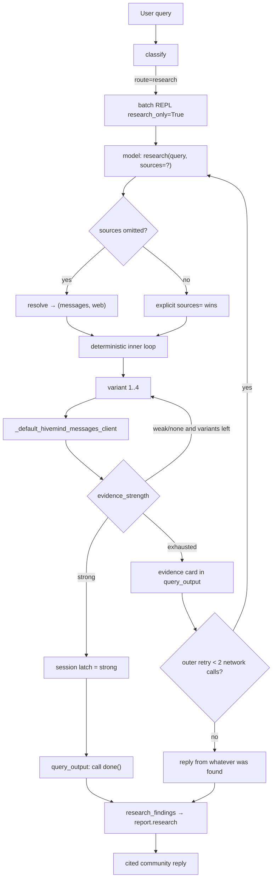
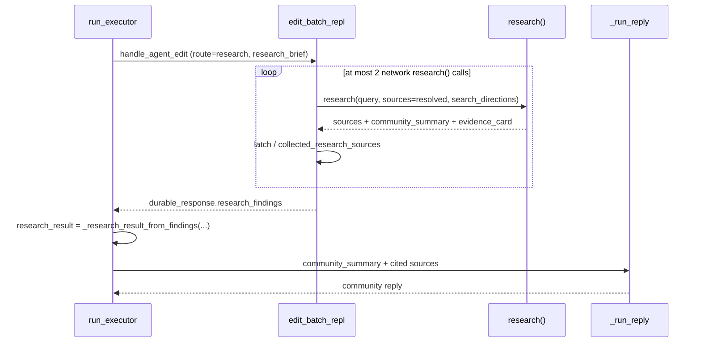

# Discord-Message Search as the Informational Default + Iteration Until Found

> **Supersession (2026-08-12 user ruling):** Iteration, the "deterministic inner loop", found-latch, term expansion (`expand_research_queries`), `evidence_strength`, early-stop, and related stop-search machinery in this document are **superseded** by [`docs/plans/agent-judgment-iteration.md`](agent-judgment-iteration.md). The omit-default, messages-client inheritance, hoist, memory, and followup-as-prompt-text contracts remain; the inner loop / latch / expansion / scoring / `max_batches=4` sections do not.

| Field | Value |
|---|---|
| **Author** | VibeComfy executor / research |
| **Date** | 2026-08-13 |
| **Revised** | 2026-08-13 (review pass 2: followup gated on messages-in-play, not subset; token/stopword helpers live in `hivemind_clients`, not imported from `research.py`) |
| **Status** | Draft |
| **Repo** | VibeComfy |
| **Parent** | [`docs/plans/informational-research-path.md`](informational-research-path.md) (2026-08-12; 3 review rounds; 0 open issues) |
| **Scope** | Default source resolution for `route=research` + iteration-until-found. Reply hoist, memory, and tests only where those two mechanisms force them. |
| **Related live probes** | MiniMax H3 community sentiment; LTX 2.5 praises/complaints (2026-08-12) |

This is a **focused refinement** of the parent plan, not a re-derivation. The parent still owns the messages client, query playbook, hoist insertion, reply citation rules, web backoff, and the "do not break" list. This document redesigns two things the parent left too opt-in / too model-dependent:

1. Discord message search becomes the **default** for informational queries.
2. Search **iterates until relevant data is found, then stops**.

---

## Overview

Informational questions already classify correctly (`route=research`, `intent=research`, `implement=false`, `source_preferences=["messages","web"]`) and already enter the batch REPL with `research_only=True`. They still return knowledge-free replies because (a) the `"messages"` tier is a no-op alias of the workflow-only Hivemind client and (b) omitted `research(..., sources=)` defaults to `("workflows",)` at [`vibecomfy/porting/edit/_resolve.py:786`](../../vibecomfy/porting/edit/_resolve.py). The parent plan fixed (a) with a real messages client and treated (b) as inherit-on-omit from classify `source_preferences`.

That inherit-on-omit seam is still classify-dependent: `source_preferences` is an optional advisory field, and the fallback remains workflows. This design flips the one line that actually decides the corpus. On a research-only REPL session, omitted `sources=` resolve to `("messages", "web")`. Explicit `sources=` still wins. Adapt/revise and the public `research()` API stay workflow-default. Classify prefs stay visible in the prompt; they are not a hidden control path.

Iteration is a **deterministic inner loop** inside `research()`, not another model turn. Classify `search_directions` plus the user query expand into at most four variants. Each variant hits the messages client, is scored, and the loop early-stops on `strength=strong` (parent count / approved-distillation rule — no IDF score bar). A session-scoped **found latch** then short-circuits further `research()` calls so the agent stops. Thin or timed-out results keep the best hits (union by id) and only exclude phrases that returned a successful thin/none; timeouts stay retryable. The model sees a structured `ResearchResult.evidence_card` dict. Exhaustion replies from the union and admits thinness.



---

## Background & Motivation

Verified against live source on 2026-08-13. Parent document has the full root-cause writeup; this section only restates the two failure modes this refinement changes.

### What the parent already decided (inherited, not reopened)

| Decision | Where it lives | This doc |
|---|---|---|
| Two Hivemind clients, one transport | `_default_hivemind_client` stays on `external_resources?kind=eq.workflow`; new `_default_hivemind_messages_client` on `unified_feed` + `message_feed` | inherit |
| `HivemindClient = Callable[[str, float], dict]` | `research.py:137-138` | inherit — do not widen |
| No prefetch on `route=research` | [`core.py:504-524`](../../vibecomfy/executor/core.py); locked by `TestShouldPrefetchResearch.test_should_prefetch_research_false_for_research_route` (~4741) | inherit |
| Messages runner is normalize-only | do not reuse `_run_hivemind_research` (`research.py:1072-1114`) — it would treat Discord attachment URLs as workflow JSON | inherit |
| Distillations-first, `kind=eq.message` Step B, channel-scoped `message_feed` fallback including `live_updates` | parent §1 | inherit |
| Single-token ilike via `_hivemind_single_or_phrase_ilike`, never `_hivemind_phrase_ilike_query` (that helper returns `None` unless ≥2 tokens — `research.py:701-715`) | parent §1 | inherit |
| No FTS, no unfiltered `limit=1000`, no reaction ranking | hivemind skill + parent | inherit |
| Edit live `_frag_*` modules, not generated `edit_*.py` SOURCE wrappers | parent module layout | inherit |
| Hoist `research_findings` after `_run_implement` via `_research_result_from_findings` | parent §4 | inherit — this doc only specifies what the findings packet must contain after iteration |
| Additive contracts only | `community_summary` on `ResearchResult`; no classify-route change; research-route `needs_implement=True` stays | inherit |

### Failure mode this refinement closes

The parent framed messages as **opt-in via `sources=`**, with omitted REPL sources inheriting classify prefs and falling back to `("workflows",)`. That is still classify-dependent:

- `_CLASSIFY_SYSTEM` marks `source_preferences` optional ([`prompts.py:45-46`](../../vibecomfy/executor/prompts.py)).
- `_research_brief_from_plan` copies prefs into `payload["research_brief"]` only when present ([`core.py:1646-1649`](../../vibecomfy/executor/core.py)).
- `_format_research_brief_for_prompt` JSON-dumps them into turn 0 ([`_frag_state.py:479-505`](../../vibecomfy/comfy_nodes/agent/_frag_state.py)).
- `research()` has **no** `sources=` parameter (`research.py:6212-6224`).
- The omit site is a hard default: `requested_source_tuple = requested_sources or ("workflows",)` ([`_resolve.py:786`](../../vibecomfy/porting/edit/_resolve.py)).

Live MiniMax/LTX probes *did* pass `sources=["messages","web"]` and still got workflows — that is the client-alias bug the parent already designs. The omit default is a second silent failure: any `research("MiniMax H3")` with no keyword searches workflows only. The user ask is that Discord search must not require the model to remember `sources=`.

Iteration cannot converge even after the client is real. The batch REPL already allows multiple `research(...)` calls ([`edit_batch_repl.py`](../../vibecomfy/comfy_nodes/agent/edit_batch_repl.py); MiniMax issued two). There is no search → evaluate → stop loop in code. `_batch_research_memory_summary` ([`_frag_batch_memory.py:185-243`](../../vibecomfy/comfy_nodes/agent/_frag_batch_memory.py)) only persists workflow markers (`"Concrete workflow pattern found"`, `"github_workflow_json"`, `"source_workflow_path"`). `_research_followup_guidance` ([`_resolve.py:383-422`](../../vibecomfy/porting/edit/_resolve.py)) has no messages branch. `done()` is already allowed on `research_only` ([`edit_batch_repl.py:2321`](../../vibecomfy/comfy_nodes/agent/edit_batch_repl.py)), but nothing tells the model it has enough evidence. `batch_max_turns` defaults to 50 ([`_frag_state.py:222`](../../vibecomfy/comfy_nodes/agent/_frag_state.py)).

### What the corpus has (unchanged evidence)

Same publishable key `research.py:72-73` already ships. Direct HTTP on 2026-08-12: `unified_feed` "ltx 2.5" → 8 hits including `live_updates` and `ltx_chatter`; `unified_feed` "minimax h3" → 8 hits; `message_feed` has `minimax_h3_chatter`. The knowledge path is a wiring bug, not a corpus gap.

---

## Goals & Non-Goals

### Goals

1. On `research_only` REPL sessions, omitted `research(...) sources=` search Discord community knowledge (`messages`) plus `web`, without the model requesting it and without requiring classify `source_preferences` to be present.
2. Explicit non-empty `sources=` always wins. Empty `sources=[]` is omit. Adapt/revise omitted sources stay `("workflows",)`. Public `research(query)` with `sources=None` stays legacy (no Discord).
3. One primary iteration mechanism: a deterministic inner multi-search that expands terms, scores hits, early-stops on strong evidence, latches the result, and stops. The model sees a structured evidence card and does not run a second LLM reformulation loop.
4. Message-tier evidence carries across REPL turns (memory + latch). Reply cites author/channel for messages and title+status for distillations — inherited hoist, with the evidence card / `community_summary` as the packet the hoist reads.
5. Additive and minimal. Existing `HivemindClient` shape, workflow client URLs, classify vocabulary, and `_should_prefetch_research=False` stay.

### Non-goals

- Re-deriving the messages client, query playbook, hoist insertion point, or web backoff — those stay in the parent.
- Prefetching research for `route=research`.
- Auto-injecting a synthetic `research()` statement before the model speaks. The model still calls `research()`; the default is which corpus that call hits.
- Unioning classify prefs with explicit `sources=`.
- Changing `_normalize_research_sources` diagnostic contract (invalid → `unsupported_research_source`).
- Ranking by Discord reactions.
- FTS, unfiltered feed dumps, distillation write-back, new product UI, graph edits on informational answers.

---

## Key Decisions

1. **Research-route default tier set, not inherit-on-omit, not a reordered tier list.** Omitted `sources=` on a `research_only` session resolve to `("messages", "web")`. Rationale: inherit-on-omit is still classify-optional; a reordered tier list would require `research()` to know `intent` and still would not search messages unless they were in `sources`. One function, one omit-site, one boolean already on the loop (`research_only_route` at [`edit_batch_repl.py:1323`](../../vibecomfy/comfy_nodes/agent/edit_batch_repl.py)). When messages are in play and workflows/registry are not (`"messages" in source_set and "workflows" not in source_set and "registry" not in source_set`) **or** a messages `evidence_card` is present, `_research_followup_guidance` emits **only** `_messages_followup`. Explicit `sources=["web"]` (Decision 3 escape hatch, including adapt web-only) still gets External workflow check.
2. **Classify `source_preferences` stay prompt-visible and are not a hidden control path.** The parent used them to fill omission. This design drops that. If the model wants to follow the brief, it writes `sources=[...]`. `search_directions` still flow from the brief into the inner loop (PR 4) — that is query expansion, not tier selection. The canned distilled/faster brief in `_research_brief_from_plan` (`core.py:1660-1678`) is **not** a special inherit: omitted sources on that research-route question still resolve to `("messages", "web")`. Sisypy is safe because it emits explicit `sources=["workflows"]`. The canned `avoid` line is updated so it does not tell the model to ignore Discord.
3. **Explicit `sources=` wins with no union and no forced prepend of `messages`.** `research("…", sources=["web"])` on a research-only session is web-only. Escape hatch preserved. Empty `sources=[]` / `sources=()` is omit, not “no tiers.”
4. **Public `research()` and adapt/revise are unchanged.** `research("Hotshot XL")` does not query Discord. Adapt prefetch still passes only `_default_hivemind_client`. `research(..., sources=)` nulls every tier that is not listed, including default registry/web.
5. **Primary iteration is a deterministic inner loop with a session found-latch.** Not a model-driven reformulation loop (today's failure) and not a second LLM call. Classify already produced 2–5 `search_directions`; those are the reformulations.
6. **"Found" is `evidence_strength == "strong"`** on normalized message/distillation sources: an approved distillation mentioning a distinctive token, **or** ≥3 token-covering message/distillation hits. **No `top_score` bar.** IDF scores rank and drop `score <= 0` only. Early-stop is per `research()` call; the latch then stops the outer loop.
7. **Outer REPL is a bounded retry over a union, not a last-write-wins overwrite.** Max 2 network-hitting `research()` calls per research-only session. Distinguish `tried_ok` (exclude on the next call) vs `tried_error` (timeout/HTTP — still retryable). Union message sources by `kind:hivemind_id`, keep highest score. Exhaustion replies from the union.
8. **One evidence-card carrier: additive `ResearchResult.evidence_card: dict | None` plus `community_summary`.** No private `_evidence_card`, no rebuild-from-sources-only path. `_research_result_from_latch` constructs a `ResearchResult` from the session union. The fold loop writes `state.collected_*` including `collected_evidence_card`.
9. **Cleaner seam than the parent:** the parent's Decision 2 ("messages are opt-in via `sources=`") remains true for the public `research()` API. It is the wrong default at the REPL omit-site for `route=research`. This design flips that one line and deletes inherit-on-omit as a second knob.
10. **Extract `research_sources.py` + `research_iteration.py`.** Do not grow `research.py` (~6.5k lines). Messages client extraction stays as the parent specified (`hivemind_clients.py`). `_query_tokens` and both stopword frozensets move there too; `research_iteration` imports them from `hivemind_clients`, never from `research`.

---

## Proposed Design

### Inherited module layout (parent, condensed)

| File | Responsibility this refinement touches |
|---|---|
| `vibecomfy/executor/hivemind_clients.py` | **New** (parent PR 1). Shared PostgREST GET, workflow client move/re-export, messages client, channel map, raw ranking, normalize. **Also owns** `_query_tokens`, `_QUERY_TOKEN_RE`, `_SEARCH_STOPWORDS`, `_HIVEMIND_FALLBACK_STOPWORDS` (moved from `research.py`; `research.py` re-exports them so existing tests stay green). |
| `vibecomfy/executor/research_sources.py` | **New (this doc).** `canonicalize_research_sources`, `resolve_repl_research_sources`. No HTTP. No `core` import. |
| `vibecomfy/executor/research_iteration.py` | **New (this doc).** Expansion, scoring, `evidence_strength`, `EvidenceCard`, `_dedupe_and_rank_messages`, `_union_message_sources`, `synthesize_community_summary`, `format_evidence_card`. No HTTP. **No `core` import. No `research` import** (cycle: `core` → `research` → `research_iteration`). **May import `hivemind_clients`** for `_channel_scope_for_query`, `_FAMILY_TO_GROUP`, `_query_tokens`, `_SEARCH_STOPWORDS`, `_HIVEMIND_FALLBACK_STOPWORDS`. |
| `vibecomfy/executor/research.py` | Façade: four tier booleans; additive `sources=` (PR 2); `search_directions=` / `tried_queries=` / `prior_sources=` / `evidence_latch=` (PR 4). Inner loop iff messages tier is actually enabled. Re-export workflow client. |
| `vibecomfy/porting/edit/_resolve.py` | Omit-site calls `resolve_repl_research_sources`. Split clients. PR 4: pass expansion kwargs, honor latch via `_research_result_from_latch`, messages-only followup. |
| `vibecomfy/comfy_nodes/agent/edit_batch_repl.py` | Stash `session.research_only`, `session.executor_research_brief`. Cap research-only turns at 4. Fold `detail` into `state.collected_*` (complete field list). |
| `vibecomfy/comfy_nodes/agent/_frag_batch_memory.py` | Persist any `research_query`, not only workflow markers. |
| `vibecomfy/comfy_nodes/agent/_frag_state.py` | Additive `collected_research_sources`, `collected_research_summary`, `collected_community_summary`, `collected_evidence_card` (initialized in PR 4). |
| `vibecomfy/comfy_nodes/agent/_frag_response_contract.py` | Stamp `research_findings` before `build_legacy_agent_edit_v1` (~1160). |
| `vibecomfy/executor/core.py` | Hoist after `_run_implement` (parent §4). `_run_reply` prefers `community_summary`. Update distilled/faster canned `avoid` (PR 3). |
| `vibecomfy/executor/contracts.py` | Additive `community_summary: str = ""` and `evidence_card: dict[str, Any] | None = None` on `ResearchResult` (both land in PR 4). |
| `vibecomfy/executor/prompts.py` | Reply citation split + route-gate “explain why nothing changed” (parent §4). |
| `vibecomfy/comfy_nodes/agent/provider.py` | Research-only prompt: omit 4-turn apply-edit cap; document the new omit default. |

Generated `edit_*.py` SOURCE wrappers are **not live**. Behavior changes go in `_frag_*` and `edit_batch_repl.py`.

---

### 1. Research-route default sources (the default-Discord seam)

#### Why this seam, not the other two

The ask listed three options. This design picks **a research-route default tier set**.

| Option | What it would do | Why not (or why yes) |
|---|---|---|
| Inherit-on-omit (parent) | Omitted `sources=` → classify `source_preferences`, else `("workflows",)` | Still opt-in at the classify layer. Prefs are optional. Empty brief → workflows. That is the failure mode. |
| **Research-route default (pick)** | Omitted `sources=` + `research_only` → `("messages", "web")` | Uses a boolean the loop already computes. Does not depend on classify remembering prefs. One function, one call site. |
| Reordered tier list | Rank messages above workflows when `intent=research` | `research()` has no `intent`. Ranking is not selection — messages still would not run unless they were in `sources`. Would risk searching Discord on adapt if wired naively. |

#### The one function

New module `vibecomfy/executor/research_sources.py`. **Do not import `core`** (`core.py` already imports `research`; `research()` will import this module).

```python
from __future__ import annotations

from collections.abc import Mapping
from typing import Any

# Keep in lockstep with _RESEARCH_SOURCE_ALIASES values in
# vibecomfy/porting/edit/_resolve.py:425-445.
_ALLOWED_RESEARCH_TIERS = frozenset({"workflows", "registry", "messages", "web"})

_RESEARCH_SOURCE_ALIASES: dict[str, str] = {
    "local": "workflows",
    "workflow": "workflows",
    "workflows": "workflows",
    "template": "workflows",
    "templates": "workflows",
    "registry": "registry",
    "comfy-registry": "registry",
    "comfy_registry": "registry",
    "manager": "registry",
    "comfyui-manager": "registry",
    "custom_nodes": "registry",
    "custom-nodes": "registry",
    "hivemind": "messages",
    "message": "messages",
    "messages": "messages",
    "discord": "messages",
    "web": "web",
    "github": "web",
    "internet": "web",
}

_RESEARCH_ROUTE_DEFAULT_SOURCES: tuple[str, ...] = ("messages", "web")
_EDIT_ROUTE_DEFAULT_SOURCES: tuple[str, ...] = ("workflows",)


def canonicalize_research_sources(
    value: Any,
    *,
    default: tuple[str, ...] = _EDIT_ROUTE_DEFAULT_SOURCES,
) -> tuple[str, ...]:
    """Normalize aliases; drop unknown; preserve order.

    Empty / None → ``default``. Never returns a CompactDiagnostic.
    ``_normalize_research_sources`` in _resolve.py keeps the diagnostic
    contract for invalid *explicit* sources=.
    """
    if value is None:
        return default
    if isinstance(value, str):
        raw_items = [value]
    elif isinstance(value, (list, tuple, set)):
        raw_items = list(value)
    else:
        return default
    normalized: list[str] = []
    seen: set[str] = set()
    for item in raw_items:
        if not isinstance(item, str):
            continue
        source = _RESEARCH_SOURCE_ALIASES.get(item.strip().casefold())
        if source is None or source not in _ALLOWED_RESEARCH_TIERS or source in seen:
            continue
        seen.add(source)
        normalized.append(source)
    return tuple(normalized) if normalized else default


def resolve_repl_research_sources(
    requested: tuple[str, ...] | None,
    *,
    research_only: bool,
) -> tuple[str, ...]:
    """Single omit-site resolver.

    * Non-empty explicit ``sources=`` (already passed through
      ``_normalize_research_sources``) wins with no union.
    * ``None`` **or empty** ``()`` is omit. ``sources=[]`` is omit, not
      “search nothing.” This matches today’s
      ``requested_sources or ("workflows",)`` truthiness.
    * Omitted + research-only → ``("messages", "web")``.
    * Omitted + any other route → ``("workflows",)``.
    """
    if requested:
        return requested
    if research_only:
        return _RESEARCH_ROUTE_DEFAULT_SOURCES
    return _EDIT_ROUTE_DEFAULT_SOURCES
```

`_RESEARCH_SOURCE_ALIASES` is duplicated here so `_resolve.py` can keep its copy next to the diagnostic helper (tests in `tests/test_porting_edit_resolve.py` import it from `_resolve`). Do **not** change `_normalize_research_sources`. Optionally have `_resolve.py` import the alias map from `research_sources.py` in a follow-up if drift appears; v1 can copy.

#### Call site — the only place omitted sources become a corpus

[`_resolve_query_statement`](../../vibecomfy/porting/edit/_resolve.py) today:

```786:806:vibecomfy/porting/edit/_resolve.py
                requested_source_tuple = requested_sources or ("workflows",)
                source_set = set(requested_source_tuple)
                ...
                output = research_module.research(
                    query,
                    local_limit=5 if "workflows" in source_set else 0,
                    ...
                    hivemind_client=None if not source_set.intersection({"messages", "workflows"}) else research_module._default_hivemind_client,
                    web_search_client=None if "web" not in source_set else research_module._default_web_search_client,
                )
```

**PR 3 call site** — flip the omit default and split clients. Do **not** pass `search_directions=`, `tried_queries=`, `prior_sources=`, or `evidence_latch=` (those kwargs do not exist until PR 4).

```python
from vibecomfy.executor.research_sources import resolve_repl_research_sources

research_only = bool(getattr(self, "research_only", False))
requested_source_tuple = resolve_repl_research_sources(
    requested_sources,  # None or () → omit
    research_only=research_only,
)
source_set = set(requested_source_tuple)

output = research_module.research(
    query,
    local_limit=5 if "workflows" in source_set else 0,
    hivemind_timeout=3.0,
    web_search_timeout=3.0,
    registry_resolver=registry_resolver if "registry" in source_set else None,
    hivemind_client=(
        research_module._default_hivemind_client
        if "workflows" in source_set
        else None
    ),
    hivemind_messages_client=(
        research_module._default_hivemind_messages_client
        if "messages" in source_set
        else None
    ),
    web_search_client=(
        research_module._default_web_search_client
        if "web" in source_set
        else None
    ),
    sources=requested_source_tuple,
)
```

**PR 4 call site** — same as PR 3, plus latch short-circuit and expansion kwargs. Brief is already on the session (PR 3 stashes it); PR 4 is the first reader of `search_directions`.

```python
latch = getattr(self, "community_latch", None)
network_calls = int(getattr(self, "research_network_calls", 0) or 0)
latch_strength = (
    latch.get("strength") if isinstance(latch, Mapping)
    else getattr(latch, "strength", None)
)

if research_only and latch_strength == "strong":
    output = _research_result_from_latch(self, stop_reason="latched")
elif research_only and network_calls >= _MAX_RESEARCH_NETWORK_CALLS:
    output = _research_result_from_latch(self, stop_reason="outer_cap")
else:
    brief = getattr(self, "executor_research_brief", None)
    inherited_search_directions = (
        tuple(brief.get("search_directions") or ())
        if isinstance(brief, Mapping)
        else ()
    )
    output = research_module.research(
        query,
        local_limit=5 if "workflows" in source_set else 0,
        hivemind_timeout=3.0,
        web_search_timeout=3.0,
        registry_resolver=registry_resolver if "registry" in source_set else None,
        hivemind_client=(
            research_module._default_hivemind_client
            if "workflows" in source_set else None
        ),
        hivemind_messages_client=(
            research_module._default_hivemind_messages_client
            if "messages" in source_set else None
        ),
        web_search_client=(
            research_module._default_web_search_client
            if "web" in source_set else None
        ),
        sources=requested_source_tuple,
        search_directions=inherited_search_directions,
        tried_queries=getattr(self, "tried_ok_queries", ()),
        prior_sources=getattr(self, "latched_message_sources", ()),
        evidence_latch=getattr(self, "community_latch", None),
    )
    _update_session_latch_from_result(self, output, query=query)
```

`research()` honors the `sources=` tuple it is passed. It does **not** read classify prefs or `research_only`. Tier selection stays in the resolver; retrieval stays in `research()`.

#### Stashing the two session flags

`EditSession.__init__` ([`session.py:119-131`](../../vibecomfy/porting/edit/session.py)) is not extended. Assign public attributes immediately after construction in live [`edit_batch_repl.py:1250-1255`](../../vibecomfy/comfy_nodes/agent/edit_batch_repl.py):

```python
session = edit_session_module.EditSession(
    prepared_ui,
    schema_provider=state.schema_provider,
    value_default_context=value_default_context,
)
session.executor_research_brief = state.executor_research_brief  # dict | None
session.research_only = research_only_route  # computed at line 1323 — move that assignment above session creation, or set it here from the same `_canonical_agent_edit_route` call
# PR 4 attributes (assign empty now or in the PR 4 edit of this block):
session.community_latch = None          # evidence_card dict | None
session.latched_message_sources = ()    # union of message/distillation sources
session.tried_ok_queries = ()           # successful thin/none phrases; excluded next call
session.tried_error_queries = ()        # timeout / HivemindError; still retryable
session.research_network_calls = 0
session.collected_community_summary = ""
state.batch_session = session
```

`research_only_route` is currently computed ~70 lines later ([`edit_batch_repl.py:1323`](../../vibecomfy/comfy_nodes/agent/edit_batch_repl.py)). Move `canonical_route = deps._canonical_agent_edit_route(...)` and `research_only_route = canonical_route == "research"` to just above `EditSession(...)`. Same values, earlier.

Tests can set `session.research_only = True` without constructing `AgentEditState`.

#### Compatibility matrix

| Caller | `sources=` | `research_only` | Resolved sources | Discord? |
|---|---|---|---|---|
| REPL, route=research, model omits | `None` | `True` | `("messages", "web")` | yes |
| REPL, route=research, `sources=[]` | empty | `True` | `("messages", "web")` (omit) | yes |
| REPL, route=research, distilled/faster canned brief, model omits | `None` | `True` | `("messages", "web")` — brief prefs stay prompt-only | yes |
| REPL, route=research, `sources=["messages","web"]` | explicit | `True` | as written | yes |
| REPL, route=research, `sources=["web"]` | explicit | `True` | `("web",)` | no |
| REPL, route=research, `sources=["workflows"]` | explicit | `True` | `("workflows",)` | no |
| REPL, route=adapt, model omits | `None` | `False` | `("workflows",)` | no |
| REPL, route=adapt, `sources=["messages"]` | explicit | `False` | `("messages",)` | yes (explicit) |
| Public `research("Hotshot XL")` | `None` (legacy) | n/a | all current tiers, **messages off** | no |
| Public `research(..., sources=("messages",))` | explicit | n/a | messages only | yes |
| Adapt prefetch `_run_research` | n/a | n/a | workflow client only | no |

The Sisypy `distilled-faster-research-route.yaml` actor emits a canned `research("...", sources=["workflows"])`. Explicit wins, so that actor is unchanged. A **live** model that omits `sources=` on a distilled/faster research-route question will now search Discord+web (product choice — see Decision 2 and the resolve unit `test_resolve_omitted_sources_ignores_distilled_faster_brief_workflows`). PR 3 updates the canned `avoid` in `_research_brief_from_plan` from `"treating Discord snippets as authoritative without workflow evidence"` to `"inventing community consensus that the sources do not support"`.

#### `research()` façade (additive, parent-compatible)

Signature grows in two steps. PR 2 adds `sources=` and `hivemind_messages_client=`. PR 4 adds the iteration kwargs.

```python
def research(
    query: str,
    *,
    task: str | None = None,
    graph: dict[str, Any] | None = None,
    target_node_type: str = "",
    hivemind_client: HivemindClient | None | object = _USE_DEFAULT,
    hivemind_messages_client: HivemindClient | None | object = _USE_DEFAULT,
    hivemind_timeout: float = _DEFAULT_HIVEMIND_TIMEOUT,
    registry_resolver: RegistryResolver | None | object = _USE_DEFAULT,
    web_search_client: WebSearchClient | None | object = _USE_DEFAULT,
    web_search_timeout: float = _DEFAULT_WEB_SEARCH_TIMEOUT,
    local_limit: int = 10,
    sources: tuple[str, ...] | None = None,
    # PR 4 only — do not pass these from the resolver in PR 3:
    search_directions: tuple[str, ...] | None = None,
    tried_queries: tuple[str, ...] = (),
    prior_sources: tuple[dict[str, Any], ...] = (),
    evidence_latch: Mapping[str, Any] | None = None,
) -> ResearchResult:
```

Four booleans. `sources is None` is the legacy public API (messages off). When `sources` is a tuple, **only listed tiers run** — default clients are not an implicit extra.

```python
source_set = set(sources) if sources is not None else None
run_workflows = source_set is None or "workflows" in source_set
run_messages = source_set is not None and "messages" in source_set
run_web = source_set is None or "web" in source_set
run_registry = source_set is None or "registry" in source_set

messages_enabled = (
    run_messages
    and os.environ.get("VIBECOMFY_MESSAGES_RESEARCH", "1") != "0"
)
```

Default-client resolution (after applying `_USE_DEFAULT`):

| Condition | Workflow Hivemind | Messages client | Web client | Registry | `local_limit` | Enter `_run_messages_iteration`? |
|---|---|---|---|---|---|---|
| `sources is None` (legacy) | default | **skip** | default | default | as passed | no |
| `sources=("messages",)` | skip | default | **skip** | **skip** | 0 | yes |
| `sources=("messages","web")` | skip | default | default | **skip** | 0 | yes |
| `sources=("web",)` | skip | skip | default | skip | 0 | no |
| `sources=("workflows",)` | default | skip | skip | skip | as passed | no |
| `sources=("messages",)` and `VIBECOMFY_MESSAGES_RESEARCH=0` | skip | **skip** + warning `"messages tier disabled"` | skip | skip | 0 | **no** |
| Caller passed `web_search_client=fake` but `"web" not in sources` | — | — | **skip** (tier wins) | — | — | — |

`VIBECOMFY_MESSAGES_RESEARCH=0` forces the messages client to `None` **and** skips `_run_messages_iteration` even when `"messages"` is in `sources`.

When a default injectable would run but the tier is off, assign `None` — do not leave `_USE_DEFAULT` resolved. Public `research(..., sources=("messages",))` must not hit DDG/Brave or `resolve_missing_nodes`.

#### Prompt copy (required companion, not the fix)

[`provider.py:382`](../../vibecomfy/comfy_nodes/agent/provider.py) today says omitted sources search internal workflows only. For `research_only=True`, replace the edit surface + 4-turn apply-edit cap ([`provider.py:391-392`](../../vibecomfy/comfy_nodes/agent/provider.py)) in **two steps**.

**PR 3** (no evidence card yet):

```text
You are answering a research question for a ComfyUI canvas. Gather auditable
evidence with research(...), then call done(). Do not edit the graph.

research("query words", sources=["workflows","registry","messages","web"])
  — messages: Banodoco Discord / unified_feed community knowledge, NOT workflows.
If sources are omitted on this informational route, the executor searches
messages and web. Do not pass sources=["workflows"] for community opinion.
There is no 4-turn "apply the best edit" cap. Do not emit Add/Change statements.
```

**PR 4** appends:

```text
When the evidence card says strength=strong, call done(). Do not keep searching.
```

Do not rely on this prompt to select the corpus. The resolver does that.

---

### 2. Iteration until found, then stop

#### Primary mechanism (one pick)

**Deterministic inner loop + session found-latch.** Not a model-driven reformulation loop. Not a hybrid that adds a second LLM call.

| Mechanism | Determinism | Cost | Latency | Fits existing REPL? |
|---|---|---|---|---|
| **Inner loop + latch (pick)** | yes — testable expansion/score/stop | 1–4 message GETs per `research()`, no extra model turn | p50 < 4s, hard cap 12s | yes — outer REPL becomes a 1-retry backstop |
| Model feedback only | no — MiniMax already issued two blind calls | +1 model turn per retry, same broken client until default is fixed | +multi-10s per turn | already exists; cannot converge |
| Hybrid with a reformulation LLM | mixed | extra classify-like call | extra turn | duplicates `search_directions` classify already produced |

Classify already emitted 2–5 `search_directions` (e.g. `"MiniMax H3 model community reception"`). Those *are* the reformulations. Spending another model call to invent them again is the failure mode, not the fix.

The outer batch REPL stays. It is no longer the search engine. It is a bounded retry for the case the inner loop returns `none`/`weak` after exhausting variants, plus the `done()` commit.

#### What "relevant / found" means

Two predicates. Do not mix them.

**Client-local thinness** (raw PostgREST rows, inside the messages client, inherited from parent) decides whether to run `message_feed` Step C. It must **not** call `evidence_strength`.

```python
def _raw_message_hits_are_thin(rows: list[Mapping[str, Any]], query: str) -> bool:
    """Skip Step C when A+B are already strong enough.

    Not thin when either:
      - any row has kind == "distillation" and metadata.status == "approved"
        and a distinctive token appears in title/body, or
      - >= 3 rows with kind in {message, distillation} whose title/body/content
        contain a distinctive token.
    Empty rows are thin. Timeout is always thin.
    """
```

**Normalized strength** (after `_normalize_hivemind_message_source`) decides early-stop, the latch, and the evidence card.

```python
def score_message_source(
    src: Mapping[str, Any],
    query: str,
    *,
    channel_group: tuple[str, ...],
) -> int:
    """Integer score used **only** to rank and to drop score <= 0.

    Not part of the found predicate. Distinctive-token IDF reused from
    ``_rank_hivemind_rows`` (research.py:745-833) without workflow bonuses.
    ``channel_group`` comes from ``hivemind_clients._channel_scope_for_query(query)``.

    +80  source == hivemind_distillation and distillation_status == "approved"
    +40  source == hivemind_distillation and distillation_status == "pending"
    +20  confidence == "high"
    +10  source == hivemind_message (base)
    +25  channel == "daily_summaries"
    +20  channel in channel_group (topic match, e.g. minimax_h3_chatter / ltx_chatter)
    +term  existing IDF-style phrase-in-title / phrase-in-body (relative; do not
           threshold this)
    Recency is a sort tie-break (newer created_at wins), not a bonus.
    Skip rows with score <= 0.
    """


def evidence_strength(
    sources: tuple[Mapping[str, Any], ...],
    query: str,
) -> str:
    """Return "strong" | "weak" | "none". Normalized sources only.

    Parent count / approved-distillation rule. **No top_score bar.**
    Calls ``_channel_scope_for_query(query)`` from ``hivemind_clients`` so
    ranking helpers share one channel group; strength itself does not
    require a topic-channel hit.

    strong: any approved distillation whose title/body/description contains
            a distinctive token from the user query,
            OR >= 3 hivemind_message / hivemind_distillation hits whose
            title/description contain a distinctive token.
    weak:   1-2 such hits, or only pending distillation (no approved, < 3 covering).
    none:   no message/distillation sources (or none covering a distinctive token).
    """


def _dedupe_and_rank_messages(
    rows: list[Mapping[str, Any]],
    query: str,
) -> list[dict[str, Any]]:
    """Dedupe key ``kind:hivemind_id`` (fallback url). Keep highest score.
    ``channel_group = _channel_scope_for_query(query)`` from hivemind_clients.
    Score via ``score_message_source``. Sort by ``(-score, -created_at)``.
    Drop score <= 0. Cap is applied by the caller (12).
    """


def _union_message_sources(
    *batches: tuple[Mapping[str, Any], ...],
) -> tuple[dict[str, Any], ...]:
    """Cross-call union. Same dedupe key as ``_dedupe_and_rank_messages``.
    Keep the higher ``score`` when ids collide. Does not re-query HTTP.
    """
```

`research_iteration.py` imports `_channel_scope_for_query`, `_FAMILY_TO_GROUP`, `_query_tokens`, `_SEARCH_STOPWORDS`, and `_HIVEMIND_FALLBACK_STOPWORDS` from `hivemind_clients`. **Do not import `research.py`** — `research()` is the façade that imports `research_iteration`, so that would cycle (`core` → `research` → `research_iteration` → `research`). `hivemind_clients` must not import `research` or `research_iteration`. `research.py` re-exports the moved token/stopword helpers so existing `from vibecomfy.executor.research import _query_tokens, _SEARCH_STOPWORDS` tests stay green. Do not late-import `research` inside expansion functions either.

Distinctive tokens for coverage = tokens remaining after `_SEARCH_STOPWORDS | _HIVEMIND_FALLBACK_STOPWORDS` plus any family/version token from `_FAMILY_TO_GROUP` (parent, in `hivemind_clients`) that appears in the query. Single-token queries such as `"ltx"` / `"minimax"` remain distinctive. Do **not** use `_hivemind_search_terms()[0]` (that prefers 3-grams like `"do people think"`).

Live-probe calibration (expected, not a CI assertion against live HTTP):

| Query | Expected first-variant strength | Why |
|---|---|---|
| `"minimax h3"` | `strong` | ≥3 `unified_feed` hits including dedicated `minimax_h3_chatter` |
| `"ltx 2.5"` | `strong` | ≥3 hits in `live_updates` / `ltx_chatter` |
| `"a made-up-model-xyzzy-9"` | `none` | empty corpus; exhaustion path |

#### Query expansion

```python
# research_iteration.py — expansion-only glue. Do not reuse this list for
# PostgREST queries or for _hivemind_search_terms.
_EXPANSION_QUESTION_STOPWORDS = frozenset({
    "people", "think", "about", "do", "does", "did", "new", "newer",
    "community", "reception", "complaint", "complaints", "praise", "praises",
    "worth", "trying", "try", "say", "said", "feel", "feels", "feeling",
    "thoughts", "thought", "opinion", "opinions", "like", "likes",
    "good", "bad", "anyone", "someone", "everybody", "whats", "what's",
    "tell", "me", "us", "your", "my", "their",
})


@dataclass(frozen=True)
class QueryVariant:
    query: str
    origin: str  # "user" | "search_direction" | "token"


def expand_research_queries(
    query: str,
    search_directions: tuple[str, ...] = (),
    *,
    max_variants: int = 4,
    exclude: tuple[str, ...] = (),
) -> tuple[QueryVariant, ...]:
    """Build N distinct search strings. No core import.

    Tokenize with ``hivemind_clients._query_tokens``. Drop
    ``hivemind_clients._SEARCH_STOPWORDS | hivemind_clients._HIVEMIND_FALLBACK_STOPWORDS
    | _EXPANSION_QUESTION_STOPWORDS``.
    Keep version-like tokens (contain a digit, e.g. ``2.5``, ``h3``).
    Do **not** import these helpers from ``research.py``.

    User variant (origin="user"):
      1. If any ``_FAMILY_TO_GROUP`` alias (parent, in hivemind_clients)
         matches the query, the user variant is the shortest original-order
         span that still contains every matched family token plus any
         adjacent version-like token (``minimax``+``h3`` → ``"MiniMax H3"``;
         ``ltx``+``2.5`` → ``"LTX 2.5"``).
      2. Else join the remaining tokens, max 8, original order.

    Then append each already-sanitized ``search_direction`` (truncated to 8
    tokens, drop expansion stopwords) and a compact leftover token-join if
    still under ``max_variants`` and distinct.

    ``exclude`` is casefold-compared and is **only** ``tried_ok`` phrases
    (successful thin/none). Timed-out phrases are not excluded.

    Never emit the raw user sentence. Never emit stopword-only fragments.
    Never emit leftover glue such as ``"do people think"``.
    Do **not** call ``_hivemind_search_terms()[0]`` (3-gram first).
    Cap at max_variants. No ``channels`` field.
    """
```

Example, MiniMax H3 classify:

```text
query = "What do people think about the new MiniMax H3 model?"
# existing stopwords drop: what, the, model
# expansion stopwords drop: do, people, think, about, new
# _FAMILY_TO_GROUP matches minimax + adjacent h3
search_directions = ("MiniMax H3 model community reception", ...)

variants:
  1. "MiniMax H3"                                 origin=user
  2. "MiniMax H3"                                 dropped — casefold dup of 1
     direction after expansion-stopword strip → "MiniMax H3" (dup) or
     leftover distinctive tokens if any remain
```

If the direction collapses to the same phrase, it is deduped. A second distinct direction (e.g. `"MiniMax H3 music video"`) is kept. Variant 1 is expected to early-stop on the live corpus.

#### Evidence card (model-facing stop signal)

```python
@dataclass(frozen=True)
class EvidenceCard:
    strength: str          # "strong" | "weak" | "none"
    tried: tuple[str, ...]           # successful variants this call
    tried_error: tuple[str, ...]     # HivemindError / timeout this call
    unused: tuple[str, ...]
    hit_count: int
    top_score: int                   # informational only; not a found gate
    stop_reason: str  # "strong" | "variants_exhausted" | "budget" | "latched" | "outer_cap"

    def to_dict(self) -> dict[str, Any]:
        return {
            "strength": self.strength,
            "tried": list(self.tried),
            "tried_error": list(self.tried_error),
            "unused": list(self.unused),
            "hit_count": self.hit_count,
            "top_score": self.top_score,
            "stop_reason": self.stop_reason,
        }


def format_evidence_card(card: Mapping[str, Any]) -> str:
    errors = card.get("tried_error") or ()
    error_line = (
        f"\nerrors: {', '.join(repr(t) for t in errors)}" if errors else ""
    )
    unused = card.get("unused") or ()
    unused_line = (
        f"\nunused: {', '.join(repr(u) for u in unused)}" if unused else ""
    )
    tried = card.get("tried") or ()
    return (
        f"[evidence] strength={card.get('strength')} hits={card.get('hit_count')} "
        f"top_score={card.get('top_score')} stop={card.get('stop_reason')}\n"
        f"tried: {', '.join(repr(t) for t in tried) or '(none)'}"
        + error_line
        + unused_line
    )
```

**Single carrier.** `research()` sets `ResearchResult.evidence_card = card.to_dict()` (or `None` when the messages tier did not run). `to_dict()` on `ResearchResult` emits the key only when set. `_format_research_query_output` and `_messages_followup` accept a `Mapping`. There is no `output._evidence_card`, no rebuild-from-sources-only path, and no `EvidenceCard` dataclass on `contracts.py`.

This line is the first thing in `query_output` (above `community_summary` and the source list). Followup guidance is then exactly one of:

```python
def _messages_followup(card: Mapping[str, Any]) -> str:
    strength = str(card.get("strength") or "")
    stop = str(card.get("stop_reason") or "")
    if strength == "strong" or stop == "latched":
        return (
            "Community evidence found. Answer from these messages/distillations. "
            "Cite author/channel. Do not invent quotes. Call done(). "
            "Do not search workflows for community opinion."
        )
    if stop == "outer_cap":
        return (
            "Community search stayed thin after the allowed retries. "
            "Call done(). Summarize only the sources listed. "
            "If they are thin or off-topic, say so; do not invent praises or complaints."
        )
    return (
        "Community search was thin. You may call research() once more with a "
        "different distinctive phrase (model name + version, or a complaint/praise "
        "term). Do not treat workflow templates as community opinion. "
        "If the next search is also thin, call done() and say so."
    )
```

`_research_followup_guidance` **replaces** the existing notes when the call is informational. The branch that actually fires today on `("messages", "web")` is **not** `"Workflow-first check"` (`"workflows" in source_set` — [`_resolve.py:386-391`](../../vibecomfy/porting/edit/_resolve.py)) — it is `"External workflow check"` ([`_resolve.py:398-403`](../../vibecomfy/porting/edit/_resolve.py)): `"web" in source_set and _has_url_only_web_leads(result) and not _has_concrete_workflow_pattern(result)` → *search externally for a workflow JSON*. Brave/DDG hits are typically URL-only. That is the push-back-to-templates failure.

```python
def _research_followup_guidance(query, sources, result) -> str:
    source_set = set(sources)
    card = getattr(result, "evidence_card", None)
    messages_card = isinstance(card, Mapping) and bool(card)
    messages_in_play = (
        "messages" in source_set
        and "workflows" not in source_set
        and "registry" not in source_set
    )
    if messages_in_play or messages_card:
        if messages_card:
            return "\n\n" + _messages_followup(card)
        return ""
    # existing Workflow-first / Research-order / External workflow /
    # Concrete workflow pattern / Registry check notes.
    # Explicit sources=["web"] (research-only escape hatch or adapt web-only)
    # is NOT messages_in_play — External workflow check still fires.
    ...
```

Gate on **messages actually being in play**, not on `source_set <= {"messages", "web"}`. `{"web"} <= {"messages", "web"}` is True in Python, so the subset test would swallow Decision 3’s `sources=["web"]` escape hatch and adapt web-only calls, returning `""` and dropping External workflow check (`_resolve.py:398-403`).

When `("messages" in source_set and "workflows" not in source_set and "registry" not in source_set)` **or** a messages `evidence_card` is present, emit **only** `_messages_followup(card)`. Skip Workflow-first, Research-order, External workflow, Concrete workflow pattern, and Registry check. `sources=("web",)` still emits External workflow check.

#### Inner loop (inside `research()`, trigger is `"messages" in sources`)

```python
def _run_messages_iteration(
    query: str,
    *,
    search_directions: tuple[str, ...],
    client: HivemindClient,
    timeout: float,
    tried_ok: tuple[str, ...],
    latch: Mapping[str, Any] | None,
    prior_sources: tuple[dict[str, Any], ...] = (),
    wallclock_s: float = 12.0,
    max_variants: int = 4,
) -> tuple[tuple[dict[str, Any], ...], EvidenceCard]:
    if isinstance(latch, Mapping) and latch.get("strength") == "strong":
        card = EvidenceCard(
            strength="strong",
            tried=tuple(latch.get("tried") or ()),
            tried_error=tuple(latch.get("tried_error") or ()),
            unused=tuple(latch.get("unused") or ()),
            hit_count=int(latch.get("hit_count") or _message_hit_count(prior_sources)),
            top_score=int(latch.get("top_score") or _top_score(prior_sources)),
            stop_reason="latched",
        )
        return tuple(prior_sources)[:12], card

    variants = expand_research_queries(
        query,
        search_directions,
        max_variants=max_variants,
        exclude=tried_ok,  # successful thin/none only — not timeouts
    )
    collected: list[dict[str, Any]] = list(prior_sources)  # keep first-call hits
    tried: list[str] = []
    tried_error: list[str] = []
    start = time.monotonic()
    for variant in variants:
        if time.monotonic() - start > wallclock_s:
            return _card_from_collected(
                collected, query, tried=tried, tried_error=tried_error,
                unused=[v.query for v in variants if v.query not in tried
                        and v.query not in tried_error],
                stop_reason="budget",
            )
        try:
            batch = _run_hivemind_messages_research(
                variant.query, client=client, timeout=timeout,
            )
        except HivemindError:
            tried_error.append(variant.query)  # retryable; do not exclude
            continue
        collected.extend(batch)
        tried.append(variant.query)  # successful; exclude on next outer call
        collected = _dedupe_and_rank_messages(collected, query)
        if evidence_strength(tuple(collected), query) == "strong":
            return _card_from_collected(
                collected[:12], query, tried=tried, tried_error=tried_error,
                unused=[v.query for v in variants if v.query not in tried
                        and v.query not in tried_error],
                stop_reason="strong",
            )
    return _card_from_collected(
        collected[:12], query, tried=tried, tried_error=tried_error,
        unused=(), stop_reason="variants_exhausted",
    )
```

`_card_from_collected` builds `EvidenceCard` with `strength=evidence_strength(...)`, `hit_count`, and `top_score` (informational). A timeout on `"MiniMax H3"` goes to `tried_error`, so the next outer `research()` may retry that phrase. A successful thin `"MiniMax H3"` goes to `tried` / session `tried_ok_queries` and is excluded; `prior_sources` still carries the 1–2 hits into the next call.

In-process GET cache keyed by `(table, normalized_params)` lives for the life of one `research()` call so overlapping variants do not double-hit PostgREST. Optional later: hoist that cache onto `EditSession` if logs show cross-call repeats.

`messages.jsonl` records **outer** model `research(...)` statements only. Expansion does not add jsonl lines. Tests spy the fake messages client for distinct variant query strings.

#### Session found-latch (the "then stop" half)

The latch lives on `EditSession` because that is where `_resolve_query_statement` runs. The **only** on-the-wire / `ResearchResult` shape is a plain dict.

```python
# attributes on EditSession (assigned in edit_batch_repl, not __init__)
session.community_latch: dict[str, Any] | None     # last-or-stronger evidence_card dict
session.latched_message_sources: tuple[dict, ...]  # union across calls
session.tried_ok_queries: tuple[str, ...]
session.tried_error_queries: tuple[str, ...]
session.research_network_calls: int
session.collected_community_summary: str
```

```python
# contracts.py ResearchResult — additive, lands in PR 4 (before hoist)
community_summary: str = ""
evidence_card: dict[str, Any] | None = None
# to_dict() emits either key only when set
```

`_research_result_from_latch` lives in `_resolve.py` (the resolver already constructs `StatementResult` from a `ResearchResult`). It does **not** hit HTTP. It does **not** re-run web/registry — those tiers already ran on earlier calls; the latch path is a messages stop.

```python
_MAX_RESEARCH_NETWORK_CALLS = 2
_STRENGTH_RANK = {"none": 0, "weak": 1, "strong": 2}


def _research_result_from_latch(session: Any, *, stop_reason: str) -> ResearchResult:
    """Construct ResearchResult from the session union. No HTTP.

    Used when latch.strength == "strong" (stop_reason="latched") or
    when research_network_calls >= 2 (stop_reason="outer_cap").
    Sources are the union already stored on the session — never last-call-only.
    Web sources from earlier calls are not replayed; query_output on this
    short-circuit is community-only, which is what informational reply needs.
    """
    from vibecomfy.executor.contracts import ResearchResult
    from vibecomfy.executor.research_iteration import (
        evidence_strength,
        synthesize_community_summary,
        _message_hit_count,
        _top_score,
    )

    sources = tuple(getattr(session, "latched_message_sources", ()) or ())
    query = str(getattr(session, "_last_research_query", "") or "")
    prev = getattr(session, "community_latch", None)
    card = dict(prev) if isinstance(prev, Mapping) else {}
    card["stop_reason"] = stop_reason
    if stop_reason == "latched":
        card["strength"] = "strong"
    else:
        card["strength"] = evidence_strength(sources, query)
    card["hit_count"] = _message_hit_count(sources)
    card["top_score"] = _top_score(sources)
    card.setdefault("tried", list(getattr(session, "tried_ok_queries", ()) or ()))
    card.setdefault("tried_error", list(getattr(session, "tried_error_queries", ()) or ()))
    card.setdefault("unused", [])
    community = str(getattr(session, "collected_community_summary", "") or "")
    if not community:
        community = synthesize_community_summary(sources, query=query)
    return ResearchResult(
        summary=community,
        sources=sources,
        community_summary=community,
        evidence_card=card,
    )


def _update_session_latch_from_result(
    session: Any,
    output: Any,
    *,
    query: str,
) -> None:
    from vibecomfy.executor.research_iteration import (
        _union_message_sources,
        synthesize_community_summary,
    )

    session._last_research_query = query
    session.research_network_calls = int(
        getattr(session, "research_network_calls", 0) or 0
    ) + 1
    new_msgs = tuple(
        s for s in (getattr(output, "sources", ()) or ())
        if isinstance(s, Mapping)
        and s.get("source") in {"hivemind_message", "hivemind_distillation"}
    )
    session.latched_message_sources = _union_message_sources(
        getattr(session, "latched_message_sources", ()) or (),
        new_msgs,
    )
    card = getattr(output, "evidence_card", None)
    if isinstance(card, Mapping):
        prev = getattr(session, "community_latch", None)
        if prev is None or _STRENGTH_RANK.get(card.get("strength"), 0) >= _STRENGTH_RANK.get(
            prev.get("strength") if isinstance(prev, Mapping) else None, 0
        ):
            session.community_latch = dict(card)
        session.tried_ok_queries = tuple(dict.fromkeys(
            list(getattr(session, "tried_ok_queries", ()) or ())
            + list(card.get("tried") or ())
        ))
        session.tried_error_queries = tuple(dict.fromkeys(
            list(getattr(session, "tried_error_queries", ()) or ())
            + list(card.get("tried_error") or ())
        ))
    community = str(getattr(output, "community_summary", "") or "").strip()
    if not community:
        community = synthesize_community_summary(
            session.latched_message_sources, query=query
        )
    if community:
        session.collected_community_summary = community
```

`research()` itself, when `messages_enabled`, calls `_run_messages_iteration(..., tried_ok=tried_queries, prior_sources=prior_sources, latch=evidence_latch)` and sets `ResearchResult.community_summary` + `ResearchResult.evidence_card = card.to_dict()`. If `evidence_latch["strength"] == "strong"`, the façade still returns the latched packet (resolver normally does not call `research()` in that case; the façade path exists for unit tests).

#### Bounds

| Knob | Default | Env | Scope |
|---|---|---|---|
| `max_variants` | 4 | `VIBECOMFY_MESSAGES_MAX_VARIANTS` | per `research()` call |
| per-request timeout | 3.0s (REPL) / 5.0s (prefetch) | existing | per HTTP GET |
| wall-clock cap | 12s | `VIBECOMFY_MESSAGES_WALLCLOCK_S` | per `research()` call |
| result cap | 12 message/distillation sources | — | after merge |
| network-hitting `research()` calls | 2 | — | per research-only session |
| research-only `max_batches` | `min(state.batch_max_turns, 4)` | — | REPL turns (includes `done()`) |
| edit-route `max_batches` | 50 | existing | unchanged |

Research-only cap implementation, in `edit_batch_repl.py` next to the existing `max_batches = max(1, int(state.batch_max_turns or 1))` (~1397):

```python
max_batches = max(1, int(state.batch_max_turns or 1))
if research_only_route:
    max_batches = min(max_batches, 4)
```

Four turns cover: research → (optional retry) → done, plus one error-recovery turn. `done()` on `research_only` is already not refused ([`edit_batch_repl.py:2321`](../../vibecomfy/comfy_nodes/agent/edit_batch_repl.py)).

#### Exhaustion (graceful degradation)

When the latch is not strong and the outer cap is hit (or `max_batches` expires):

1. `_research_result_from_latch(..., stop_reason="outer_cap")` returns the **union** on `session.latched_message_sources`, not the last call.
2. Durable `research_findings` stamps that union (possibly empty).
3. `community_summary` is extractive from the union, or the literal sentence `No community discussion found for "<query>".` when empty.
4. Reply prompt (parent §4, inherited) already forbids inventing praises/complaints and forbids leading with "didn't apply any edits."
5. The evidence card `stop=outer_cap` is the honest-thinness instruction.

No exception, no retry storm, no fallback to the workflow client "just in case."

#### Cross-turn memory

[`_batch_research_memory_summary`](../../vibecomfy/comfy_nodes/agent/_frag_batch_memory.py) currently skips most research `query_output`. Change the relevance predicate:

```python
relevant = bool(detail.get("research_query")) or any(
    marker in query_output
    for marker in (
        "Concrete workflow pattern found",
        "github_workflow_json",
        "source_workflow_path",
        "No node signature found",
        "Registry check",
        "[evidence]",
        "hivemind_message",
        "hivemind_distillation",
        "Community evidence found",
        "Community search was thin",
        "community_summary",
    )
) or bool(detail.get("resolver_candidates"))
```

Persist whenever `detail["research_query"]` is set. Keep `max_items=3` and the 1000-char formatter. The evidence card + `community_summary` then survive into the next turn's `Prior research/query memory` block ([`edit_batch_repl.py:1453-1458`](../../vibecomfy/comfy_nodes/agent/edit_batch_repl.py)).

Also put structured sources on `StatementResult.detail` (parent §4; resolver must not import `AgentEditState`):

```python
detail["research_result_sources"] = [
    {k: v for k, v in src.items()
     if not str(k).startswith("_") or k in {"_tier", "_freshness_status", "_retrieval_time"}}
    for src in (getattr(output, "sources", ()) or ())[:12]
]
detail["community_summary"] = getattr(output, "community_summary", "") or ""
detail["research_summary"] = getattr(output, "summary", "") or ""
detail["evidence_card"] = getattr(output, "evidence_card", None)
```

`edit_batch_repl.py` has no existing research-fold hook (it walks `batch_result.statements` for lint / search signatures / landed counts at ~1952 / ~2034 / ~2116). Add one complete fold after each turn, in the same walk. Initialize the four fields on `AgentEditState` in **PR 4** (the card must exist before the hoist PR):

```python
# _frag_state.py AgentEditState
collected_research_sources: tuple[dict[str, Any], ...] = ()
collected_research_summary: str = ""
collected_community_summary: str = ""
collected_evidence_card: dict[str, Any] | None = None
```

```python
_STRENGTH_RANK = {"none": 0, "weak": 1, "strong": 2}


def _fold_research_statement(state: Any, detail: Mapping[str, Any]) -> None:
    from vibecomfy.executor.research_iteration import _union_message_sources

    incoming = tuple(
        s for s in (detail.get("research_result_sources") or ())
        if isinstance(s, Mapping)
    )
    state.collected_research_sources = _union_message_sources(
        getattr(state, "collected_research_sources", ()) or (),
        incoming,
    )
    community = str(detail.get("community_summary") or "").strip()
    if community:
        state.collected_community_summary = community
    summary = str(detail.get("research_summary") or "").strip()
    if summary:
        state.collected_research_summary = summary
    card = detail.get("evidence_card")
    if isinstance(card, Mapping) and card:
        prev = getattr(state, "collected_evidence_card", None)
        if prev is None or _STRENGTH_RANK.get(card.get("strength"), 0) >= _STRENGTH_RANK.get(
            prev.get("strength") if isinstance(prev, Mapping) else None, 0
        ):
            state.collected_evidence_card = dict(card)


# after each turn, for every statement.detail:
#   if detail.get("research_query") or detail.get("research_result_sources"):
#       _fold_research_statement(state, detail)
```

Stamp tests must run a real resolve (or a fixture `StatementResult.detail`) through this fold, then assert `_build_batch_repl_response` reads `state.collected_evidence_card` — not a hand-built state field with no fold.

#### `_format_research_query_output`

[`_resolve.py:210-276`](../../vibecomfy/porting/edit/_resolve.py) already prints `summary` then sources, using `title` / `class_type` (so it will not say `"unnamed"` once the messages normalizer sets `title`). Prepend:

1. `format_evidence_card(result.evidence_card)` if present.
2. `community_summary` if present.
3. Existing source list. For `source in {hivemind_message, hivemind_distillation}` include `author` / `channel` / `distillation_status` in the descriptor parts (extend the `key` tuple at line 248-250).

#### Messages client query sequence (inherited; do not redesign)

Parent §1 is authoritative. Condensed so this doc is implementable alone:

```text
# per expanded variant, always scoped ilike, never fts
A  GET /unified_feed?select=*&kind=eq.distillation
     &or=(title.ilike.*PHRASE_OR_TOKEN*,body.ilike.*PHRASE_OR_TOKEN*)&limit=20
B  GET /unified_feed?select=*&kind=eq.message
     &or=(title.ilike.*PHRASE_OR_TOKEN*,body.ilike.*PHRASE_OR_TOKEN*)
     &order=created_at.desc&limit=20
C  if _raw_message_hits_are_thin(A+B) or timeout:
   GET /message_feed?select=message_id,content,author_name,channel_name,channel_id,created_at
     &channel_name=in.(daily_summaries,<topic group incl live_updates>,...)
     &content=ilike.*PHRASE_OR_TOKEN*&order=created_at.desc&limit=30
D  token-OR fill only on message_feed with channel scope, never first unified_feed query
```

`PHRASE_OR_TOKEN` from `_hivemind_single_or_phrase_ilike` (works for one token). Channel map includes `minimax_h3_chatter` and `live_updates` (parent; skill map omits `live_updates`). Timeout recovery: retry `daily_summaries` only, then densest topic group, then optional `created_at=gte.<90d>`, then `HivemindError` → warning.

Snowflake ids are `str(...)`. Dedupe key `kind:item_id`. Normalize via `_normalize_hivemind_message_source` (parent) so `source ∈ {hivemind_message, hivemind_distillation}`, `title` is always set, messages carry `author`/`channel`/`url`, distillations carry `distillation_status`/`confidence` and empty `channel`.

---

### 3. Reply surfaces findings (forced by 1 + 2)

Do not change the parent's hoist insertion. Restate the contract this iteration must populate.



Stamp site: [`_build_batch_repl_response`](../../vibecomfy/comfy_nodes/agent/_frag_response_contract.py) immediately before `built_response = build_legacy_agent_edit_v1(...)` (~1160), gated on `canonical_route == "research"`:

```python
if canonical_route == "research":
    response["research_findings"] = {
        "summary": state.collected_community_summary or state.collected_research_summary,
        "community_summary": state.collected_community_summary,
        "sources": list(state.collected_research_sources)[:12],
        "warnings": list(state.executor_research_warnings),
        "evidence_card": state.collected_evidence_card,  # dict | None
    }
```

Hoist in `run_executor` immediately after `_run_implement(...)` succeeds (~2270), before `_run_reply`. `_should_prefetch_research` stays False; `research_result` is None until this hoist. `_research_result_from_findings` is the parent's helper; it constructs `ResearchResult(summary=..., sources=..., community_summary=..., evidence_card=findings.get("evidence_card"))` from the durable packet. The fold loop (PR 4) is what writes `state.collected_evidence_card`; the stamp site only reads it.

`_run_reply` ([`core.py:1703-1705`](../../vibecomfy/executor/core.py)) prefers `community_summary`:

```python
research_summary = None
if research_result is not None:
    research_summary = (
        research_result.community_summary or research_result.summary or None
    )
```

`build_reply_messages` ([`prompts.py:639-641`](../../vibecomfy/executor/prompts.py)) currently renders `src.get("title", src.get("label", "unnamed"))`. Split by `source` as the parent specifies: messages → author/channel; distillations → title + status/confidence; never invent an author for a distillation. Amend `_REPLY_SYSTEM` line 571 ("If nothing was changed, explain why clearly.") with the parent's route gate.

---

## API / Interface Changes

Additive only.

| Surface | Change |
|---|---|
| `research(..., sources=, hivemind_messages_client=)` (PR 2); `search_directions=`, `tried_queries=`, `prior_sources=`, `evidence_latch=` (PR 4) | new kwargs; existing positional/keyword call sites unchanged |
| `ResearchResult.community_summary` / `evidence_card` | additive in PR 4; `to_dict()` emits only when set |
| Durable `research_findings` | additive envelope key; older readers ignore |
| `EditSession.research_only` / `community_latch` / … | public attributes, no `__init__` change |
| `_normalize_research_sources` | **unchanged** diagnostic contract |
| Classify JSON | **unchanged** |
| `POST /vibecomfy/agent-executor` | additive `report.research` on research-route turns |
| `HivemindClient` | stays `(query, timeout)` |

---

## Data Model Changes

No database migrations. Read-only against the public PostgREST schema the parent already specified.

| Table | Columns consumed |
|---|---|
| `unified_feed` | `kind, source, item_id, title, body, author, context, url, metadata, created_at` |
| `message_feed` | `message_id, content, author_name, channel_name, channel_id, created_at` |
| `external_resources` | unchanged workflow client |

`unified_feed.kind` handled in v1: `message`, `distillation`. Other kinds ignored so workflow resources cannot re-enter through the back door.

In-process message source shape (required keys for reply/tests): `source`, `title`/`class_type`, `description`, `hivemind_id` (`str`, never a JSON number). Optional: `author`, `channel`, `url`, `created_at`, `kind`, `distillation_status`, `confidence`.

---

## Alternatives Considered

### A. Inherit-on-omit from classify `source_preferences` (parent Decision 4)

**Pros:** uses work classify already does; MiniMax/LTX live classify already emits `["messages","web"]`.  
**Cons:** prefs are optional; empty brief still defaults to workflows; two control paths (prompt + hidden inherit); the user asked for Discord to be the default, not "default if classify remembered."  
**Decision:** reject as the source-selection seam. Keep prefs in the prompt. Still pass `search_directions` from the brief in PR 4 — that is expansion, not tier selection. The shipped distilled/faster canned brief (`core.py:1660-1678`) is **not** carved out: omitted sources on that question still resolve to `("messages", "web")`. Update its `avoid` line in PR 3 so the prompt does not contradict Discord-default. Sisypy stays green via explicit `sources=["workflows"]`.

### B. Reorder the tier list so messages rank before workflows when `intent=research`

**Pros:** sounds like "messages first."  
**Cons:** ranking ≠ selection. `research()` has no `intent` today; adding it couples the public API to classify. Adapt/revise must not start searching Discord.  
**Decision:** reject.

### C. Auto-inject a `research()` statement before turn 0

**Pros:** guarantees a search even if the model never calls `research()`.  
**Cons:** new control flow; fights "REPL is the outer loop"; live probes already called `research()` — the bug was the corpus, not a missing call.  
**Decision:** reject for v1. Revisit only if logs show research-only turns that never call `research()`.

### D. Model-driven reformulation loop as the primary engine

**Pros:** fewer new functions.  
**Cons:** status quo. MiniMax issued two queries and both were blind. Classify already produced directions. Extra model turns are the expensive part of the pipeline.  
**Decision:** reject as primary. The outer REPL remains a 1-retry backstop driven by the evidence card.

### E. Prefetch messages in `run_executor` before the REPL

**Pros:** reply always has evidence.  
**Cons:** contradicts `_should_prefetch_research` (False for research route; test-enforced). Un-audited retrieval that does not appear as a `research()` statement in `messages.jsonl`.  
**Decision:** reject. Same as parent Decision 3.

### F. Point `_default_hivemind_client` at `unified_feed`

**Pros:** one client.  
**Cons:** the client was moved *off* `unified_feed` because workflow searches returned nothing / timed out. `TestDefaultHivemindClient` locks `external_resources` + `kind=eq.workflow`.  
**Decision:** reject. Same as parent Decision 1.

---

## Security & Privacy Considerations

Inherited from the parent. Relevant to this refinement:

| Risk | Severity | Mitigation |
|---|---|---|
| Prompt injection via message body | Medium | `_excerpt(..., limit=500)` on description; reply treats sources as evidence not instructions |
| Discord author names in replies | Medium | only public PostgREST fields; no attachment fetch; no CDN refresh in v1 |
| Rate-limit / abuse of Supabase | Medium | channel scope, `limit<=30`, 12s wall clock, 2 network calls, in-process GET cache, timeout → warning |
| SSRF via Hivemind URLs | Low | messages runner does not fetch `url`; workflow promotion stays on the existing allow-list |
| Latch leaking sources across sessions | Low | latch lives on `EditSession`, which is per `handle_agent_edit` invocation |

Auth: existing anon `apikey` only. No contributor key, no write path.

---

## Observability

Reuse `profiler_span` / `profiler_log`. Structured extras, no bodies, no `apikey`, no full `or=` URLs.

```text
research.sources.resolve   research_only, omitted, resolved
research.messages.start    query_preview, variant_count, excluded
research.messages.http     table, status, elapsed_ms, row_count, scoped
research.messages.merge    distillation_n, message_n, deduped, strength, top_score
research.messages.stop     reason=strong|budget|variants_exhausted|latched|outer_cap
research.messages.latch    hit=true|false, network_calls
```

`query_preview` uses existing `short_text`.

Metrics (log-derived is enough for v1): `informational_strength{strong,weak,none}`, `hivemind_messages_timeout_total`, `informational_outer_retry_total`, `informational_latch_hit_total`.

Artifacts already exist: `messages.jsonl` (outer statements + `query_output` including the evidence card), `model_request.json` / `model_response.json`, `report.research` after hoist.

No new pager. A debug log when `strength=none` on a research-only session is enough to catch a future corpus/API break.

---

## Rollout Plan

No feature-flag service. Env knobs consistent with existing `VIBECOMFY_*_TTL`:

```text
VIBECOMFY_MESSAGES_RESEARCH=1          # default on after the client is wired
VIBECOMFY_MESSAGES_MAX_VARIANTS=4
VIBECOMFY_MESSAGES_WALLCLOCK_S=12
```

### Stages

Minimum user-visible slice is **client + default sources + iteration + hoist**. Do not call the client-wiring PR “shipped for live probes” — reply stays knowledge-free until hoist.

1. Messages client exists, unused in prod (parent PR 1).
2. REPL `sources=["messages"]` hits the new client. Omitted sources still workflows. Reply still `implementation_message`.
3. Research-route omit default flips to `("messages", "web")`. Informational `research("MiniMax H3")` hits Discord even if the model forgets `sources=`.
4. Inner loop + latch + evidence card + memory. First `research()` tries N variants and stops on strong.
5. Hoist + reply citations. **This** is the MiniMax/LTX live-probe gate.
6. Real batch-REPL integration test (patched messages client).
7. Web backoff remains later / parallel (parent PR 6). Out of scope for this refinement's critical path.

### Rollback

- `VIBECOMFY_MESSAGES_RESEARCH=0` → `hivemind_messages_client=None` (warning: "messages tier disabled"). Research-route default then yields empty messages + web.
- Revert the omit-site one-liner to `requested_sources or ("workflows",)` if adapt tests regress — they should not, because `research_only` is False there.
- Revert hoist if narration quality drops (old "no graph changes" replies return).
- Revert the research-only `max_batches` cap independently if a long research conversation is needed later.

### Latency budget

| Path | Today (live) | Target |
|---|---|---|
| Single workflow Hivemind GET | ~1–3s | unchanged |
| Messages `research()` , early-stop after 1–2 variants | n/a | p50 < 4s, p95 < 10s, hard cap 12s |
| Full informational turn (classify + 1 research() + reply) | already multi-10s model-bound | +≤12s retrieval, **not** +another model loop |
| Worst case (2 outer research() × 4 variants, no early-stop) | n/a | bounded by 2 × 12s + 4 REPL turns |

Storage: none required. Optional messages cache later (`~/.cache/vibecomfy/hivemind_messages/<sha256>.json`, 7d TTL) is parent-optional, not this refinement.

---

## Risks

| Risk | Severity | Mitigation |
|---|---|---|
| `unified_feed` leading-wildcard `ilike` statement timeout | **High** | phrase-first, `kind=` filter, `limit=20`, channel-scoped `message_feed` fallback, degrade to warning (parent) |
| Workflow recall regression | **High** | do not touch `_default_hivemind_client` query shape; keep `TestDefaultHivemindClient`; messages off when `sources is None` |
| Research-route default surprises a research question that wanted workflows | **Medium** | explicit `sources=["workflows"]` still wins; prompt says so; Sisypy distilled-faster already passes explicit workflows |
| Distilled/faster canned brief prefers workflows but omit now hits Discord | **Medium** | documented product choice; PR 3 rewrites the canned `avoid` line; unit `test_resolve_omitted_sources_ignores_distilled_faster_brief_workflows` locks `("messages", "web")` |
| Inner loop stalls / doubles latency | **Medium** | `max_variants=4`, 12s wall clock, early-stop on strong, in-process GET cache, 2-call outer cap |
| Latch short-circuits a *better* second query | **Low** | strong means approved distillation or ≥3 token-covering hits — enough to answer MiniMax/LTX; model can still write prose from the latched packet |
| Reply invents citations | **Medium** | extractive `community_summary`; reply prompt forbids unsourced praises; fixtures assert author/channel vs title+status |
| `report.research is None` tests | **Medium** | update flow tests in the hoist PR; fakes without `research_findings` may still be `None` |
| Channel map drift | **Low** | constant with a comment pointing at the hivemind skill; unknown channels still appear via kind-filtered `unified_feed` |
| Dropping inherit-on-omit loses a classify-narrowed `["web"]` omit | **Low** | classify prefs remain in the prompt; if the model agrees it writes `sources=["web"]`; defaulting omit to messages+web is the product intent |

---

## Test Plan

Lock the two mechanisms plus the reply surface they force. Do **not** treat Sisypy `distilled-faster-research-route.yaml` or `actors.py` `fake_hivemind_client` as the full-path lock — that actor patches `core._default_hivemind_client` **and mocks `handle_agent_edit`**, so `research()` / `_resolve_query_statement` never run.

### Unit — `tests/test_executor_research_sources.py` (new)

- `resolve_repl_research_sources(None, research_only=True) == ("messages", "web")`
- `resolve_repl_research_sources((), research_only=True) == ("messages", "web")` — empty is omit
- `resolve_repl_research_sources(None, research_only=False) == ("workflows",)`
- `resolve_repl_research_sources(("web",), research_only=True) == ("web",)` — explicit wins, no prepend
- `resolve_repl_research_sources(("workflows",), research_only=True) == ("workflows",)`
- `canonicalize_research_sources(["discord", "hivemind", "web"]) == ("messages", "web")`
- `canonicalize_research_sources(["nope"], default=("workflows",)) == ("workflows",)`
- Never raises; never returns a diagnostic

### Unit — `tests/test_research_iteration.py` (new)

- `expand_research_queries("What do people think about the new MiniMax H3 model?", ("MiniMax H3 model community reception",))` emits a `"MiniMax H3"` user variant; never the raw sentence; never `"do people think"`; `len <= 4`
- `expand_research_queries("What is LTX 2.5 and what do people say about it", ())` emits `"LTX 2.5"`
- `vibecomfy.executor.research_iteration` module graph does **not** import `vibecomfy.executor.research` (assert via `sys.modules` after import, or `importlib` + source scan of the module’s `import` statements)
- `exclude=("minimax h3",)` drops the user variant casefold
- `evidence_strength` of a 3-row MiniMax/LTX chatter fixture **with no pre-seeded `score` fields** → `"strong"`
- 1 message hit → `"weak"`; empty → `"none"`
- 1 approved distillation mentioning `"ltx"` → `"strong"`; pending-only → `"weak"`
- Early-stop: fake client returns 3 covering hits on variant 1 → spy called once; `stop_reason == "strong"`
- Timeout on variant 1: `tried_error` contains the phrase; a second `_run_messages_iteration` with `tried_ok=()` **retries** that phrase
- Successful thin on variant 1: `tried` contains the phrase; second call with `tried_ok=("MiniMax H3",)` and `prior_sources=first_hits` does **not** re-query that phrase and still includes the first hits in the union
- Budget: monkeypatch wall-clock so the second variant is skipped → `stop_reason == "budget"`
- `synthesize_community_summary` names author + channel; empty sources → `"No community discussion found"`
- `_dedupe_and_rank_messages` applies the `daily_summaries` / topic-channel bonus via `_channel_scope_for_query` (spy or fixture channels)

### Unit — `tests/test_executor_hivemind_messages.py` (new, parent)

Parent's client-shape tests stay required: distillation-then-message `unified_feed` URLs, `message_feed` fallback with `live_updates` in `in.()`, no `fts`, no `external_resources`, `str` snowflake ids, ranking ignores `reactions`. This refinement does not add client tests beyond consuming that client through the iteration spy.

### Unit — `tests/test_executor_research.py` (extend)

- `research(..., sources=("messages",), hivemind_messages_client=fake)` does **not** call the workflow client, web client, or registry resolver; `local_limit` 0
- `research("Hotshot XL")` (no `sources`) does **not** call the messages client
- `research(..., sources=("messages","web"), hivemind_messages_client=fake, web_search_client=fake_web)` calls `fake_web` and not registry
- `VIBECOMFY_MESSAGES_RESEARCH=0` + `sources=("messages",)` → messages client not called, no `_run_messages_iteration`
- Inner loop spy: distinct variant queries; stop after strong
- Latch input: `evidence_latch={"strength": "strong"}` → fake client **not** called
- `community_summary` non-empty iff message sources present

### Unit — `tests/test_porting_edit_resolve.py` (extend)

Class names:

- `test_resolve_omitted_sources_research_only_defaults_to_messages_web`
- `test_resolve_empty_sources_list_is_omit_not_no_tiers`
- `test_resolve_omitted_sources_adapt_defaults_to_workflows`
- `test_resolve_omitted_sources_ignores_distilled_faster_brief_workflows` — brief `source_preferences=["workflows","messages","web"]` + omit → still `("messages", "web")`
- `test_resolve_explicit_web_sources_not_unioned_with_messages`
- `test_resolve_messages_sources_sets_messages_client_not_workflow_client`
- `test_resolve_omitted_research_only_requests_web_client_without_http` — assert `web_search_client` is the default callable (or a spy), **patch `_default_web_search_client`** so no DDG/Brave runs
- `test_resolve_messages_and_workflows_sets_both_clients`
- `test_normalize_research_sources_invalid_still_errors` (unchanged contract)
- `test_normalize_empty_list_returns_empty_tuple_no_diagnostic`
- `test_format_research_query_output_prints_evidence_card_and_author_channel`
- `test_research_followup_guidance_strong_tells_model_to_done`
- `test_research_followup_guidance_does_not_emit_workflow_first_check_for_messages_only`
- `test_research_followup_guidance_messages_web_url_only_does_not_ask_for_workflow_json` — `sources=("messages","web")` + URL-only web fixture must not contain `"workflow JSON"` / `"Workflow-first"`
- `test_research_followup_guidance_web_only_still_emits_external_workflow_check` — `sources=("web",)` + URL-only web fixture **must** contain `"workflow JSON"` / External workflow check; no messages card
- `test_resolve_strong_latch_skips_http_and_increments_no_network_call`
- `test_resolve_second_network_call_then_outer_cap_returns_union_not_last`
- `test_fold_research_statement_writes_collected_evidence_card`

### Unit — `tests/test_comfy_nodes_agent_edit.py` / memory

- `_batch_research_memory_summary` persists a statement whose `query_output` contains `[evidence]` / `hivemind_message` and whose `detail["research_query"]` is set, even without workflow markers
- Existing workflow-marker tests stay green

### Unit — `tests/test_executor_flows.py`

- `_should_prefetch_research` remains False for research route (`TestShouldPrefetchResearch`)
- Research-route hoist: fake `handle_agent_edit` returning `research_findings` populates `report.research.sources` with `source=="hivemind_message"`
- Existing research-only fakes **without** findings may still assert `report.research is None`
- `_run_reply` receives `research_summary == community_summary` when set (inspect `run_reply_turn` kwargs, not a canned `fake_reply`)

### Unit — `tests/test_executor_contracts.py` / prompts

- `build_reply_messages` message fixture (`alice` / `ltx_chatter`) lists author/channel
- Distillation-only fixture lists title + status/confidence, **not** a fake author
- Research-route system text no longer requires “explain why nothing changed” as the lead

### Integration — real batch REPL, patched messages client

Drive a real `EditSession` + `_resolve_query_statement` with a fixture model that emits `research("LTX 2.5")` (no `sources=`) then `done()`.

1. `session.research_only = True`
2. Patch `vibecomfy.executor.research._default_hivemind_messages_client` to return this **raw message** fixture (not distillation-only):

```python
{
    "kind": "message",
    "title": None,
    "body": "LTX 2.5, agree, fast and a clear improvement!",
    "author": "alice",
    "context": "ltx_chatter",
    "item_id": "test-1",  # str, not int
}
```

3. **Also** patch `vibecomfy.executor.research._default_web_search_client` to a no-op `lambda query, timeout: {"results": []}` (or pass `web_search_client=None` through a resolve spy). The omit default is `("messages", "web")`; leaving web unpatched performs live DDG/Brave in CI. This is **not** optional `@pytest.mark.network`.
4. Assert the messages client was called.
5. Assert resolved sources were `("messages", "web")` (omit default fired).
6. Assert `detail["research_result_sources"][].source == "hivemind_message"`.
7. Assert `detail["query_output"]` contains `[evidence] strength=`.
8. Assert `_fold_research_statement` populated `state.collected_evidence_card` and `state.collected_research_sources` from `detail` (not hand-set).
9. After hoist, assert `report.research.sources` and that `run_reply_turn` kwargs include `ltx_chatter` / `alice`.
10. `graph_unchanged=true`, `apply_eligible=false`.
11. Inner-loop spy: first call may expand; jsonl still has **one** outer `research()` statement.
12. Second-call test: first `research()` returns strong → second `research("something else")` does not hit the fake client (`stop=latched`).
13. Weak-then-retry test: first call returns 1 hit + timeout on a second variant → second call's union still contains the first hit; `tried_error` phrases are retried.

Optional `@pytest.mark.network` smoke gated on env: `unified_feed?select=kind&limit=1`. Do not require live Hivemind in CI.

### Live acceptance (manual, after hoist)

Re-run the two 2026-08-12 probes:

1. `python -m vibecomfy.agent "What do people think about the new MiniMax H3 model?"`
2. `python -m vibecomfy.agent "What is LTX 2.5 and what do people say about it…"`

Pass if:

- At least one `research()` statement ran (jsonl).
- The messages client was invoked (not `external_resources?kind=eq.workflow` for the messages tier).
- Reply cites real channels (`minimax_h3_chatter` / `ltx_chatter` / `live_updates` / `daily_summaries`) or a distillation title+status.
- Reply does **not** say it only found workflow templates or that it "didn't apply any changes to the graph" as the lead.

A third probe, `research("MiniMax H3")` with a fixture model that **omits** `sources=`, is the acceptance gate for Decision 1.

---

## Open Questions

1. **Should a later revision inherit brief prefs when they already contain `messages`?** Not in v1. The research-route default already matches what classify emits for these questions, including the distilled/faster canned brief (product choice: omit → messages+web). Revisit only if we see research-route questions whose classify prefs are routinely narrower (web-only) *and* the model omits `sources=`.
2. **Should adapt-route community questions enable the messages client by default?** Out of scope. Adapt prefetch is workflow-precedent. Explicit `sources=["messages"]` already works after the client split.
3. **Shared in-process cache across REPL turns.** v1 caches inside one `research()` call; the latch makes a second call cheap when strong. Implement a turn-scoped GET cache on `EditSession` if logs show weak retries repeating the same variant.
4. **Reply model vs extractive summary.** v1 uses deterministic `community_summary` + reply model grounded on sources (parent Decision 7). If the reply model still hedges after hoist, skip the reply rewrite for research-route and surface `community_summary` directly.
5. **`minimax_h3_chatter` maintenance.** Live probes show a dedicated channel; the parent's map includes it. If more model-specific channels appear, a maintenance script beats hard-coding each one.

---

## References

- Parent design: [`docs/plans/informational-research-path.md`](informational-research-path.md)
- Hivemind skill: `~/.codex/skills/hivemind/SKILL.md` (endpoint, schema, channel map, playbook; note it omits `live_updates` — this design keeps the parent's addition)
- Workflow client: `vibecomfy/executor/research.py` (`_default_hivemind_client`, `research`, `_hivemind_phrase_ilike_query`, `_run_hivemind_research`, `_rank_hivemind_rows`)
- Phase orchestration: [`vibecomfy/executor/core.py`](../../vibecomfy/executor/core.py) (`_ROUTE_BEHAVIORS`, `_should_prefetch_research`, `_research_brief_from_plan`, `_run_reply`, `_run_implement`)
- Contracts: [`vibecomfy/executor/contracts.py`](../../vibecomfy/executor/contracts.py) (`ClassifyDecision`, `ResearchResult`)
- Classify / reply: [`vibecomfy/executor/prompts.py`](../../vibecomfy/executor/prompts.py)
- REPL omit-site: [`vibecomfy/porting/edit/_resolve.py`](../../vibecomfy/porting/edit/_resolve.py) (`_normalize_research_sources`, `_resolve_query_statement`, `_research_followup_guidance`, `_format_research_query_output`)
- REPL loop: [`vibecomfy/comfy_nodes/agent/edit_batch_repl.py`](../../vibecomfy/comfy_nodes/agent/edit_batch_repl.py) (`research_only_route`, `EditSession(...)`, `done()` refusal skip)
- Research-only prompt: [`vibecomfy/comfy_nodes/agent/provider.py`](../../vibecomfy/comfy_nodes/agent/provider.py)
- Live fragments: [`_frag_state.py`](../../vibecomfy/comfy_nodes/agent/_frag_state.py), [`_frag_batch_memory.py`](../../vibecomfy/comfy_nodes/agent/_frag_batch_memory.py), [`_frag_response_contract.py`](../../vibecomfy/comfy_nodes/agent/_frag_response_contract.py), [`_frag_entrypoint.py`](../../vibecomfy/comfy_nodes/agent/_frag_entrypoint.py)
- Tests: `tests/test_executor_research.py`, `tests/test_executor_flows.py`, `tests/test_porting_edit_resolve.py`, `tests/test_executor_contracts.py`, `tests/test_comfy_nodes_agent_edit.py`
- Search skill HTTP example: [`docs/agent-skill/skills/search-comfy-workflows/SKILL.md`](../agent-skill/skills/search-comfy-workflows/SKILL.md)

---

## PR Plan

Each PR is independently reviewable and mergeable. Minimum user-visible slice: **PR 1 + 2 + 3 + 4 + 5**. Live MiniMax/LTX probes are a gate on **PR 5**, not on PR 2. PR 3 is the default-Discord flip; PR 4 is iteration-until-found.

This plan **replaces** the parent's PR 3 (inherit-on-omit) and **reorders** iteration ahead of "nice to have" web backoff. Parent PRs 1, 2, 4, 6, 7 remain in spirit; numbers below are this refinement's sequence.

### PR 1 — Messages Hivemind client (unused in prod)

- **Title:** `feat(research): add unified_feed/message_feed messages client`
- **Files:** `vibecomfy/executor/hivemind_clients.py` (new), `vibecomfy/executor/research.py` (move/re-export `_hivemind_get` / `_default_hivemind_client` / `_query_tokens` / `_SEARCH_STOPWORDS` / `_HIVEMIND_FALLBACK_STOPWORDS` / `_QUERY_TOKEN_RE`; add `_run_hivemind_messages_research`, `_normalize_hivemind_message_source`, `_hivemind_single_or_phrase_ilike`, `_TIER_TTL_MAP` entries), `tests/test_executor_hivemind_messages.py` (new), existing `tests/test_executor_research.py` (must stay green)
- **Depends on:** none
- **Changes:** Shared PostgREST GET parameterized by table. New `_default_hivemind_messages_client(query, timeout)` with distillations-first `unified_feed`, `kind=eq.message` Step B, channel-scoped `message_feed` fallback including `live_updates` and `minimax_h3_chatter`, timeout recovery, `str()` snowflake ids, dedupe, ranking, normalize-only runner (no workflow URL fetch). Move `_query_tokens` and both stopword frozensets into `hivemind_clients` and re-export them from `research.py` so existing tests keep importing from `research`. Workflow client behavior and URLs unchanged. Not wired into `_resolve_query_statement` yet.

### PR 2 — Split tiers in `research()` and the batch REPL

- **Title:** `feat(research): gate Hivemind workflow vs messages by sources=`
- **Files:** `vibecomfy/executor/research.py` (`sources=`, `hivemind_messages_client=`; four booleans `run_workflows` / `run_messages` / `run_web` / `run_registry`; null default web/registry unless listed), `vibecomfy/porting/edit/_resolve.py` (client split in `_resolve_query_statement` only — omit default still `("workflows",)`), `tests/test_executor_research.py`, `tests/test_porting_edit_resolve.py`
- **Depends on:** PR 1
- **Changes:** `research(..., sources=)` runs only requested tiers. Public `research(..., sources=("messages",))` must not hit DDG/Brave or registry. `_resolve_query_statement` no longer passes `_default_hivemind_client` for `"messages"`. `sources=["messages"]` returns message-kind sources only. Omitted `sources=` still defaults to `("workflows",)` so this PR cannot regress adapt. Legacy `research(query)` still skips messages. Feature knob `VIBECOMFY_MESSAGES_RESEARCH=0` skips the messages client **and** does not enter `_run_messages_iteration`. **Not user-visible:** reply still sees only `implementation_message`.

### PR 3 — Research-route omit default is messages+web

- **Title:** `feat(research): default omitted sources to messages+web on research route`
- **Files:** `vibecomfy/executor/research_sources.py` (new; empty tuple is omit), `vibecomfy/comfy_nodes/agent/edit_batch_repl.py` (compute `research_only_route` before `EditSession(...)`; assign `session.research_only` and `session.executor_research_brief`; cap `max_batches` at 4 when research-only), `vibecomfy/porting/edit/_resolve.py` (**PR 3 call site only** — `resolve_repl_research_sources`; do **not** pass `search_directions=` / `tried_queries=` / `evidence_latch=`), `vibecomfy/comfy_nodes/agent/provider.py` (research-only prompt: omit 4-turn apply-edit cap; document the omit default; **do not** mention an evidence card), `vibecomfy/executor/core.py` (rewrite distilled/faster canned `avoid` line), `tests/test_executor_research_sources.py` (new), `tests/test_porting_edit_resolve.py` (including distilled/faster omit unit and empty-`sources=[]` unit)
- **Depends on:** PR 2
- **Changes:** Omitted `sources=` (including `[]`) + `session.research_only` → `("messages", "web")`. Explicit `sources=` wins; no union; no inherit of classify `source_preferences`. Adapt omit still `("workflows",)`. Brief is stashed so PR 4 can read `search_directions`. **This** closes the "model forgot `sources=`" hole. Still not a live-probe gate by itself (reply not hoisted).

### PR 4 — Deterministic inner loop, evidence card, found-latch, memory

- **Title:** `feat(research): iterate message search until strong evidence, then stop`
- **Files:** `vibecomfy/executor/research_iteration.py` (new; no `core` import; **no `research` import**; may import `hivemind_clients`), `vibecomfy/executor/research.py` (loop iff messages tier enabled; honor `tried_queries` / `prior_sources` / `evidence_latch` / `search_directions`), `vibecomfy/executor/contracts.py` (additive `community_summary` **and** `evidence_card` dict — both land here, before hoist), `vibecomfy/porting/edit/_resolve.py` (**PR 4 call site**: latch short-circuit, `_research_result_from_latch`, `_update_session_latch_from_result`, messages-only `_research_followup_guidance`, `_format_research_query_output` prints card), `vibecomfy/comfy_nodes/agent/_frag_state.py` (initialize four `collected_*` fields), `vibecomfy/comfy_nodes/agent/edit_batch_repl.py` (`_fold_research_statement` complete field list; session `tried_ok` / `tried_error`), `vibecomfy/comfy_nodes/agent/_frag_batch_memory.py` (persist `research_query` / `[evidence]`), `vibecomfy/comfy_nodes/agent/provider.py` (append the evidence-card `done()` sentence), `tests/test_research_iteration.py` (new), `tests/test_executor_research.py`, `tests/test_porting_edit_resolve.py`, `tests/test_comfy_nodes_agent_edit.py`
- **Depends on:** PR 2 and **PR 3** (omit default so informational calls enter the messages loop; brief stashed so `search_directions` exist)
- **Changes:** `expand_research_queries` with `_EXPANSION_QUESTION_STOPWORDS` + `_FAMILY_TO_GROUP` span. Parent count/approved-distillation `evidence_strength` (no score bar). Inner loop unions `prior_sources`, distinguishes `tried_ok` vs `tried_error`. Session latch short-circuits further HTTP. Max 2 network-hitting `research()` calls. Fold writes `collected_evidence_card`. Tests spy the fake client for distinct queries — not jsonl counts.

### PR 5 — Hoist REPL findings into reply (user-visible)

- **Title:** `feat(executor): hoist research_findings and cite community sources`
- **Files:** `vibecomfy/comfy_nodes/agent/_frag_response_contract.py` (`_build_batch_repl_response` stamps `research_findings` including `state.collected_evidence_card` before `build_legacy_agent_edit_v1` ~1160), `vibecomfy/executor/core.py` (`_research_result_from_findings` after `_run_implement`, passthrough `community_summary` + `evidence_card`; `_run_reply` prefers `community_summary`), `vibecomfy/executor/prompts.py` (source labeling + route-gate “explain why nothing changed”), `tests/test_executor_flows.py`, `tests/test_executor_contracts.py`
- **Depends on:** **PR 4** (`ResearchResult.community_summary` / `evidence_card` and `state.collected_*` must already exist). PR 3 is in that chain.
- **Changes:** Durable response carries `research_findings`. `run_executor` assigns `research_result` when prefetch was skipped. Reply cites `hivemind_message` author/channel and distillation title+status. Generated `edit_*.py` wrappers are **not** edited. `contracts.py` is **not** edited here — fields landed in PR 4. **This** is the live-probe gate.

### PR 6 — Real REPL integration tests (not Sisypy-as-full-path)

- **Title:** `test(research): informational omit-sources path asserts message citations`
- **Files:** `tests/test_porting_edit_resolve.py` and/or `tests/test_executor_flows.py` (real `EditSession` with `research_only=True`, fixture model emitting `research("LTX 2.5")` **without** `sources=`, patch **both** `_default_hivemind_messages_client` and `_default_web_search_client`), optional `@pytest.mark.network` smoke
- **Depends on:** PR 5 (hoist + reply) and PR 4 (iteration spy / latch / fold) for the full assertions; a slimmer resolve-only omit-default test (web-patched) can land with PR 3
- **Changes:** Assert resolved `("messages", "web")`, messages client called, no live web HTTP, `detail["research_result_sources"][].source == "hivemind_message"`, evidence card in `query_output`, fold wrote `state.collected_evidence_card`, hoisted `report.research.sources`, `run_reply_turn` kwargs cite `ltx_chatter`/`alice` from a **message** fixture, `graph_unchanged`, latch skips a second HTTP call, weak-then-retry keeps the union. Documents the MiniMax H3 / LTX 2.5 manual re-probe plus an omit-`sources=` probe as the live acceptance gate after PR 5.

### PR 7 — Web search backoff and cache TTL (later / parallel)

- **Title:** `fix(research): back off Brave/GitHub 429s and honor web cache TTL`
- **Files:** `vibecomfy/executor/research.py` (`_default_web_search_client`, cache read/write), `tests/test_executor_research.py`
- **Depends on:** none (can land parallel to PR 1–6)
- **Changes:** Parent's web hardening. One retry + 15m skip sentinel on 429/403; negative cache; honor `expires_at`. Not on the critical path for Discord-default informational answers.
