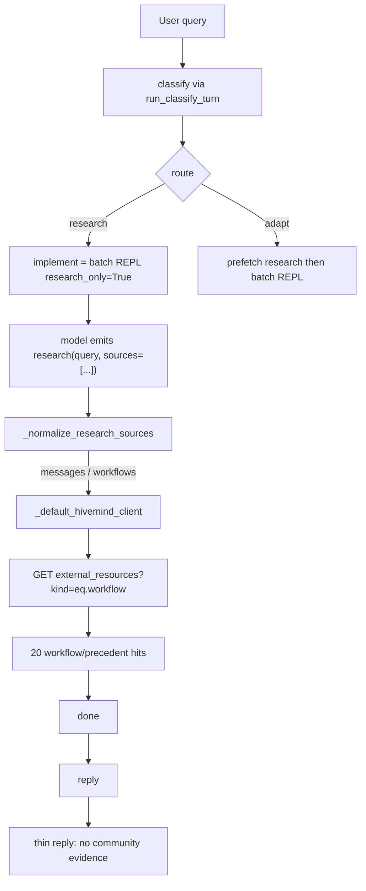
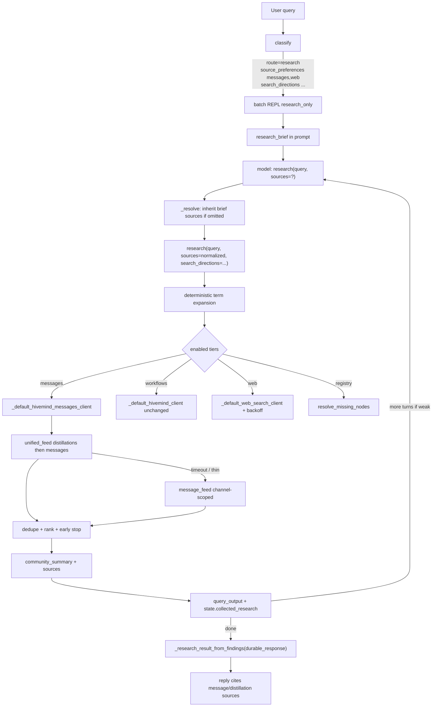
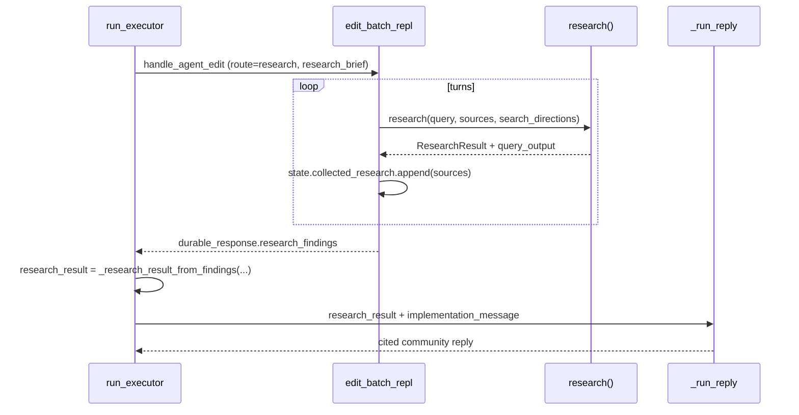

# VibeComfy Informational-Question Pipeline: Real Messages Tier + Gated Iteration

> **Supersession (2026-08-12 user ruling):** Goal 3, §3, Key Decisions 5 and 8, PR 5, and the inner-loop mermaid / observability (`informational_strength`, `variant_count`) are **superseded** by [`docs/plans/agent-judgment-iteration.md`](agent-judgment-iteration.md). Iteration is agent judgment only — no code-level search/stop loop. Goal 2 / Decision 4 (inherit-on-omit) were already superseded by the child omit-default in [`discord-message-search-default.md`](discord-message-search-default.md). The messages client, tier gating, hoist insertion, and "do not break" list remain **except** parent §1 `_rank_message_rows` IDF / `score <= 0` drop, which the successor replaces with approved-then-recency display order.

| Field | Value |
|---|---|
| **Author** | VibeComfy executor / research |
| **Date** | 2026-08-12 |
| **Revised** | 2026-08-12 (review pass) |
| **Status** | Draft |
| **Scope** | `vibecomfy/executor`, live `_frag_*` agent modules, `vibecomfy/porting/edit`, unit/integration tests |
| **Related live probes** | MiniMax H3 community sentiment; LTX 2.5 praises/complaints |

---

## Overview

Informational questions already classify correctly (`route=research`, `implement=false`, `source_preferences=["messages","web"]`) and already enter the agentic batch REPL. They still return knowledge-free replies because the `"messages"` research tier is a no-op alias of the workflow-only Hivemind client (`external_resources?kind=eq.workflow`). The Banodoco corpus *does* contain the answers — `unified_feed` and `message_feed` return LTX 2.5 and MiniMax H3 chatter, live updates, and distillations — but nothing in the executor research path queries those tables.

This design adds a genuine messages client (distillations-first `unified_feed` + channel-scoped `message_feed`). Omitted REPL `sources=` inherit classify `source_preferences` via `session.executor_research_brief`; explicit `sources=` wins. A deterministic inner multi-search loop runs under the existing batch-REPL outer loop. Reply then receives a synthesized community-knowledge packet with citable message/distillation sources. Workflow-precedent search (`_default_hivemind_client` → `external_resources`) is left unchanged.

---

## Background & Motivation

### Current pipeline (verified in code)



Classify is a route decision (`vibecomfy/executor/prompts.py::_CLASSIFY_SYSTEM`). Allowed routes: `respond`, `research`, `inspect`, `revise`, `adapt`, `reorganise`, `clarify`. For informational questions, live DeepSeek V4 Flash classify already emits:

```text
route=research, intent=research, implement=false, reply=true
source_preferences=["messages","web"]
search_directions=["MiniMax H3 model community reception", ...]
```

`ClassifyDecision.__post_init__` (`contracts.py:506-518`) then canonicalizes booleans to `(research=True, implement=False)`. `_ROUTE_BEHAVIORS["research"]` (`core.py:354-361`) still sets `needs_implement=True` so the request enters `handle_agent_edit` / `edit_batch_repl.py` with `research_only=True`. That is intentional: the research route's "implement" phase *is* the agentic research loop, not a graph edit.

`_should_prefetch_research` is **False** for `route=research` (`core.py:504-524`; the function returns `False` unless the route is `adapt` or a narrow revise-with-provenance case). Tests assert this at `tests/test_executor_flows.py` (`TestShouldPrefetchResearch.test_should_prefetch_research_false_for_research_route`, ~4741). Do not start prefetching for research-route questions.

### Root cause 1 — messages tier is the workflow client

`_default_hivemind_client` (`research.py:451-520`) is hard-coded:

```text
GET https://ujlwuvkrxlvoswwkerdf.supabase.co/rest/v1/external_resources
  ?select=*
  &or=(title.ilike.*TERM*,body.ilike.*TERM*)
  &kind=eq.workflow
  &limit=10|30
```

The docstring is explicit: it *avoids* `unified_feed` because "the old unified_feed table only indexes Discord chat messages, so workflow searches against it never returned results." That is correct for **workflow** search and must stay.

The batch REPL then treats `"messages"` as the same client (`_resolve.py:804`):

```python
hivemind_client = (
    None
    if not source_set.intersection({"messages", "workflows"})
    else research_module._default_hivemind_client
)
```

`_RESEARCH_SOURCE_ALIASES` maps `hivemind` / `discord` / `message` → `"messages"`, but the execution path never opens `unified_feed` or `message_feed`. Grep confirms those table names appear only in scripts, skill docs, and the workflow-client docstring.

### Root cause 2 — source_preferences are advisory prose

`_research_brief_from_plan` (`core.py:1626-1679`) copies `source_preferences` into `payload["research_brief"]`. Live `_format_research_brief_for_prompt` (`_frag_state.py`, re-exported through the `edit.py` façade) JSON-dumps them into the turn-0 prompt. `research()` itself has **no** `sources=` parameter. Tier selection happens only when the model writes `research("…", sources=[...])`.

Worse, omitted `sources` default to workflows only (`_resolve.py:786`):

```python
requested_source_tuple = requested_sources or ("workflows",)
```

So even a correctly classified informational question falls back to the workflow corpus if the model omits `sources=`. Live MiniMax/LTX runs *did* pass `sources=["messages","web"]` and still got workflows — the alias, not the default, was the live failure. The default is a second silent failure mode.

### Root cause 3 — iteration cannot converge

The batch REPL already allows multiple `research(...)` calls (MiniMax H3 issued two). Each call hits the same workflow-only surface, so the second query cannot discover message knowledge. There is no `search → evaluate → reformulate` loop in code; refinement is entirely model-chosen.

Live `_batch_research_memory_summary` (`_frag_batch_memory.py`) only persists prior research when `query_output` matches workflow markers (`"Concrete workflow pattern found"`, `"github_workflow_json"`, `"source_workflow_path"`, …). Message-tier hits would not carry across turns even after the client is fixed.

### Root cause 4 — reply never sees REPL evidence

Because prefetch is skipped, `research_result` stays `None` through `_run_reply`. Reply context is only `implementation_message` (typically a no-candidate narrator line such as "I investigated … but didn't apply any changes to the graph"). `report.research is None` is currently asserted by `tests/test_executor_flows.py` (`test_research_only_default_profile`, `test_research_only_sources_in_result`).

Even if sources were forwarded, `build_reply_messages` (`prompts.py:639-641`) labels them with `src.get("title", src.get("label", "unnamed"))`. Hivemind sources use `class_type`, so they would render as `"unnamed"`.

### What the corpus actually has (live HTTP, 2026-08-12)

Same publishable key the workflow client already ships (`research.py:72-73`):

| Table | Query | Hits (examples) |
|---|---|---|
| `unified_feed` | `ltx 2.5` | "LTX 2.5's Multishot Doesn't Need a Workflow — It's Just a Prompt Feature, and It Works" (`live_updates`); "LTX 2.5's Workflow Complexity Is the Real Adoption Barrier"; "so how do we feel about ltx 2.5" (`ltx_chatter`); "LTX 2.5, agree, fast and a clear improvement!" |
| `unified_feed` | `minimax h3` | "MiniMax H3 is amazing, made a music video with it…"; "Minimax H3 is sick…"; "still falls short … compared to MiniMax H3" |
| `message_feed` | channel `minimax_h3_chatter` | dedicated channel exists; also hits in `ltx_chatter` / `nsfw` / `introductions` / `art_sharing` |
| distillations | `ltx` | 1 pending, medium confidence — thin but present |

The knowledge path is a wiring bug, not a corpus gap.

### What already works (do not break)

- Classify correctly identifies informational intent → `route=research`, no graph edit.
- Non-fatal research failure handling (`HivemindError` → warning, executor continues).
- Batch REPL multi-turn `research(...)` + auditable `messages.jsonl`.
- Provenance stamping (`_stamp_source_evidence_meta`), ranking, freshness TTLs for existing tiers.
- Headless agent and in-editor panel share `run_executor` — one fix covers both.
- Workflow Hivemind client (`external_resources` + `kind=eq.workflow` + phrase-then-token-OR + JSONB semantic filters). Tests in `TestDefaultHivemindClient` assert `external_resources` and `kind=eq.workflow` on every URL.

---

## Goals & Non-Goals

### Goals

1. A real `"messages"` tier that queries `unified_feed` / `message_feed` (distillations-first, channel-scoped, ilike phrase + token, dedupe, rank) and returns `source in {"hivemind_message","hivemind_distillation"}`.
2. Executor-level source inheritance: omitted REPL `sources=` inherit classify `source_preferences` via `session.executor_research_brief`; explicit `sources=` wins and is never unioned with the brief. `research()` honors the `sources=` tuple it is passed — it does not read classify prefs itself.
3. Deterministic inner multi-search for informational queries: expand classify `search_directions` + query tokens into N variants, merge/rank, stop early on strong evidence, emit a community-knowledge summary for reply.
4. Keep the batch REPL as the **outer** loop. Term expansion is **inner** to each `research()` call.
5. Reply cites community content (author, channel, excerpt, url) and does not invent citations.
6. Secondary: web-tier cache / backoff / fallback so Brave 429 and empty DDG do not silently empty the second path.
7. Tests: unit + a real batch-REPL integration test (patched messages client) asserting message-kind sources, hoist, and reply citations. Sisypy is **not** the full-path lock.

### Non-goals

- Changing classify route vocabulary or the research-route `needs_implement=True` contract.
- Prefetching research for `route=research` (would fight `_should_prefetch_research` and the existing flow tests).
- Replacing the workflow Hivemind client or searching `unified_feed` for workflows.
- Ranking by Discord reactions (`reactions` is mostly null).
- Auto-submitting distillations on every answer (the hivemind contribute flywheel is optional follow-up, not this plan).
- FTS (`fts`) queries — skill and current client both treat them as unreliable / timeout-prone.
- Unfiltered `limit=1000` feed dumps.
- New product UI. Headless + editor already share the executor.
- Making informational answers apply graph edits.

---

## Proposed Design

### Target control flow



### Module layout

`research.py` is already ~6.5k lines. Do **not** grow it by another 500. Extract a sibling module and keep `research()` as the façade.

| New / changed file | Responsibility |
|---|---|
| `vibecomfy/executor/hivemind_clients.py` | Shared PostgREST GET, workflow client move-or-reexport, **new messages client**, channel map, ranking, normalization |
| `vibecomfy/executor/research.py` | `research(..., sources=, search_directions=)` façade; call inner loop when `"messages" in sources`; keep local/registry/web/precedent |
| `vibecomfy/executor/research_iteration.py` | Query expansion, early-stop, community summary (pure, no HTTP, **no import of `core`**) |
| `vibecomfy/executor/core.py` | After `_run_implement`, hoist `durable_response["research_findings"]` into `ResearchResult`; `_run_reply` prefers `community_summary` |
| `vibecomfy/executor/contracts.py` | Additive `community_summary: str = ""` on `ResearchResult` (lands in the hoist PR) |
| `vibecomfy/executor/prompts.py` | Reply: cite message author/channel vs distillation title/status; route-gate “explain why nothing changed” |
| `vibecomfy/porting/edit/_resolve.py` | Split clients in `_resolve_query_statement`; inherit brief sources from `self.executor_research_brief` |
| `vibecomfy/comfy_nodes/agent/provider.py` | Research-only prompt: `messages` ≠ workflows; omit 4-turn apply-edit cap and construction surface |
| `vibecomfy/comfy_nodes/agent/_frag_state.py` | Live `AgentEditState`: add `collected_research_*` fields (`executor_research_brief` already exists at line 207) |
| `vibecomfy/comfy_nodes/agent/_frag_entrypoint.py` | Live `handle_agent_edit`: already assigns `state.executor_research_brief` (~237) |
| `vibecomfy/comfy_nodes/agent/_frag_batch_memory.py` | Live `_batch_research_memory_summary`: persist message-tier `query_output` |
| `vibecomfy/comfy_nodes/agent/_frag_response_contract.py` | Live `_build_batch_repl_response` (~929): stamp `research_findings` on the durable dict |
| `vibecomfy/comfy_nodes/agent/edit_batch_repl.py` | Live loop (not a generated wrapper): stash brief on `EditSession`; fold statement sources into state |

**Generated SOURCE wrappers are not live.** Files such as `edit_state.py`, `edit_entrypoint.py`, `edit_batch_memory.py`, and `edit_response_contract.py` begin with `# Generated from edit.py. Keep behavior changes in the installed source body.` plus a `SOURCE = r'''...'''` blob. Nobody imports them at runtime. `edit.py` is the façade that `import *`s the `_frag_*` modules (T-040). Editing a generated wrapper leaves production unchanged. Do not put behavior changes there.

Keep `_default_hivemind_client` importable from `research.py` (re-export) so existing patches (`vibecomfy.executor.core._default_hivemind_client`, `vibecomfy.executor.research._default_hivemind_client`) keep working.

---

### 1. Genuine messages research tier

#### Shared transport

Generalize `_hivemind_get` (today bound to `_DEFAULT_HIVEMIND_URL = …/external_resources`):

```python
_HIVEMIND_REST_ROOT = "https://ujlwuvkrxlvoswwkerdf.supabase.co/rest/v1"
_DEFAULT_HIVEMIND_KEY = "sb_publishable_O38oPBafrBoFrpi_rlWJvA_UJrulFsx"  # already shipped

def _hivemind_get_table(
    table: str,
    params: Mapping[str, str],
    *,
    timeout: float,
) -> Any:
    """GET {REST_ROOT}/{table}?{urlencode(params)} with the publishable anon key.

    ``table`` is one of: external_resources, unified_feed, message_feed.
    Raises HivemindError on HTTP / timeout / invalid JSON. Never logs the key.
    """
```

`_default_hivemind_client` keeps calling `_hivemind_get_table("external_resources", …)` with `kind=eq.workflow`. Existing `TestDefaultHivemindClient` assertions stay green.

#### Channel map

Port the hivemind skill map, plus the live `minimax_h3_chatter` channel:

```python
_DAILY_SUMMARIES = ("daily_summaries",)

_CHANNEL_GROUPS: dict[str, tuple[str, ...]] = {
    "ltx": ("ltx_chatter", "ltx_resources", "ltx_gens", "ltx_training", "live_updates", "resources"),
    "wan": ("wan_chatter", "wan_comfyui", "wan_gens", "wan_resources", "live_updates", "resources"),
    "comfy": ("comfyui", "wan_comfyui", "ltx_chatter", "live_updates", "resources"),
    "minimax": ("minimax_h3_chatter", "ltx_chatter", "live_updates", "chatter", "art_sharing"),
    "training": ("training_control_loras", "ltx_training", "wan_training", "comfyui"),
    "general": ("chatter", "live_updates", "nsfw", "introductions", "art_sharing"),
}

_FAMILY_TO_GROUP = (
    (("ltx", "ltxv", "lightricks", "ltx 2.5", "ltx2.5"), "ltx"),
    (("wan", "wanvideo", "vace", "scail", "infinitetalk", "lightx2v"), "wan"),
    (("minimax", "minimax h3", "h3"), "minimax"),
    (("comfy", "comfyui", "kijai"), "comfy"),
)
```

```python
def _channel_scope_for_query(query: str) -> tuple[str, ...]:
    """daily_summaries first, then matching topic groups, then general fallback.

    Never returns empty: at minimum (daily_summaries, chatter).
    Cap at 10 channel names so PostgREST ``in.()`` stays cheap.
    """
```

#### Messages client signature and injectable type

Keep `HivemindClient = Callable[[str, float], dict[str, Any]]`. The default messages client computes channel scope internally. Do **not** widen the callable with `channels=` / `limit=` kwargs: fakes in existing tests are `(query, timeout)` and extra kwargs would break them.

```python
def _default_hivemind_messages_client(query: str, timeout: float) -> dict[str, Any]:
    """Search Banodoco community knowledge.

    Channel scope is computed inside via ``_channel_scope_for_query(query)``
    (includes ``live_updates`` for LTX / general groups). Returns
    ``{"results": [unified-shaped dicts...], "warnings": [...]}``.
    Each result keeps raw unified_feed / message_feed columns plus
    ``_hivemind_table`` and ``_match_query`` for ranking/audit.
    """
```

#### Messages runner (normalize-only — do not reuse `_run_hivemind_research`)

`_run_hivemind_research` (`research.py:1072-1114`) scans `url`/`body`/`content` and calls `_hivemind_workflow_url_candidates` + `_fetch_external_workflow_json_source`. `_ALLOWED_DIRECT_WORKFLOW_JSON_HOSTS` includes `cdn.discordapp.com` / `media.discordapp.net`. Message rows with Discord attachment URLs would be treated as workflow JSON. That is a silent “do not break” violation.

```python
def _run_hivemind_messages_research(
    query: str,
    *,
    client: HivemindClient,
    timeout: float,
) -> tuple[dict[str, Any], ...]:
    """Call ``client(query, timeout)`` and normalize only.

    No ``_hivemind_workflow_url_candidates``. No
    ``_fetch_external_workflow_json_source``. Channel scope lives inside
    the default client, not on this runner.
    """
    response = client(query, timeout)
    items = response.get("results", response.get("sources", []))
    if not isinstance(items, list):
        return ()
    return tuple(
        _normalize_hivemind_message_source(item)
        for item in items
        if isinstance(item, dict)
    )
```

`QueryVariant` has no `channels` field. Expansion does not pick channels; `_channel_scope_for_query` does that per query string inside the default client.

#### Phrase helper (single-token must work)

`_hivemind_phrase_ilike_query` (`research.py:701-715`) returns `None` unless there are **≥2** non-stopword tokens. Reusing it would drop `ltx` / `minimax`. Do **not** reuse it on `unified_feed`.

```python
def _hivemind_single_or_phrase_ilike(query: str) -> str | None:
    """Build ``or=(title.ilike.*Q*,body.ilike.*Q*)`` for one distinctive token
    or a multi-token phrase. Returns None only when no distinctive token remains.
    Never falls through to unscoped token-OR on unified_feed.
    """
```

#### Query sequence (per expanded term)

Always scoped `ilike`. Never FTS. Never unscoped `limit=1000`.

**Step A — distillations first**

```text
GET /unified_feed?select=*
  &kind=eq.distillation
  &or=(title.ilike.*PHRASE_OR_TOKEN*,body.ilike.*PHRASE_OR_TOKEN*)
  &limit=20
```

`PHRASE_OR_TOKEN` comes from `_hivemind_single_or_phrase_ilike`. Do **not** OR every stopword-stripped token on `unified_feed` — that is the timeout pattern the workflow client already avoids on the large table.

**Step B — unified_feed messages only** (same phrase/token)

```text
GET /unified_feed?select=*
  &kind=eq.message
  &or=(title.ilike.*PHRASE_OR_TOKEN*,body.ilike.*PHRASE_OR_TOKEN*)
  &order=created_at.desc
  &limit=20
```

`kind=eq.message` is **intentional**. The skill’s default unfiltered `unified_feed` search also returns `article` / `transcript` / workflow resources. Those are v1 non-goals: workflow resources would re-introduce the original bug through the back door, and articles/transcripts are a later tier. Step B therefore keeps only Discord messages.

**Step C — message_feed, channel-scoped** (if A+B are thin or timed out)

Do **not** call `evidence_strength` here. That helper expects normalized `source in {hivemind_message, hivemind_distillation}` (see §3) and would treat every raw client row as a miss, so Step C would always fire. Thin is a **client-local** predicate on raw unified_feed / message_feed rows:

```python
def _raw_message_hits_are_thin(rows: list[Mapping[str, Any]], query: str) -> bool:
    """True when A+B are not yet strong enough to skip message_feed.

    Operates on raw PostgREST dicts (``kind``, ``title``, ``body``/``content``,
    ``metadata.status``). Never reads ``source``.

    Not thin (skip Step C) when either:
      - any row has ``kind == "distillation"`` and
        ``(metadata or {}).get("status") == "approved"`` and a distinctive
        token appears in title/body, or
      - >= 3 rows with ``kind in {"message", "distillation"}`` whose
        title/body/content contain a distinctive token.
    Otherwise thin (run Step C). Empty rows are thin.
    """
```

Timeout is HTTP 500 / `SQLSTATE 57014`. Also run Step C on timeout regardless of thin.

```text
GET /message_feed?select=message_id,content,author_name,channel_name,channel_id,created_at
  &channel_name=in.(daily_summaries,ltx_chatter,live_updates,...)
  &content=ilike.*PHRASE_OR_TOKEN*
  &order=created_at.desc
  &limit=30
```

Channel `in.()` **must** include `live_updates` whenever the LTX / general / minimax groups fire — live probes’ “LTX 2.5’s Multishot…” / “Workflow Complexity…” hits live there. The hivemind skill map omits `live_updates`; this design adds it.

On HTTP 500 / statement timeout:

1. Retry with only `daily_summaries`.
2. Retry with the single densest topic group (still including `live_updates` for LTX).
3. Optionally add `created_at=gte.<90d>`.
4. Convert remaining failure to `HivemindError` → warning.

**Step D — token-OR fill** only on `message_feed` with channel scope, never as the first `unified_feed` query. Use `_hivemind_search_terms` for the token list. Never call `_hivemind_phrase_ilike_query` here.

#### Distillations-first merge

```python
_STATUS_RANK = {"approved": 0, "pending": 1}
# raw messages / resources sort after any distillation
```

Merge order: approved distillations → pending distillations → `daily_summaries` messages → topic-channel messages → other messages. Dedupe key:

```python
def _hivemind_item_id(row: Mapping[str, Any]) -> str:
    """Snowflake-safe id. Discord ``message_id`` is a bigint; JSON numbers
    lose precision above 2^53. Always ``str(...)``. Never json-load test or
    cache fixtures with bare int snowflakes — use strings.
    """
    raw = row.get("item_id", row.get("message_id", row.get("id")))
    return "" if raw is None else str(raw)

def _message_dedupe_key(row: Mapping[str, Any]) -> str:
    kind = str(row.get("kind") or "")
    item_id = _hivemind_item_id(row)
    if kind and item_id:
        return f"{kind}:{item_id}"
    return str(row.get("url") or f"{row.get('author')}:{row.get('body','')[:80]}")
```

#### Ranking (do not use reactions)

```python
def _rank_message_rows(rows: list[dict], query: str) -> list[dict]:
    # +80 approved distillation
    # +40 pending distillation
    # +20 metadata.confidence == "high"
    # +25 context/channel_name == "daily_summaries"
    # +20 channel in query's topic group
    # phrase-in-title / phrase-in-body via existing _hivemind_search_terms IDF-style
    # recency tie-break: newer created_at wins (sort key -timestamp)
    # skip rows with score <= 0
```

Reuse the rare-term IDF idea already in `_rank_hivemind_rows` (`research.py:745-833`). Do **not** add the workflow bonuses (`kind==workflow` +25, parseable +40, compiled API +30).

#### Normalization

Extend `_normalize_hivemind_source` or add a sibling. Today it already falls back to a body excerpt when title is missing (`research.py:976-979`) — keep that.

```python
def _normalize_hivemind_message_source(item: dict[str, Any]) -> dict[str, Any]:
    kind = item.get("kind") or "message"
    if kind != "distillation" and item.get("_hivemind_table") == "message_feed":
        kind = "message"
    title = _first_text(item, "title", "class_type")
    body = _first_text(item, "body", "content", "description", "text")
    if not title and body:
        title = _excerpt(body, limit=80)
    channel = (
        item.get("context")
        or item.get("channel_name")
        or item.get("channel")
        or ""
    )
    metadata = item.get("metadata") if isinstance(item.get("metadata"), dict) else {}
    source_kind = (
        "hivemind_distillation" if kind == "distillation" else "hivemind_message"
    )
    return {
        "class_type": title,
        "title": title,                 # reply + formatter both see a title
        "score": item.get("score", 0),
        "reasons": _coerce_tasks(item.get("reasons", [])),
        "source": source_kind,
        "kind": kind,
        "pack": channel or "banodoco-discord",
        "description": _excerpt(body),
        "tasks": [],
        "path": None,
        "hivemind_id": _hivemind_item_id(item),
        "url": _first_text(item, "url", "source_url", "permalink"),
        "author": _first_text(item, "author", "author_name"),
        "channel": channel if kind != "distillation" else "",
        "created_at": item.get("created_at"),
        "distillation_status": metadata.get("status"),
        "confidence": metadata.get("confidence"),
        "node_types": None,
        "workflow_schema": None,
    }
```

Stamp via existing `_stamp_source_evidence_meta`. Extend `_source_tier_for_source` and `_TIER_TTL_MAP`:

```python
"hivemind_message": _DEFAULT_HIVEMIND_TTL,       # 7d
"hivemind_distillation": _DEFAULT_HIVEMIND_TTL,
```

`_build_summary` (`research.py:396-445`) currently prefers workflow path/url language. When any source has `source in {hivemind_message, hivemind_distillation}`, emit:

```text
Found N community result(s): <top titles>. Channels: ltx_chatter, daily_summaries.
```

Do not append `WORKFLOW_RESEARCH_GUIDANCE` for a messages-only result set.

#### Injectability

`HivemindClient` stays `Callable[[str, float], dict[str, Any]]` (see runner above). Add an optional second injectable so tests can stub messages without stubbing workflows:

```python
def research(
    query: str,
    *,
    # existing kwargs unchanged...
    hivemind_client: HivemindClient | None | object = _USE_DEFAULT,
    hivemind_messages_client: HivemindClient | None | object = _USE_DEFAULT,
    sources: tuple[str, ...] | None = None,
    search_directions: tuple[str, ...] | None = None,
) -> ResearchResult:
```

Default `hivemind_messages_client` → `_default_hivemind_messages_client`. `None` skips the messages tier. Existing callers that pass only `hivemind_client=` keep today's workflow behavior.

---

### 2. Executor-level tier gating

#### Canonical source set

Reuse `_RESEARCH_SOURCE_ALIASES` as-is in `_resolve.py`. Do **not** change `_normalize_research_sources`’s diagnostic contract (invalid sources still return `unsupported_research_source`; tests in `tests/test_porting_edit_resolve.py` lock that). Inheritance uses a **new** helper that never raises a diagnostic:

```python
# vibecomfy/executor/research_sources.py  (or a private helper in _resolve.py)
_ALLOWED_RESEARCH_TIERS = frozenset({"workflows", "registry", "messages", "web"})

def canonicalize_research_sources(
    value: Any,
    *,
    default: tuple[str, ...] = ("workflows",),
) -> tuple[str, ...]:
    """Normalize aliases via _RESEARCH_SOURCE_ALIASES; drop unknown; preserve order.
    Empty / None → ``default``. Never returns a CompactDiagnostic.
    """
```

`_sanitize_source_preferences` (`core.py:299-310`) already drops `"registry"` unless the user asked about install/packs. Keep that. Classify prefs are **not** a hard override inside `research()`. The statement’s `sources=` wins; the brief only fills omission.

#### `research()` honors `sources=`

| Tier in `sources` | What runs |
|---|---|
| `workflows` | local corpus (`local_limit`) + `_default_hivemind_client` (external_resources workflows) |
| `messages` | `_default_hivemind_messages_client` (+ inner expansion; trigger is `"messages" in sources`) |
| `web` | `_default_web_search_client` |
| `registry` | `resolve_missing_nodes` |
| omitted / `None` | **legacy**: all tiers (preserves `tests/test_executor_research.py` merge tests) |

Critical split in `_run_hivemind_research` callers:

```python
source_set = set(sources) if sources is not None else None
run_workflows = source_set is None or "workflows" in source_set
run_messages = source_set is not None and "messages" in source_set
# When sources is None (legacy public API), do NOT auto-run messages.
# Messages are opt-in so adapt/workflow tests do not start hitting unified_feed.
```

This is the compatibility hinge: today's `research("Hotshot XL")` must not grow a Discord search. Informational path always passes `sources=` explicitly.

#### Batch REPL inheritance seam (one call site)

`_ResolveMixin` lives on `EditSession` (`vibecomfy/porting/edit/session.py:112`). `EditSession.__init__` has **no** `executor_research_brief`. The brief already lives on live `AgentEditState.executor_research_brief` (`_frag_state.py:207`), assigned from the implement payload in `_frag_entrypoint.py:237`. `_resolve_query_statement` (`_resolve.py:605`) is the function that currently does `requested_source_tuple = requested_sources or ("workflows",)` (~786).

**Setter** — immediately after `EditSession(...)` in live `edit_batch_repl.py` (~1250–1255):

```python
session = edit_session_module.EditSession(
    prepared_ui,
    schema_provider=state.schema_provider,
    value_default_context=value_default_context,
)
session.executor_research_brief = state.executor_research_brief  # dict | None
state.batch_session = session
```

Type: `EditSession.executor_research_brief: Mapping[str, Any] | None`. No `EditSession.__init__` change; assign a public attribute. Tests can set `session.executor_research_brief = {"source_preferences": ["messages", "web"]}` without constructing `AgentEditState`.

**Reader** — in `_resolve_query_statement` after `_normalize_research_sources` succeeds (or when `requested_sources is None`):

```python
brief = getattr(self, "executor_research_brief", None)
brief_prefs = (
    brief.get("source_preferences")
    if isinstance(brief, Mapping)
    else None
)
inherited = canonicalize_research_sources(brief_prefs, default=("workflows",))
requested_source_tuple = requested_sources or inherited
source_set = set(requested_source_tuple)
inherited_search_directions = (
    tuple(brief.get("search_directions") or ())
    if isinstance(brief, Mapping)
    else ()
)
# Brief search_directions are already sanitized by
# core._research_brief_from_plan (core.py:1642-1645). Do not re-import core.

output = research_module.research(
    query,
    local_limit=5 if "workflows" in source_set else 0,
    hivemind_timeout=3.0,
    web_search_timeout=3.0,
    registry_resolver=registry_resolver if "registry" in source_set else None,
    hivemind_client=(
        research_module._default_hivemind_client
        if "workflows" in source_set else None
    ),
    hivemind_messages_client=(
        research_module._default_hivemind_messages_client
        if "messages" in source_set else None
    ),
    web_search_client=(
        research_module._default_web_search_client
        if "web" in source_set else None
    ),
    sources=requested_source_tuple,
    search_directions=inherited_search_directions,
)
```

When the model *does* pass `sources=`, **do not union** with the brief. The statement is the authority for that call. Classify `source_preferences` never override an explicit `sources=` list. This preserves “I only want web” as a valid follow-up.

PR 2 can split clients when the model passes `sources=["messages"]` without this stash. PR 3 (inherit) is what closes the omitted-`sources=` → `("workflows",)` failure. Both are required before calling the live probes “fixed.”

#### Executor prefetch (`_run_research`)

Still unused for `route=research`. For `adapt`, keep passing only `hivemind_client=_default_hivemind_client` (workflows). Do not enable messages on adapt prefetch unless a later plan asks for community-informed edits. Out of scope.

#### Classify prompt (no route-table change)

`_CLASSIFY_SYSTEM` already says: use `"messages"` for community knowledge. No decision-table change. Optionally add one line:

```text
For "what do people think / complaints / praises / worth trying" questions,
prefer source_preferences=["messages","web"] and route="research".
```

Cheap, but not required for the wiring fix.

---

### 3. Deterministic inner multi-search loop

New module `vibecomfy/executor/research_iteration.py`. No HTTP. **Do not import `core`** (`core.py` already imports `research`; `research()` will import this module — a `research_iteration → core` import is a cycle).

**Trigger (one rule):** run the inner loop iff `sources is not None and "messages" in sources`. After PR 2/3 the REPL always passes `sources=`. There is no separate `informational=` flag. `search_directions` may be empty; expansion still emits the user-token variant.

```python
@dataclass(frozen=True)
class QueryVariant:
    query: str
    origin: str          # "user" | "search_direction" | "token"

def expand_research_queries(
    query: str,
    search_directions: tuple[str, ...] = (),
    *,
    max_variants: int = 4,
) -> tuple[QueryVariant, ...]:
    """Build N distinct search strings. No core import.

    ``search_directions`` arriving from the REPL are already sanitized by
    ``core._research_brief_from_plan``. This function only stopword-strips,
    dedups casefold, and caps. It does not call ``_sanitize_search_directions``.

    Order:
      1. Distinctive phrase from the user query (stopwords stripped,
         e.g. "MiniMax H3", "LTX 2.5") — origin="user"
      2. Each already-sanitized search_direction, truncated to 8 tokens
      3. Compact token join of remaining distinctive tokens
         (model family + version) if not already present
    Never emit the raw user sentence. Never emit stopword-only fragments.
    Cap at max_variants. No ``channels`` field — the default messages client
    scopes channels from the query string.
    """

def evidence_strength(sources: tuple[Mapping[str, Any], ...], query: str) -> str:
    """Return "strong" | "weak" | "none".

    **Normalized sources only** (after ``_normalize_hivemind_message_source``).
    Used by the inner loop early-stop and ``_research_followup_guidance``.
    Do not pass raw client rows — use ``_raw_message_hits_are_thin`` in Step C.

    strong: >=1 approved distillation mentioning a distinctive token,
            OR >=3 hivemind_message/hivemind_distillation hits whose
            title/body contain a distinctive token.
    weak:   1-2 message hits, or only pending distillation.
    none:   no message/distillation sources.
    """

def synthesize_community_summary(
    sources: tuple[Mapping[str, Any], ...],
    *,
    query: str,
) -> str:
    """Deterministic extractive summary. No model call.

    Groups by polarity-agnostic themes using title/description excerpts.
    Names author + channel + created_at date when present.
    States "no community discussion found" when sources are empty.
    Never invents quotes. Caps at ~800 chars so reply + query_output stay small.
    """
```

#### Inner loop inside `research()`

```python
if sources is not None and "messages" in sources:
    variants = expand_research_queries(query, search_directions or ())
    collected: list[dict] = []
    warnings: list[str] = []
    for variant in variants:
        try:
            batch = _run_hivemind_messages_research(
                variant.query,
                client=resolved_messages_client,
                timeout=hivemind_timeout,
            )
        except HivemindError as exc:
            warnings.append(f"hivemind_messages[{variant.origin}]: {exc}")
            continue
        collected.extend(batch)
        if evidence_strength(tuple(collected), query) == "strong":
            break
    # dedupe, rank, stamp, then continue with web/registry if those tiers enabled
```

**Testing the inner loop:** `messages.jsonl` records *outer* model `research(...)` statements only. Expansion does not add jsonl lines. A count of `≥1 research()` call is true of today’s MiniMax run and proves nothing. Assert a fake messages client spy was invoked with **distinct variant query strings** (or assert `research.messages.*` logs). Keep a separate outer-loop test that a second model `research(...)` is still allowed and `research_only=True` `done()` still commits.

Budget (per `research()` call, not per REPL turn):

| Knob | Default | Rationale |
|---|---|---|
| `max_variants` | 4 | 4 × (distillation + message + optional feed) ≈ 8–12 HTTP GETs |
| per-request timeout | 3.0s (REPL) / 5.0s (prefetch) | existing constants |
| wall-clock cap | 12s | stop expanding if elapsed > cap |
| result cap after merge | 12 message/distillation sources | keep `query_output` readable |

Early-stop is **per `research()` call**. The model may still issue a second `research(...)` with a different query (outer loop). That second call expands independently. To prevent duplicate HTTP: cache messages-tier GETs in-process keyed by `(table, normalized_params)` for the life of the `research()` call, and optionally on `AgentEditState` for the REPL turn budget.

#### Community summary on `ResearchResult`

Additive field on the existing dataclass (`contracts.py:1940-1963` — today has `summary` / `sources` / `warnings` / precedent fields, **no** `community_summary`). Land this field in the **hoist PR**, not the inner-loop PR, so reply can use it as soon as findings exist (even before expansion):

```python
# contracts.py ResearchResult — add after selected_precedent
community_summary: str = ""

def to_dict(self) -> dict[str, Any]:
    ...
    if self.community_summary:
        result["community_summary"] = self.community_summary
```

Until the inner-loop PR, `community_summary` may be empty or a one-liner copied from `summary`. The hoist path still prefers it when non-empty.

`_format_research_query_output` should print `community_summary` *above* the source list when present, so the model sees a usable paragraph before `done()`.

`_research_followup_guidance` needs a messages branch:

```python
if "messages" in source_set:
    if evidence_strength(result.sources, query) == "strong":
        notes.append(
            "Community evidence found. Answer from these messages/distillations. "
            "Cite author/channel. Do not invent quotes. Call done() when the "
            "question is answerable; do not keep searching workflows."
        )
    else:
        notes.append(
            "Community search was thin. Try a different distinctive phrase "
            "(model name + version, or a complaint/praise term). "
            "Do not treat workflow templates as community opinion."
        )
```

#### Cross-turn memory

Live `_batch_research_memory_summary` (`_frag_batch_memory.py`) currently skips most research `query_output`. Add markers:

```python
"hivemind_message",
"hivemind_distillation",
"Community evidence found",
"Community search was thin",
"community_summary",
```

Or, simpler and more reliable: persist whenever `detail["research_query"]` is set, not only when workflow markers match. Cap with the existing `max_items=3` / 1000-char formatter.

---

### 4. Hoist REPL findings into reply



#### Collection on live state

Live `AgentEditState` is `_frag_state.py` (not `edit_state.py`). It already has `executor_research_sources` and `executor_research_brief`. Add:

```python
collected_research_sources: tuple[dict[str, Any], ...] = ()
collected_research_summary: str = ""
collected_community_summary: str = ""
```

In `_resolve_query_statement` after a successful `research()` call, put structured sources on `StatementResult.detail` (the resolver must not import `AgentEditState`):

```python
detail["research_result_sources"] = [
    {k: v for k, v in src.items() if not str(k).startswith("_") or k in {
        "_tier", "_freshness_status", "_retrieval_time"
    }}
    for src in (getattr(output, "sources", ()) or ())[:12]
]
detail["community_summary"] = getattr(output, "community_summary", "") or ""
detail["research_summary"] = getattr(output, "summary", "") or ""
```

Live `edit_batch_repl.py` already walks `batch_result.statements`. After each turn, fold `detail["research_result_sources"]` into `state.collected_research_sources` (dedupe by `str(hivemind_id)` or `url`).

#### Stamp site: `_build_batch_repl_response`

The durable success dict is built by `_build_batch_repl_response` in live `_frag_response_contract.py` (~929), not by `edit.py` / narrator / `executor_durable.py`. `build_legacy_agent_edit_v1` does not strip unknown keys, so `research_findings` can ride the envelope.

Insert immediately before `built_response = build_legacy_agent_edit_v1(...)` (~1160), gated on the research route:

```python
if canonical_route == "research":
    response["research_findings"] = {
        "summary": state.collected_community_summary or state.collected_research_summary,
        "community_summary": state.collected_community_summary,
        "sources": list(state.collected_research_sources)[:12],
        "warnings": list(state.executor_research_warnings),
    }
```

#### Hoist insertion point in `run_executor`

`_run_implement` already returns `ImplementationResult(durable_response=result)` (`core.py:1570-1574`). `run_executor` then calls `_run_reply(..., research_result=research_result)` with prefetch-skipped `research_result is None` (`core.py:2263-2391`).

**Exact insertion:** immediately after the `_run_implement(...)` call succeeds (~2270), before `_run_reply`:

```python
implementation_result = _run_implement(...)
if (
    research_result is None
    and _canonical_route_for_plan(plan) == "research"
):
    research_result = _research_result_from_findings(
        implementation_result.durable_response
    )
```

```python
def _research_result_from_findings(
    durable: Mapping[str, Any] | None,
) -> ResearchResult | None:
    if not isinstance(durable, Mapping):
        return None
    findings = durable.get("research_findings")
    if not isinstance(findings, Mapping):
        return None
    sources = tuple(
        s for s in (findings.get("sources") or ()) if isinstance(s, dict)
    )
    community = str(findings.get("community_summary") or "")
    summary = community or str(findings.get("summary") or "")
    if not summary and not sources:
        return None
    return ResearchResult(
        summary=summary,
        sources=sources,
        warnings=tuple(str(w) for w in (findings.get("warnings") or ())),
        community_summary=community,
        # precedent_* fields stay at dataclass defaults
    )
```

There is no `ResearchResult.from_findings` classmethod. Construct `ResearchResult(...)` directly.

**`_run_reply` preference** (`core.py:1703-1705` today uses `research_result.summary`):

```python
research_summary = None
if research_result is not None:
    research_summary = (
        research_result.community_summary or research_result.summary or None
    )
```

**Test contract change:** `tests/test_executor_flows.py` currently asserts `result.report.research is None` for research-only. Update those tests to assert `report.research` is either `None` (mocked `handle_agent_edit` without findings) or a `ResearchResult` when the fake returns `research_findings`. Fakes `_fake_handle_agent_edit_research` should grow an optional findings payload so the hoist path is unit-tested without HTTP.

#### Reply prompt

`build_reply_messages` at `prompts.py:639-641` uses `src.get("title", src.get("label", "unnamed"))`. Hivemind sources use `class_type`. Distillation `author`/`url` are null; `context` is conditions, not a channel. Citation rules must split by source kind:

```python
title = src.get("title") or src.get("class_type") or src.get("label") or "unnamed"
kind = str(src.get("source") or "")
if kind == "hivemind_distillation":
    status = src.get("distillation_status") or ""
    conf = src.get("confidence") or ""
    meta = " / ".join(p for p in (status, conf) if p)
    line = f"  - {title}" + (f" (distillation, {meta})" if meta else " (distillation)")
elif kind == "hivemind_message":
    author = src.get("author") or ""
    channel = src.get("channel") or src.get("pack") or ""
    meta = " — ".join(p for p in (author, channel) if p)
    line = f"  - {title}" + (f" ({meta})" if meta else "")
else:
    line = f"  - {title}"
```

Amend `_REPLY_SYSTEM` (`prompts.py:532-579`). Today it contains “If nothing was changed, explain why clearly.” (`prompts.py:571`), which fights informational answers. Replace that blanket rule with a route gate, and add the citation rule:

```text
- If nothing was changed and route is not "research", explain why clearly.
- For route="research", do not lead with "no graph changes" / "didn't apply
  any edits"; a one-clause aside is enough. Summarize only sources listed
  under Research findings. For hivemind_message, cite author/channel when
  present. For hivemind_distillation, cite the title (the question) plus
  status/confidence — do not invent an author or channel. If sources are
  workflow templates and the user asked for community opinion, say so and
  do not invent praises/complaints. If community_summary is present, use it
  as the outline and keep citations grounded in Research sources.
```

---

### 5. Web tier reliability (secondary)

`_default_web_search_client` (`research.py:1374-1419`) already caches under `~/.cache/vibecomfy/web_search`. Gaps vs live probes:

| Failure | Today | Change |
|---|---|---|
| Brave HTTP 429 | `WebSearchError`, no retry | 1 retry after 0.8s; on second 429 write a sentinel `brave_429_until` (now+15m) in the cache root and skip Brave |
| DDG empty HTML | fall through to GitHub then Brave | keep; if DDG empty **and** Brave recently 429, return cache + warning |
| Cache write only on live hits | yes | also record negative cache (`results=[]`, `expires`) for 15m so a turn's second `research()` does not re-hammer |
| No backoff on GitHub 403 | treated as `WebSearchError` | same 15m skip sentinel |

Do **not** add API keys. Do **not** scrape additional SERPs. This is hardening, not a new provider.

Honor `_DEFAULT_WEB_SEARCH_TTL` (24h) on read — `_read_web_search_cache` currently merges any `*.json` without TTL checks beyond implicit file presence. Add an `expires_at` field on write; ignore expired files.

---

### 6. Prompt / REPL copy (small, required)

`provider.py:382` today:

```text
`research("query words", sources=["workflows", "registry", "messages", "web"])`
— choose evidence tiers; `workflows` searches internal templates plus
Hivemind external workflows; if sources are omitted it searches internal
workflows/templates only
```

Update to:

```text
`research("query words", sources=["workflows", "registry", "messages", "web"])`
— `workflows`: local templates + Hivemind external_resources workflows;
  `messages`: Banodoco Discord / unified_feed community knowledge
  (not workflows); `web`: public web; `registry`: node-pack lookup.
  If sources are omitted, inherit the Research brief's source_preferences;
  if the brief has none, search workflows only.
```

For `research_only=True`, **do not** only add a mission sentence on top of the edit surface. `provider.py:391-392` currently ships “Research cap: after 4 consecutive turns that only search/research/report and land 0 edits, stop researching. Either apply the best edit… or call `clarify()` / `done()`”. `done()` refusal is already skipped (`edit_batch_repl.py:2321` `and not research_only_route`) but the prompt still tells the model to apply an edit. Also omit the Add/Change/code-node construction block when `research_only=True`.

Required `research_only=True` prompt shape:

```text
You are answering a research question for a ComfyUI canvas. Gather auditable
evidence with research(...), refine weak searches, answer in prose, then
call done(). Do not edit the graph.

research("query words", sources=["workflows","registry","messages","web"])
  — messages: Banodoco Discord / unified_feed community knowledge, NOT workflows.
If sources are omitted, inherit the Research brief's source_preferences;
if the brief has none, search workflows only.

This is an informational question. Prefer sources=["messages","web"] unless
the user asked for a workflow/template. Workflow hits are not community
opinion. There is no 4-turn "apply the best edit" cap. Do not emit Add/Change
statements.
```

---

## API / Interface Changes

### `research()` — backward compatible additive kwargs

```python
def research(
    query: str,
    *,
    task: str | None = None,
    graph: dict[str, Any] | None = None,
    target_node_type: str = "",
    hivemind_client: HivemindClient | None | object = _USE_DEFAULT,
    hivemind_messages_client: HivemindClient | None | object = _USE_DEFAULT,
    hivemind_timeout: float = _DEFAULT_HIVEMIND_TIMEOUT,
    registry_resolver: RegistryResolver | None | object = _USE_DEFAULT,
    web_search_client: WebSearchClient | None | object = _USE_DEFAULT,
    web_search_timeout: float = _DEFAULT_WEB_SEARCH_TIMEOUT,
    local_limit: int = 10,
    sources: tuple[str, ...] | None = None,
    search_directions: tuple[str, ...] | None = None,
) -> ResearchResult:
```

- Existing positional/keyword call sites unchanged.
- `hivemind_client=None` still skips **workflow** Hivemind.
- New `hivemind_messages_client=None` skips **messages**.
- `sources=None` = legacy all-current-tiers (local + workflow hivemind + registry + web). Messages stay off.

### `ResearchResult` — additive

```python
community_summary: str = ""
```

`to_dict()` emits it only when non-empty.

### Durable agent-edit response — additive

```json
{
  "research_findings": {
    "summary": "…",
    "community_summary": "…",
    "sources": [ { "source": "hivemind_message", "title": "…", "author": "…", "channel": "ltx_chatter", "url": "…", "description": "…" } ],
    "warnings": []
  }
}
```

Unknown to older readers; ignored.

### `_normalize_research_sources`

No vocabulary change and **no `default=` parameter**. Invalid sources still return `unsupported_research_source`. Inheritance uses the separate `canonicalize_research_sources(..., default=("workflows",))` helper so the diagnostic contract stays intact.

### Classify / reply JSON contracts

No new required keys. Reply renderer becomes source-shape tolerant.

### Public HTTP (`POST /vibecomfy/agent-executor`)

No request-schema change. Success envelope may include `report.research` on research-route turns (today it is omitted / null). Treat as additive.

---

## Data Model Changes

No database migrations. Read-only against the existing public PostgREST schema.

### Tables used

| Table | When | Columns consumed |
|---|---|---|
| `external_resources` | `workflows` tier (unchanged) | existing workflow client |
| `unified_feed` | `messages` tier, steps A/B | `kind, source, item_id, title, body, author, context, url, metadata, created_at` |
| `message_feed` | timeout / thin fallback | `message_id, content, author_name, channel_name, channel_id, created_at` |
| `distillation_cites` | **not in v1** | optional later for cite expansion |

`unified_feed.kind` values we handle: `message`, `distillation`. Other kinds (workflow resources in the unified view) are **ignored** by the messages client so we do not re-introduce workflow rows through the back door.

### In-process source shape (messages)

See `_normalize_hivemind_message_source` above. Required keys for reply/tests: `source`, `title`/`class_type`, `description`, `hivemind_id` (always `str`, never a JSON number). Optional: `author`, `channel` (messages only), `url`, `created_at`, `kind`, `distillation_status`, `confidence`. Distillation rows typically have null `author`/`url`; do not require them.

### Cache files

- Existing: `~/.cache/vibecomfy/web_search/<sha256>.json`
- New fields: `expires_at`, `status` (`ok` \| `empty` \| `rate_limited`)
- New sentinels: `~/.cache/vibecomfy/web_search/brave_429_until`, `github_403_until`
- Optional messages cache (PR4+): `~/.cache/vibecomfy/hivemind_messages/<sha256>.json` with the 7d TTL. Not required to ship the client.

No schema migration, no new persisted session tables. `messages.jsonl` already audits REPL turns.

---

## Alternatives Considered

### A. Point `_default_hivemind_client` at `unified_feed` for everyone

**Pros:** one client, messages "just work."  
**Cons:** the client was moved *off* `unified_feed` because workflow searches returned nothing / timed out. Adapt/revise-provenance tests and live workflow recall would regress. `TestDefaultHivemindClient` locks `external_resources` + `kind=eq.workflow`.  
**Decision:** reject. Two clients, one transport.

### B. Prefetch messages in `run_executor` before the REPL

**Pros:** reply always has evidence even if the model never calls `research()`.  
**Cons:** contradicts `_should_prefetch_research` (False for research route), duplicates the agentic loop, injects a second un-audited retrieval that does not appear as a `research()` statement in `messages.jsonl`. The user ask is explicit: REPL is the outer loop.  
**Decision:** reject prefetch. Fix defaults so the first model `research()` call (or omitted-sources inheritance from the brief) hits messages.

### C. Ask the model to emit better queries only (prompt-only fix)

**Pros:** no backend work.  
**Cons:** live runs already passed `sources=["messages","web"]` and still got workflows. Prompt cannot fix a no-op alias.  
**Decision:** reject as the sole fix. Prompt copy is a necessary companion (PR3/5).

### D. Depend on the Astrid `hivemind.search` executor

**Pros:** distillations-first merge already implemented upstream.  
**Cons:** Astrid is not a runtime dependency of the Comfy executor worker; headless + in-editor must work without it. Skill HTTP is the portable contract.  
**Decision:** reimplement the read path with the same query playbook; do not subprocess Astrid.

### E. Model-driven reformulation loop (no deterministic expansion)

**Pros:** fewer new functions.  
**Cons:** already the status quo; MiniMax issued two queries and both were blind. Deterministic expansion is cheap, testable, and stops early.  
**Decision:** deterministic inner loop; model remains outer.

---

## Security & Privacy Considerations

| Risk | Severity | Mitigation |
|---|---|---|
| Publishable anon key in repo | Low (already shipped, documented as safe) | Keep using `_DEFAULT_HIVEMIND_KEY`; never log full URLs with headers; `warning_detail_from_exception` already redacts `apikey` / `token` query keys (`contracts.py:23-34`) |
| Discord author names / chatter in replies | Medium | Only surface fields the public API already returns; do not fetch attachments; do not refresh CDN media in v1 |
| Prompt injection via message body | Medium | `_excerpt(..., limit=500)` on description; `query_output` already truncated; reply instructed to treat sources as evidence not instructions |
| SSRF via Hivemind URLs | Low | Messages client does not fetch `url`; workflow promotion fetch stays on the existing allow-list (`_ALLOWED_EXTERNAL_WORKFLOW_HOSTS`) |
| PII in cache files | Low | Messages cache (if added) stores already-public PostgREST rows under the user cache dir; no extra retention beyond TTL |
| Rate-limit / abuse of Supabase | Medium | Channel scope, `limit<=30`, wall-clock cap, in-process dedupe, timeout degrade to warning — never retry storms |

Auth: none beyond the existing anon `apikey` header. No contributor key, no write path.

---

## Observability

Reuse `profiler_span` / `profiler_log` (`executor/profiler.py`).

### Logs (structured extras, no bodies)

```text
research.messages.start  query_preview, variant_count, channels
research.messages.http   table, status, elapsed_ms, row_count, scoped
research.messages.merge  distillation_n, message_n, deduped, strength
research.messages.stop   reason=strong|budget|variants_exhausted
research.web.skip        provider=brave, reason=429_window
```

`query_preview` uses existing `short_text`. Never log `apikey` or full `or=` URLs (they can be long); log table + kind + limit + channel count.

### Metrics (log-derived is enough for v1)

- `hivemind_messages_requests_total{table,status}`
- `hivemind_messages_timeout_total`
- `informational_strength{strong,weak,none}`
- `web_search_429_total{provider}`

### Artifacts (already exist)

- `messages.jsonl` — each `research()` statement + `query_output`
- `model_request.json` / `model_response.json` — REPL turns
- `report.research` after hoist — sources + `community_summary`

### Alerts

No new pager. A debug log when `strength=none` and `source_preferences` contained `messages` is enough to catch a future corpus/API break.

---

## Rollout Plan

No feature flag service. Use env knobs consistent with existing `VIBECOMFY_*_TTL`:

```text
VIBECOMFY_MESSAGES_RESEARCH=1          # default on after PR 2
VIBECOMFY_MESSAGES_MAX_VARIANTS=4
VIBECOMFY_MESSAGES_WALLCLOCK_S=12
```

### Stages

**Minimum user-visible slice is PR 2 + PR 3 + PR 4.** Do not call PR 2 “shipped for live probes.” PR 2 only fixes `query_output` inside the REPL; the user reply stays knowledge-free until hoist (PR 4). Inheritance (PR 3) closes the omitted-`sources=` hole but is not itself user-visible.

1. **PR 1 merge** — messages client exists, unused in prod paths. Unit tests only.
2. **PR 2 merge** — REPL `sources=["messages"]` hits the new client. Workflow path unchanged. `query_output` can show `hivemind_message`. Reply is still `implementation_message`. **Not** a live-probe gate.
3. **PR 3 merge** — omitted `sources=` inherit the brief. Still not a live-probe gate by itself.
4. **PR 4 merge** — hoist + reply citation. **This** is when MiniMax/LTX user replies can cite Discord. Re-run the two live probes here.
5. **PR 5** — inner loop. Latency may rise (extra GETs) but early-stop + 12s cap bound it. `search_directions` now actually arrive (PR 3).
6. **PR 6** — web backoff. Independent of 1–5.
7. **PR 7** — real REPL integration tests (patched messages client). Not a Sisypy full-path claim.

### Rollback

- Set `VIBECOMFY_MESSAGES_RESEARCH=0` to force `hivemind_messages_client=None` (warnings: "messages tier disabled").
- Revert PR 2 if workflow tests regress — PR 1 can stay.
- Reply hoist is additive; revert PR 4 if narration quality drops (old "no graph changes" replies return).

### Latency budget

| Path | Today (live) | Target |
|---|---|---|
| Single workflow Hivemind GET | ~1–3s | unchanged |
| Messages `research()` with 4 variants, early-stop after 1–2 | n/a | p50 < 4s, p95 < 10s, hard cap 12s |
| Full informational turn (classify + 1–2 REPL research calls + reply) | already multi-10s model-bound | +≤12s retrieval, not +another model loop |

Storage: message cache if added is tiny (12 excerpts × a few KB). Web cache already exists.

---

## Risks

| Risk | Severity | Mitigation |
|---|---|---|
| `unified_feed` leading-wildcard `ilike` statement timeout | **High** | Phrase-first, `kind=` filter, `limit=20`, channel-scoped `message_feed` fallback, degrade to warning |
| Workflow recall regression | **High** | Do not touch `_default_hivemind_client` query shape; keep `TestDefaultHivemindClient`; messages opt-in via `sources=` |
| Reply invents citations | **Medium** | Extractive `community_summary`; reply prompt forbids unsourced praises; message fixtures assert author/channel; distillation fixtures assert title+status only |
| Inner loop stalls / doubles latency | **Medium** | `max_variants=4`, 12s wall clock, early-stop on strong, in-process GET cache |
| `report.research is None` test / artifact consumers | **Medium** | Update flow tests in the same PR as hoist; treat findings as additive on durable response |
| Channel map drift (`minimax_h3_chatter` etc.) | **Low** | Map is a constant with a comment pointing at the hivemind skill; unknown channels still appear via unscoped-but-kind-filtered `unified_feed` |
| Web still empty after backoff | **Low** | Messages tier is the primary knowledge path; web is secondary |

---

## Test Plan

### Unit — `tests/test_executor_hivemind_messages.py` (new)

- Phrase query hits `unified_feed` with `kind=eq.distillation` then `kind=eq.message`.
- Timeout on unified_feed retries `message_feed` with `channel_name=in.(daily_summaries,…)`.
- Distillations-first merge: approved before pending before raw message.
- Ranking ignores `reactions`; daily_summaries outranks generic chatter on equal term match.
- Normalization: message with null title → excerpt `class_type` **and** `title`; `source=="hivemind_message"`.
- Dedupe by `kind:item_id`.
- Empty terms → `{"results": []}`.
- HTTP 500 with `57014` → `HivemindError` after scoped retries.
- Never emits `fts` or `external_resources` URLs.

### Unit — `tests/test_executor_research.py` (extend)

- `research(..., sources=("messages",), hivemind_messages_client=fake)` does **not** call workflow client; local_limit 0 when workflows omitted.
- `research("Hotshot XL")` (no `sources`) does **not** call messages client (legacy).
- Inner loop: spy the fake messages client; assert it was called with **distinct variant queries** (not jsonl statement count); stop after fake returns 3 strong message hits on variant 1.
- A second *outer* `research()` call is still allowed (`research_only` `done()` still commits).
- `community_summary` non-empty iff message sources present (after hoist PR).

### Unit — `tests/test_porting_edit_resolve.py`

- `sources=["messages"]` → `hivemind_messages_client` set, `hivemind_client is None`, `local_limit==0`.
- `sources=["messages","workflows"]` → both clients set.
- Omitted sources + `session.executor_research_brief = {"source_preferences": ["messages", "web"]}` → inherited tuple, not `("workflows",)`.
- Omitted sources + no brief → still `("workflows",)`.
- Explicit `sources=["web"]` does **not** union the brief (statement wins).
- `_normalize_research_sources` diagnostic contract unchanged (invalid → `unsupported_research_source`).
- `_format_research_query_output` prints community_summary and `hivemind_message` lines.
- `_research_followup_guidance` messages branch.

### Unit — `tests/test_executor_flows.py`

- Research-route hoist: fake `handle_agent_edit` returning `research_findings` populates `report.research.sources` with `source=="hivemind_message"`.
- `_run_reply` receives `research_summary == community_summary` when set. Inspect `run_reply_turn` kwargs (channel/author/`hivemind_id`), not a canned `fake_reply`.
- `_should_prefetch_research` remains False for research route.
- Existing research-only fakes without findings still succeed (`report.research is None` OK in that case).

### Unit — `tests/test_executor_contracts.py` / prompts

- `build_reply_messages` renders `class_type` for messages, not `"unnamed"`.
- Message fixture (`alice` / `ltx_chatter`) → reply prompt lists author/channel.
- Distillation-only fixture → reply prompt lists title + status/confidence, **not** a fake author/channel.
- Research-route system text no longer requires “explain why nothing changed” as the lead.

### Web

- 429 → retry once → sentinel skip; cache used on second call.
- Expired cache ignored.

### Integration — real batch REPL, patched messages client (PR 7)

Do **not** treat Sisypy `distilled-faster-research-route.yaml` or `actors.py:1825` `fake_hivemind_client` as the full-path lock. That helper is the **adapt** LTX-audio actor: it patches `core._default_hivemind_client` **and mocks `handle_agent_edit`**, so `research()` / `_resolve_query_statement` never run. Distilled-faster likewise fakes implement and writes a canned `research("...", sources=["workflows"])` line. After PR 2, messages do not go through `_default_hivemind_client`. Forging `messages.jsonl` would make enforced checks 3–5 pass without wiring.

Put the full-path assertions in pytest:

1. Drive a real batch REPL (`EditSession` + `_resolve_query_statement`) with a fixture model (or injected `deepseek_client`) that emits `research("LTX 2.5", sources=["messages"])` then `done()`.
2. Patch `vibecomfy.executor.research._default_hivemind_messages_client` (and/or the `_resolve.py` kwarg) to return a **raw message** fixture — not a distillation-only fixture:

```python
{
    "kind": "message",
    "title": None,
    "body": "LTX 2.5, agree, fast and a clear improvement!",
    "author": "alice",
    "context": "ltx_chatter",
    "item_id": "test-1",  # str, not int
}
```

3. Assert `detail["research_result_sources"][].source == "hivemind_message"`.
4. After hoist, assert `report.research.sources` and that `run_reply_turn` kwargs include `ltx_chatter` / `alice`.
5. `graph_unchanged=true`, `apply_eligible=false`.
6. Inner loop: first spy query empty, expanded variant returns hits → spy saw ≥2 distinct queries; jsonl still has **one** outer `research()` statement.

Optional: a *route-only* Sisypy scenario may still assert `plan.route=="research"` and `research_brief.source_preferences` contains `"messages"`. That is classification/brief plumbing, not the messages client.

Do **not** require live Hivemind in CI. Optional `@pytest.mark.network` smoke in `tests/test_executor_hivemind_messages.py` gated on env, hitting `unified_feed?select=kind&limit=1`.

### Live acceptance (manual, after PR 4 — not after PR 2)

Re-run the two 2026-08-12 probes:

1. `python -m vibecomfy.agent "What do people think about the new MiniMax H3 model?"`
2. `python -m vibecomfy.agent "What is LTX 2.5 and what do people say about it…"`

Pass if reply cites real channels (`minimax_h3_chatter` / `ltx_chatter` / `live_updates` / `daily_summaries`) or a distillation title+status, and does not say it only found workflow templates.

---

## Open Questions

1. **Should adapt-route community questions also enable the messages client?** Out of scope (adapt prefetch is workflow-precedent). Revisit if users ask "what do people use for X, then add it."
2. **Distillation write-back.** Hivemind skill flywheel (`contribute` pending distillation) would make the corpus self-improving. Needs contributor key + user setting (`test_agent_research_contribution_settings.py` already exists). Not required to fix the read path.
3. **`minimax_h3_chatter` as a first-class group** vs a one-off. Live probes show a dedicated channel; the map includes it. If more model-specific channels appear, consider a maintenance script rather than hard-coding each one.
4. **Reply model vs extractive summary.** v1 uses deterministic `community_summary` + reply model grounded on sources. If the reply model still hedges, we can skip the reply rewrite for research-route and surface `community_summary` directly — deferred until we see post-PR 4 quality.
5. **Shared in-process cache across REPL turns.** v1 caches inside one `research()` call. A turn-scoped cache on live `AgentEditState` (`_frag_state.py`) would cut duplicate GETs when the model repeats a query; implement if logs show repeats.

---

## References

- Hivemind skill: `~/.codex/skills/hivemind/SKILL.md` (endpoint, schema, channel map, playbook, caveats)
- Workflow client + docstring: `vibecomfy/executor/research.py` (`_default_hivemind_client`, `research`, `_normalize_hivemind_source`, `_rank_hivemind_rows`, `_default_web_search_client`)
- Phase orchestration: `vibecomfy/executor/core.py` (`_ROUTE_BEHAVIORS`, `_should_prefetch_research`, `_run_research`, `_run_implement`, `_research_brief_from_plan`, `_run_reply`)
- Contracts: `vibecomfy/executor/contracts.py` (`ClassifyDecision`, `ResearchResult`, `_ROUTE_DESCRIPTIONS`)
- Classify / reply prompts: `vibecomfy/executor/prompts.py`
- REPL research execution: `vibecomfy/porting/edit/_resolve.py` (`_normalize_research_sources`, `research(...)` statement)
- REPL loop: `vibecomfy/comfy_nodes/agent/edit_batch_repl.py` (`research_only_route`)
- Research-only mission prompt: `vibecomfy/comfy_nodes/agent/provider.py` (`build_batch_messages`)
- Brief formatting / memory (live): `vibecomfy/comfy_nodes/agent/_frag_state.py`, `_frag_batch_memory.py`
- Durable stamp site (live): `vibecomfy/comfy_nodes/agent/_frag_response_contract.py` (`_build_batch_repl_response`)
- Entrypoint (live): `vibecomfy/comfy_nodes/agent/_frag_entrypoint.py` (`handle_agent_edit`, `state.executor_research_brief`)
- Provider seam: `vibecomfy/executor/agent_backend.py`
- Existing tests: `tests/test_executor_research.py`, `tests/test_executor_flows.py`, `tests/test_porting_edit_resolve.py`, `tests/test_executor_contracts.py`
- Sisypy is route-only at most; do not mirror `distilled-faster-research-route.yaml` as a messages-client lock
- Search skill HTTP example: `docs/agent-skill/skills/search-comfy-workflows/SKILL.md`

---

## Key Decisions

1. **Two Hivemind clients, one transport.** Workflow search stays on `external_resources?kind=eq.workflow`. Messages search is a new client on `unified_feed` + `message_feed`. Sharing one client is the bug.
2. **Messages are opt-in via `sources=`.** Legacy `research(query)` does not query Discord. Informational path always passes `sources` (from the statement or the inherited brief).
3. **No prefetch on `route=research`.** The batch REPL remains the outer loop; `_should_prefetch_research` (`core.py:504-524`) stays False. Findings are hoisted *out* of the REPL into `report.research` for reply via `_research_result_from_findings` immediately after `_run_implement`.
4. **Omitted REPL `sources=` inherit the brief; the statement always wins.** Seam: `session.executor_research_brief = state.executor_research_brief` after `EditSession(...)` in `edit_batch_repl.py` (~1250); `_resolve_query_statement` reads `getattr(self, "executor_research_brief", None)`. Classify prefs are not a hard override inside `research()`. `_normalize_research_sources` diagnostic contract is unchanged.
5. **Deterministic inner expansion, model outer iteration.** Trigger is exactly `"messages" in sources`. `expand_research_queries` does not import `core`. Test via client spy, not jsonl counts.
6. **Distillations-first, then daily_summaries, then topic channels including `live_updates`.** Step B is `kind=eq.message` on purpose (articles/transcripts/workflow resources are v1 non-goals). Single-token queries use `_hivemind_single_or_phrase_ilike`, not `_hivemind_phrase_ilike_query`. No reaction ranking. No FTS.
7. **Extractive `community_summary`, not a new model phase.** Field lands in the hoist PR. Reply remains `run_reply_turn`. Messages cite author/channel; distillations cite title+status/confidence.
8. **Extract `hivemind_clients.py` + `research_iteration.py`.** Edit live `_frag_*` modules, not generated `edit_*.py` SOURCE wrappers. Stamp `research_findings` in `_build_batch_repl_response`.
9. **Web hardening is secondary.** Cache TTL + 429 sentinels only. The primary knowledge path is the corpus we already have.
10. **Additive contracts only.** New kwargs/fields; no change to classify route table, research-route `needs_implement=True`, or workflow client URL shape. `HivemindClient` stays `(query, timeout)`.
11. **Minimum user-visible slice is PR 2 + 3 + 4.** PR 2 alone does not fix live MiniMax/LTX replies. Full-path tests are pytest + a patched messages client, not Sisypy actors that mock `handle_agent_edit`.

---

## PR Plan

Minimum user-visible slice: **PR 2 + PR 3 + PR 4**. Live MiniMax/LTX probes are a gate on PR 4, not PR 2.

### PR 1 — Messages Hivemind client (unused in prod)

- **Title:** `feat(research): add unified_feed/message_feed messages client`
- **Files:** `vibecomfy/executor/hivemind_clients.py` (new), `vibecomfy/executor/research.py` (move/re-export `_hivemind_get` / `_default_hivemind_client`, add `_run_hivemind_messages_research`, `_normalize_hivemind_message_source`, `_hivemind_single_or_phrase_ilike`, `_TIER_TTL_MAP` entries), `tests/test_executor_hivemind_messages.py` (new), existing `tests/test_executor_research.py` (must stay green)
- **Depends on:** none
- **Changes:** Shared PostgREST GET parameterized by table. New `_default_hivemind_messages_client(query, timeout)` with distillations-first `unified_feed`, `kind=eq.message` Step B, channel-scoped `message_feed` fallback including `live_updates`, timeout recovery, `str()` snowflake ids, dedupe, ranking, normalize-only runner (no workflow URL fetch). Workflow client behavior and URLs unchanged. Not wired into `_resolve_query_statement` yet.

### PR 2 — Split tiers in `research()` and the batch REPL

- **Title:** `feat(research): gate Hivemind workflow vs messages by sources=`
- **Files:** `vibecomfy/executor/research.py` (`sources=`, `hivemind_messages_client=`), `vibecomfy/porting/edit/_resolve.py` (client split in `_resolve_query_statement` only — no inheritance yet), `tests/test_executor_research.py`, `tests/test_porting_edit_resolve.py`
- **Depends on:** PR 1
- **Changes:** `research(..., sources=)` runs only requested tiers. `_resolve_query_statement` no longer passes `_default_hivemind_client` for `"messages"`. `sources=["messages"]` returns message-kind sources only. Omitted `sources=` still defaults to `("workflows",)`. Legacy `research(query)` still skips messages. Feature knob `VIBECOMFY_MESSAGES_RESEARCH` for rollback. **Not user-visible:** reply still sees only `implementation_message`.

### PR 3 — Inherit classify `source_preferences` when `sources=` is omitted

- **Title:** `feat(research): inherit research_brief sources when research() omits sources`
- **Files:** `vibecomfy/comfy_nodes/agent/edit_batch_repl.py` (stash `session.executor_research_brief`), `vibecomfy/porting/edit/_resolve.py` (`canonicalize_research_sources` + inherit in `_resolve_query_statement`; pass `search_directions` through), `tests/test_porting_edit_resolve.py`
- **Depends on:** PR 2
- **Changes:** After `EditSession(...)` (~1250), assign `session.executor_research_brief = state.executor_research_brief`. Omitted `sources=` → `canonicalize_research_sources(brief["source_preferences"], default=("workflows",))`. Explicit `sources=` wins; no union. `_normalize_research_sources` diagnostic contract unchanged. Needed so `search_directions` actually arrive at the inner loop (PR 5). Still not a live-probe gate.

### PR 4 — Hoist REPL findings into reply (user-visible)

- **Title:** `feat(executor): hoist research_findings and cite community sources`
- **Files:** `vibecomfy/comfy_nodes/agent/_frag_state.py` (`collected_research_*`), `vibecomfy/comfy_nodes/agent/edit_batch_repl.py` (fold statement sources), `vibecomfy/comfy_nodes/agent/_frag_response_contract.py` (`_build_batch_repl_response` stamps `research_findings`), `vibecomfy/comfy_nodes/agent/_frag_batch_memory.py` (persist message `query_output`), `vibecomfy/executor/contracts.py` (`community_summary: str = ""`), `vibecomfy/executor/core.py` (`_research_result_from_findings` after `_run_implement`; `_run_reply` prefers `community_summary`), `vibecomfy/executor/prompts.py` (source labeling + route-gate “explain why nothing changed”), `vibecomfy/comfy_nodes/agent/provider.py` (research-only: omit 4-turn apply-edit cap and construction surface), `tests/test_executor_flows.py`, `tests/test_executor_contracts.py`
- **Depends on:** PR 2 (PR 3 recommended so omitted-sources informational questions also hoist)
- **Changes:** Durable response carries `research_findings`. `run_executor` assigns `research_result = _research_result_from_findings(...)` when prefetch was skipped. Reply cites `hivemind_message` author/channel and distillation title+status. Generated `edit_*.py` wrappers are **not** edited. **This** is the live-probe gate.

### PR 5 — Deterministic inner multi-search loop

- **Title:** `feat(research): expand informational queries and stop on strong evidence`
- **Files:** `vibecomfy/executor/research_iteration.py` (new; no `core` import), `vibecomfy/executor/research.py` (loop iff `"messages" in sources`), `vibecomfy/porting/edit/_resolve.py` (followup guidance), `tests/test_executor_research.py`, `tests/test_research_iteration.py` (new)
- **Depends on:** PR 2; **PR 3 required** so `search_directions` from the brief actually arrive
- **Changes:** `expand_research_queries`, `evidence_strength`, `synthesize_community_summary`. Inner loop with max 4 variants, 12s cap, early-stop. No `informational=` flag. No `variant.channels`. Tests spy the fake client for distinct queries — not jsonl counts. Followup guidance tells the model to `done()` on strong community evidence instead of searching more workflows.

### PR 6 — Web search backoff and cache TTL

- **Title:** `fix(research): back off Brave/GitHub 429s and honor web cache TTL`
- **Files:** `vibecomfy/executor/research.py` (`_default_web_search_client`, cache read/write), `tests/test_executor_research.py`
- **Depends on:** none (can land parallel to PR 1–5)
- **Changes:** One retry + 15m skip sentinel on 429/403; negative cache; honor `expires_at` / `VIBECOMFY_WEB_SEARCH_TTL`. No new providers.

### PR 7 — Real REPL integration tests (not Sisypy-as-full-path)

- **Title:** `test(research): informational question asserts message-kind sources`
- **Files:** `tests/test_porting_edit_resolve.py` and/or `tests/test_executor_flows.py` (real `EditSession` + fixture model emitting `research("LTX 2.5", sources=["messages"])`, patch `_default_hivemind_messages_client`), optional `@pytest.mark.network` smoke
- **Depends on:** PR 4 (hoist + reply) and PR 5 (iteration spy) for the full assertions; a slimmer resolve-only test can land after PR 2
- **Changes:** Assert `detail["research_result_sources"][].source == "hivemind_message"`, hoisted `report.research.sources`, `run_reply_turn` kwargs cite `ltx_chatter`/`alice` from a **message** fixture (not distillation-only), `graph_unchanged`, inner-loop spy saw distinct variants. Optional route-only Sisypy check of classify/brief is allowed but is not the wiring lock. Documents the MiniMax H3 / LTX 2.5 manual re-probe as the live acceptance gate after PR 4.
